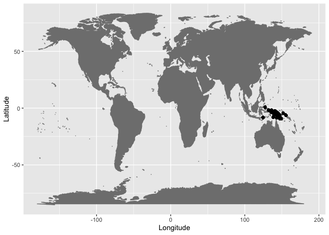
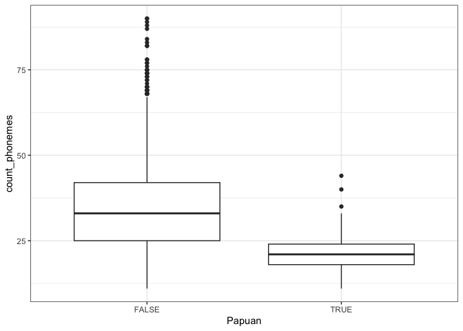
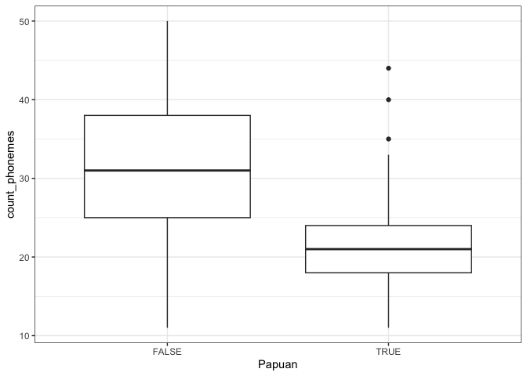
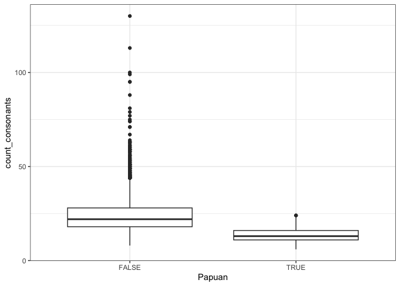
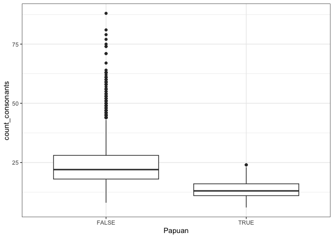
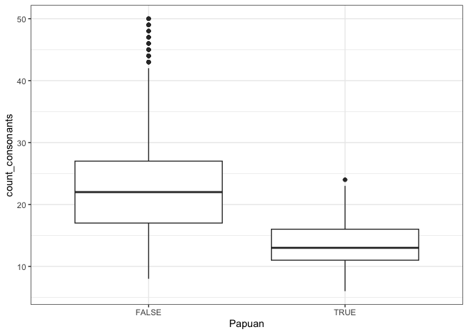

Papuan phoneme inventories in PHOIBLE
================
Steven Moran
(26 May, 2023)

``` r
library(tidyverse)
library(maps)
```

Get the current PHOIBLE inventories in CLDF format.

``` r
values <- read_csv(url('https://raw.githubusercontent.com/cldf-datasets/phoible/master/cldf/values.csv'))
languages <- read_csv(url('https://raw.githubusercontent.com/cldf-datasets/phoible/master/cldf/languages.csv'))
inventories <- read_csv(url('https://raw.githubusercontent.com/cldf-datasets/phoible/master/cldf/inventories.csv'))
parameters <- read_csv(url('https://raw.githubusercontent.com/cldf-datasets/phoible/master/cldf/parameters.csv'))
```

Merge CLDF tables into a single data frame at the level of inventories.

``` r
phoible <- values %>% select(Language_ID, Inventory_ID) %>% distinct()
phoible <- left_join(phoible, inventories, by=c("Inventory_ID" = "ID"))
phoible <- phoible %>% rename(Source_name = Name)
phoible <- left_join(phoible, languages, by=c("Language_ID" = "ID"))
```

Merge CLDF tables into a single data frame at the level of segments.

``` r
segments <- left_join(values, inventories, by=c("Inventory_ID" = "ID"))
segments <- segments %>% rename(Source_name = Name)
segments <- left_join(segments, languages, by=c("Language_ID" = "ID"))
parameters <- parameters %>% rename(SegmentName = Name)
segments <- left_join(segments, parameters, by=c("Parameter_ID" = "ID"))
```

Filter out languages – note this is not 100% correct according to
Harald, i.e., Glottolog Papunesian languages minus Austronesian does not
equal Papuan languages exactly, so this is an approximation for
exploratory analysis.

``` r
png <- segments %>% filter(Macroarea == "Papunesia")
png <- png %>% filter(Family_Name != "Austronesian")
```

Let’s check those data points on a world map.

``` r
ggplot(data=png, aes(x=Longitude,y=Latitude)) + 
  borders("world", colour="gray50", fill="gray50") + 
  geom_point()
```

<!-- -->

Tag the languages as Papuan in PHOIBLE and compare them with the
worldwide sample for segment inventory sizes. Note that this is
non-inclusive, i.e., in the whole sample a language is either Papuan or
not (according to the definition above). This means we are comparing
“only” Papuan languages versus non-Papuan languages in the sample
(instead of Papuan versus the whole sample inclusive of Papuan
languages).

``` r
phoible <- phoible %>% mutate(Papuan = ifelse(Language_ID %in% png$Language_ID, T, F))
```

Make some plots.

Total phonemes.

``` r
phoible %>%
ggplot(aes(x = Papuan, y = count_phonemes)) +
  geom_boxplot() + 
  theme_bw()
```

<!-- -->

``` r
phoible %>% filter(count_phonemes <= 90) %>%
ggplot(aes(x = Papuan, y = count_phonemes)) +
  geom_boxplot() + 
  theme_bw()
```

<!-- -->

``` r
phoible %>% filter(count_phonemes <= 50) %>%
ggplot(aes(x = Papuan, y = count_phonemes)) +
  geom_boxplot() + 
  theme_bw()
```

<!-- -->

Consonants.

``` r
phoible %>%
ggplot(aes(x = Papuan, y = count_consonants)) +
  geom_boxplot() + 
  theme_bw()
```

<!-- -->

``` r
phoible %>% filter(count_consonants <= 90) %>%
ggplot(aes(x = Papuan, y = count_consonants)) +
  geom_boxplot() + 
  theme_bw()
```

<!-- -->

``` r
phoible %>% filter(count_consonants <= 50) %>%
ggplot(aes(x = Papuan, y = count_consonants)) +
  geom_boxplot() + 
  theme_bw()
```

<!-- -->

Vowels.

``` r
phoible %>%
ggplot(aes(x = Papuan, y = count_vowels)) +
  geom_boxplot() + 
  theme_bw()
```

<!-- -->

``` r
phoible %>% filter(count_vowels <= 30) %>%
ggplot(aes(x = Papuan, y = count_vowels)) +
  geom_boxplot() + 
  theme_bw()
```

<!-- -->

Tones.

``` r
phoible %>% filter(count_tones >= 1) %>%
ggplot(aes(x = Papuan, y = count_tones)) +
  geom_boxplot() + 
  theme_bw()
```

<!-- -->
