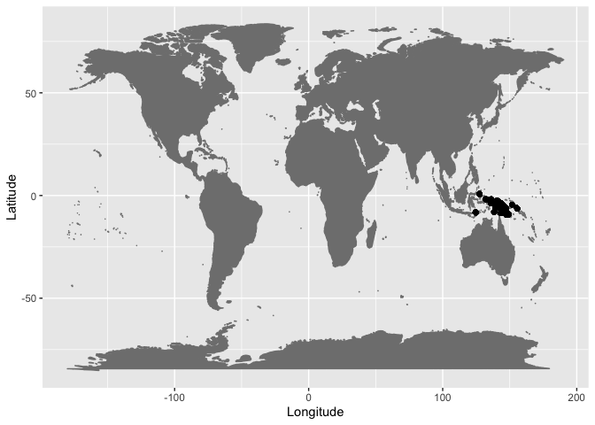
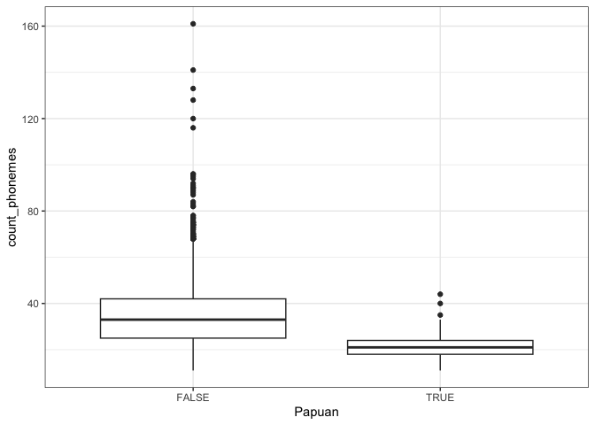
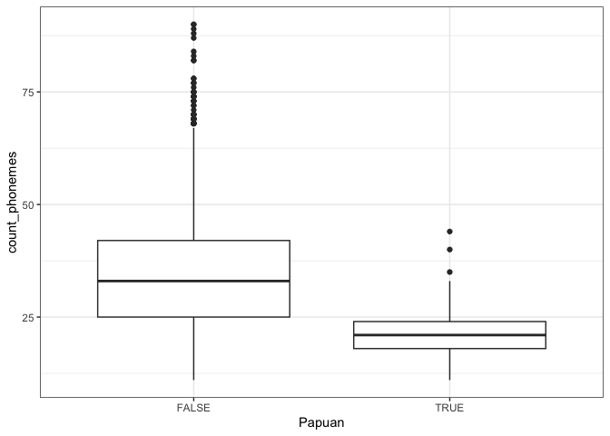
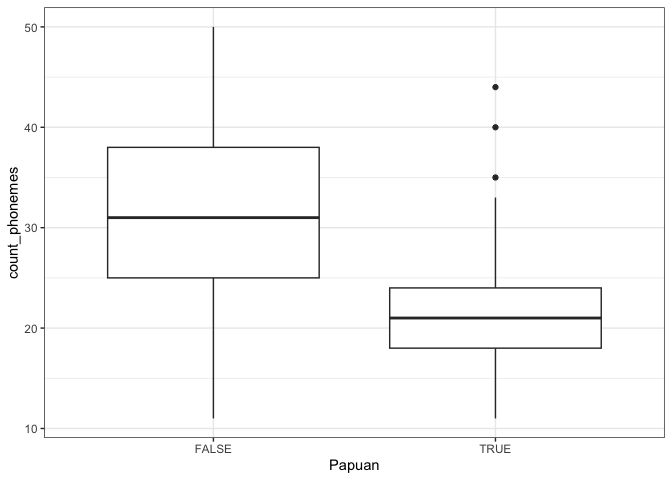
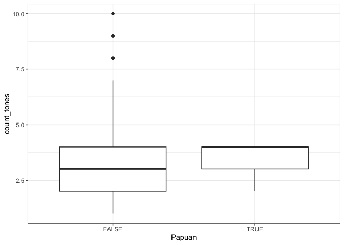
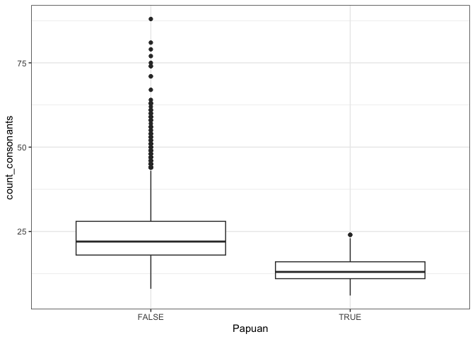
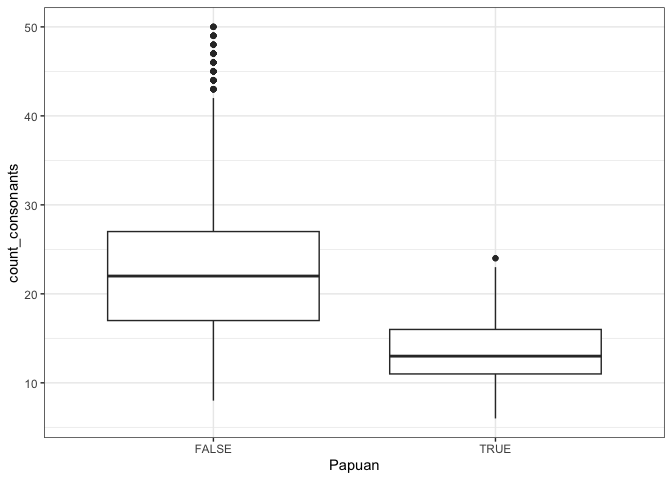
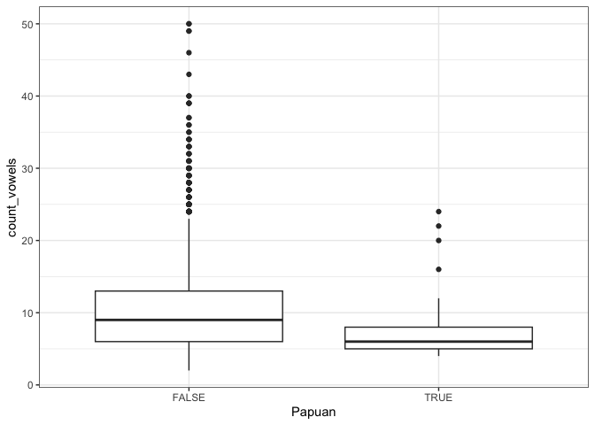
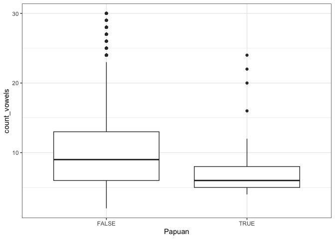

Papuan phoneme inventories in PHOIBLE
================
(30 May, 2023)

Load the R libraries.

``` r
library(tidyverse)
library(maps)
```

Get the current [PHOIBLE inventories](https://phoible.org) in [CLDF
format](https://github.com/cldf-datasets/phoible). See also:

- <https://cldf.clld.org>
- <https://clld.org/datasets.html>

``` r
values <- 
  read_csv(url('https://raw.githubusercontent.com/cldf-datasets/phoible/master/cldf/values.csv'))
languages <- 
  read_csv(url('https://raw.githubusercontent.com/cldf-datasets/phoible/master/cldf/languages.csv'))
inventories <- 
  read_csv(url('https://raw.githubusercontent.com/cldf-datasets/phoible/master/cldf/inventories.csv'))
parameters <- 
  read_csv(url('https://raw.githubusercontent.com/cldf-datasets/phoible/master/cldf/parameters.csv'))
```

Merge CLDF tables into a single data frame at the level of inventories.

``` r
phoible <- values %>% select(Language_ID, Inventory_ID) %>% distinct()
phoible <- left_join(phoible, inventories, by=c("Inventory_ID" = "ID"))
phoible <- phoible %>% rename(Source_name = Name)
phoible <- left_join(phoible, languages, by=c("Language_ID" = "ID"))
```

This is what the data format looks like.

``` r
phoible %>% head()
```

    ## # A tibble: 6 × 18
    ##   Language_ID Inventory_ID Source_name Inventory_source_ID Source          URL  
    ##   <chr>              <dbl> <chr>       <chr>               <chr>           <chr>
    ## 1 kore1280               1 Korean      SPA                 Cho1967;Martin… http…
    ## 2 kett1243               2 Ket         SPA                 Dulzon1968;Kre… http…
    ## 3 lakk1252               3 Lak         SPA                 Murkelinskij19… http…
    ## 4 kaba1278               4 Kabardian   SPA                 Kuipers1960     http…
    ## 5 nucl1302               5 Georgian    SPA                 RobinsWaterson… http…
    ## 6 buru1296               6 Burushaski  SPA                 Morgenstierne1… http…
    ## # ℹ 12 more variables: count_phonemes <dbl>, count_consonants <dbl>,
    ## #   count_vowels <dbl>, count_tones <dbl>, Name <chr>, Macroarea <chr>,
    ## #   Latitude <dbl>, Longitude <dbl>, Glottocode <chr>, ISO639P3code <chr>,
    ## #   Family_Glottocode <chr>, Family_Name <chr>

Merge CLDF tables into a single data frame at the level of segments.

``` r
segments <- left_join(values, inventories, by=c("Inventory_ID" = "ID"))
segments <- segments %>% rename(Source_name = Name)
segments <- left_join(segments, languages, by=c("Language_ID" = "ID"))
parameters <- parameters %>% rename(SegmentName = Name)
segments <- left_join(segments, parameters, by=c("Parameter_ID" = "ID"))
```

This is how the data look at the level of segments.

``` r
segments %>% filter(Name == "Hawaiian") %>% head()
```

    ## # A tibble: 6 × 64
    ##      ID Language_ID Parameter_ID Value Source.x Marginal Allophones Inventory_ID
    ##   <dbl> <chr>       <chr>        <chr> <chr>    <lgl>    <chr>             <dbl>
    ## 1  1653 hawa1245    E7FBD92350B… h     PukuiEl… NA       h                    43
    ## 2  1654 hawa1245    5A838FF4DAB… k     PukuiEl… NA       k t                  43
    ## 3  1655 hawa1245    03413638BD1… l     PukuiEl… NA       l                    43
    ## 4  1656 hawa1245    5AE96636267… m     PukuiEl… NA       m                    43
    ## 5  1657 hawa1245    E03DA215BAB… n     PukuiEl… NA       n                    43
    ## 6  1658 hawa1245    2D6FB64B3CD… p     PukuiEl… NA       p                    43
    ## # ℹ 56 more variables: Source_name <chr>, Inventory_source_ID <chr>,
    ## #   Source.y <chr>, URL <chr>, count_phonemes <dbl>, count_consonants <dbl>,
    ## #   count_vowels <dbl>, count_tones <dbl>, Name <chr>, Macroarea <chr>,
    ## #   Latitude <dbl>, Longitude <dbl>, Glottocode <chr>, ISO639P3code <chr>,
    ## #   Family_Glottocode <chr>, Family_Name <chr>, SegmentName <chr>,
    ## #   Description <chr>, SegmentClass <chr>, tone <chr>, stress <chr>,
    ## #   syllabic <chr>, short <chr>, long <chr>, consonantal <chr>, …

Filter out languages – note this is not 100% correct according to Harald
Hammarstrom (p.c.), i.e., Glottolog Papunesian languages minus
Austronesian does not equal Papuan languages exactly, so this is an
approximation for exploratory analysis.

``` r
png <- segments %>% filter(Macroarea == "Papunesia")
png <- png %>% filter(Family_Name != "Austronesian")
```

Let’s check those data points on a world map.

``` r
ggplot(data=png, aes(x=Longitude,y=Latitude)) + 
  borders("world", colour="gray50", fill="gray50") + 
  geom_point()
```

<!-- -->

Tag the languages as Papuan in PHOIBLE and compare them with the
worldwide sample for segment inventory sizes. Note that this is
non-inclusive, i.e., in the whole sample a language is either Papuan or
not (according to the definition above). This means we are comparing
“only” Papuan languages versus non-Papuan languages in the sample
(instead of Papuan versus the whole sample inclusive of Papuan
languages).

``` r
phoible <- phoible %>% mutate(Papuan = ifelse(Language_ID %in% png$Language_ID, T, F))
```

Make some plots.

Total phonemes.

``` r
phoible %>%
ggplot(aes(x = Papuan, y = count_phonemes)) +
  geom_boxplot() + 
  theme_bw()
```

<!-- -->

``` r
phoible %>% filter(count_phonemes <= 90) %>%
ggplot(aes(x = Papuan, y = count_phonemes)) +
  geom_boxplot() + 
  theme_bw()
```

<!-- -->

``` r
phoible %>% filter(count_phonemes <= 50) %>%
ggplot(aes(x = Papuan, y = count_phonemes)) +
  geom_boxplot() + 
  theme_bw()
```

<!-- -->

Consonants.

``` r
phoible %>%
ggplot(aes(x = Papuan, y = count_consonants)) +
  geom_boxplot() + 
  theme_bw()
```

<!-- -->

``` r
phoible %>% filter(count_consonants <= 90) %>%
ggplot(aes(x = Papuan, y = count_consonants)) +
  geom_boxplot() + 
  theme_bw()
```

<!-- -->

``` r
phoible %>% filter(count_consonants <= 50) %>%
ggplot(aes(x = Papuan, y = count_consonants)) +
  geom_boxplot() + 
  theme_bw()
```

<!-- -->

Vowels.

``` r
phoible %>%
ggplot(aes(x = Papuan, y = count_vowels)) +
  geom_boxplot() + 
  theme_bw()
```

<!-- -->

``` r
phoible %>% filter(count_vowels <= 30) %>%
ggplot(aes(x = Papuan, y = count_vowels)) +
  geom_boxplot() + 
  theme_bw()
```

<!-- -->

Tones.

``` r
phoible %>% filter(count_tones >= 1) %>%
ggplot(aes(x = Papuan, y = count_tones)) +
  geom_boxplot() + 
  theme_bw()
```

<!-- -->
