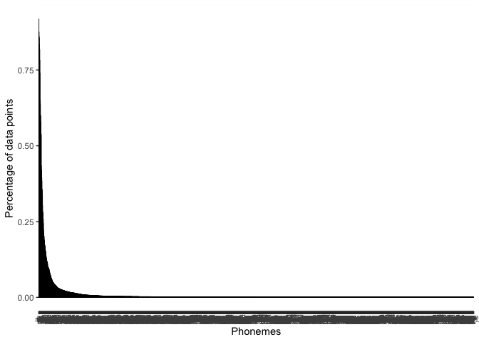

Compare PHOIBLE 2014 to 2019
================
Steven Moran &lt;<steven.moran@uzh.ch>&gt;

``` r
library(dplyr)
library(ggplot2)
# library(tidyr)
# library(testthat)
```

``` r
# 2014
p14 <- read.delim('https://raw.githubusercontent.com/clld/phoible/v2014/data/phoible-phonemes.tsv', header=T, sep = "\t", stringsAsFactors = F)
metadata <- read.csv('https://raw.githubusercontent.com/phoible/dev/master/mappings/InventoryID-LanguageCodes.csv', stringsAsFactors = F)
metadata <- metadata %>% select(InventoryID, Glottocode)
p14 <- left_join(p14, metadata, by=c("InventoryID"="InventoryID"))
head(p14)
```

    ##   InventoryID Source LanguageCode LanguageName Trump PhonemeID GlyphID
    ## 1           1    SPA          kor       Korean     1         1       1
    ## 2           1    SPA          kor       Korean     1         2       2
    ## 3           1    SPA          kor       Korean     1         3       3
    ## 4           1    SPA          kor       Korean     1         4       4
    ## 5           1    SPA          kor       Korean     1         5       5
    ## 6           1    SPA          kor       Korean     1         6       6
    ##   Phoneme     Class CombinedClass NumOfCombinedGlyphs Glottocode
    ## 1     t̠ʃʰ consonant       c-d-c-c                   4   kore1280
    ## 2      pˀ consonant           c-c                   2   kore1280
    ## 3       ʔ consonant             c                   1   kore1280
    ## 4      tˀ consonant           c-c                   2   kore1280
    ## 5       o     vowel             v                   1   kore1280
    ## 6      iː     vowel           v-d                   2   kore1280

``` r
#2019
p19 <- read.csv('https://raw.githubusercontent.com/phoible/dev/master/data/phoible.csv', stringsAsFactors = F)
head(p19)
```

    ##   InventoryID Glottocode ISO6393 LanguageName SpecificDialect   GlyphID
    ## 1           1   kore1280     kor       Korean            <NA>      0061
    ## 2           1   kore1280     kor       Korean            <NA> 0061+02D0
    ## 3           1   kore1280     kor       Korean            <NA>      00E6
    ## 4           1   kore1280     kor       Korean            <NA> 00E6+02D0
    ## 5           1   kore1280     kor       Korean            <NA>      0065
    ## 6           1   kore1280     kor       Korean            <NA> 0065+02D0
    ##   Phoneme Allophones Marginal SegmentClass Source tone stress syllabic
    ## 1       a          a       NA        vowel    spa    0      -        +
    ## 2      aː         aː       NA        vowel    spa    0      -        +
    ## 3       æ        ɛ æ       NA        vowel    spa    0      -        +
    ## 4      æː         æː       NA        vowel    spa    0      -        +
    ## 5       e          e       NA        vowel    spa    0      -        +
    ## 6      eː         eː       NA        vowel    spa    0      -        +
    ##   short long consonantal sonorant continuant delayedRelease approximant
    ## 1     -    -           -        +          +              0           +
    ## 2     -    +           -        +          +              0           +
    ## 3     -    -           -        +          +              0           +
    ## 4     -    +           -        +          +              0           +
    ## 5     -    -           -        +          +              0           +
    ## 6     -    +           -        +          +              0           +
    ##   tap trill nasal lateral labial round labiodental coronal anterior
    ## 1   -     -     -       -      -     0           0       -        0
    ## 2   -     -     -       -      -     0           0       -        0
    ## 3   -     -     -       -      -     0           0       -        0
    ## 4   -     -     -       -      -     0           0       -        0
    ## 5   -     -     -       -      -     0           0       -        0
    ## 6   -     -     -       -      -     0           0       -        0
    ##   distributed strident dorsal high low front back tense
    ## 1           0        0      +    -   +     -    -     0
    ## 2           0        0      +    -   +     -    -     0
    ## 3           0        0      +    -   +     +    -     0
    ## 4           0        0      +    -   +     +    -     0
    ## 5           0        0      +    -   -     +    -     +
    ## 6           0        0      +    -   -     +    -     +
    ##   retractedTongueRoot advancedTongueRoot periodicGlottalSource
    ## 1                   -                  -                     +
    ## 2                   -                  -                     +
    ## 3                   -                  -                     +
    ## 4                   -                  -                     +
    ## 5                   -                  -                     +
    ## 6                   -                  -                     +
    ##   epilaryngealSource spreadGlottis constrictedGlottis fortis
    ## 1                  -             -                  -      0
    ## 2                  -             -                  -      0
    ## 3                  -             -                  -      0
    ## 4                  -             -                  -      0
    ## 5                  -             -                  -      0
    ## 6                  -             -                  -      0
    ##   raisedLarynxEjective loweredLarynxImplosive click
    ## 1                    -                      -     0
    ## 2                    -                      -     0
    ## 3                    -                      -     0
    ## 4                    -                      -     0
    ## 5                    -                      -     0
    ## 6                    -                      -     0

``` r
# Number of segments
p14.segments <- p14 %>% group_by(Phoneme) %>% summarize(count=n())
p19.segments <- p19 %>% group_by(Phoneme) %>% summarize(count=n())
p14.segments$coverage <- p14.segments$count / nrow(p14.segments)
p19.segments$coverage <- p19.segments$count / nrow(p19.segments)
p14.segments <- p14.segments %>% arrange(desc(coverage))
p19.segments <- p19.segments %>% arrange(desc(coverage))
p14.segments$Rank <- seq.int(nrow(p14.segments))
p19.segments$Rank <- seq.int(nrow(p19.segments))
head(p14.segments)
```

    ## # A tibble: 6 x 4
    ##   Phoneme count coverage  Rank
    ##   <chr>   <int>    <dbl> <int>
    ## 1 m        2053    0.950     1
    ## 2 k        2016    0.933     2
    ## 3 i        1998    0.925     3
    ## 4 a        1961    0.908     4
    ## 5 j        1901    0.880     5
    ## 6 p        1873    0.867     6

``` r
head(p19.segments)
```

    ## # A tibble: 6 x 4
    ##   Phoneme count coverage  Rank
    ##   <chr>   <int>    <dbl> <int>
    ## 1 m        2914    0.918     1
    ## 2 i        2779    0.875     2
    ## 3 k        2730    0.860     3
    ## 4 j        2716    0.855     4
    ## 5 u        2646    0.833     5
    ## 6 a        2600    0.819     6

``` r
# Plot the rank group
qplot(data=p14.segments, y=count, x=Rank)
```


``` r
# Plot the rank group
qplot(data=p19.segments, y=count, x=Rank)
```


``` r
# Plot the coverage
p <- ggplot(aes(y=coverage, x=reorder(Phoneme, -coverage)), data=p14.segments) +
  geom_bar(stat="identity", width = 0.3, color = "black") +
  xlab("Phonemes") +
  ylab("Percentage of data points")
p
```


``` r
# Plot the coverage
p <- ggplot(aes(y=coverage, x=reorder(Phoneme, -coverage)), data=p19.segments) +
  geom_bar(stat="identity", width = 0.3, color = "black") +
  xlab("Phonemes") +
  ylab("Percentage of data points")
p
```



``` r
# Which phonemes arent in the other?
p14.segments[which(!(p14.segments$Phoneme %in% p19.segments$Phoneme)),]
```

    ## # A tibble: 195 x 4
    ##    Phoneme count coverage  Rank
    ##    <chr>   <int>    <dbl> <int>
    ##  1 *R̪         37  0.0171    205
    ##  2 kʼʲ        13  0.00602   340
    ##  3 *R         10  0.00463   375
    ##  4 cɕ          7  0.00324   446
    ##  5 l̪̰           7  0.00324   458
    ##  6 b̃           5  0.00231   527
    ##  7 d̃           5  0.00231   528
    ##  8 d̪ɮ̪          5  0.00231   529
    ##  9 ʰm          4  0.00185   606
    ## 10 *R̪̰          3  0.00139   663
    ## # ... with 185 more rows

``` r
p19.segments[which(!(p19.segments$Phoneme %in% p14.segments$Phoneme)),]
```

    ## # A tibble: 1,210 x 4
    ##    Phoneme count coverage  Rank
    ##    <chr>   <int>    <dbl> <int>
    ##  1 ȵ         380   0.120     59
    ##  2 ȶ         313   0.0986    68
    ##  3 ȴ         202   0.0636    91
    ##  4 n̪|n       161   0.0507   101
    ##  5 t̪|t       153   0.0482   107
    ##  6 l̺         140   0.0441   112
    ##  7 l̪|l       137   0.0431   115
    ##  8 s̪|s       136   0.0428   116
    ##  9 ɹ̺         114   0.0359   130
    ## 10 d̪|d        92   0.0290   145
    ## # ... with 1,200 more rows

``` r
# Get the intersection
p.all <- inner_join(p14.segments, p19.segments, by=c("Phoneme"="Phoneme"))
colnames(p.all) <- c("Phoneme", "Count2014", "Coverage2014", "Rank2014", "Count2019", "Coverage2019", "Rank2019")
head(p.all)
```

    ## # A tibble: 6 x 7
    ##   Phoneme Count2014 Coverage2014 Rank2014 Count2019 Coverage2019 Rank2019
    ##   <chr>       <int>        <dbl>    <int>     <int>        <dbl>    <int>
    ## 1 m            2053        0.950        1      2914        0.918        1
    ## 2 k            2016        0.933        2      2730        0.860        3
    ## 3 i            1998        0.925        3      2779        0.875        2
    ## 4 a            1961        0.908        4      2600        0.819        6
    ## 5 j            1901        0.880        5      2716        0.855        4
    ## 6 p            1873        0.867        6      2594        0.817        7

``` r
p.test <- p.all %>% head(n=75)
p.test$Phoneme <- factor(p.test$Phoneme, levels = p.test$Phoneme)

ggplot(p.test, aes(Phoneme, group = 1)) + 
  geom_line(aes(y = Coverage2014, colour = "Coverage2014")) + 
  geom_line(aes(y = Coverage2019, colour = "Coverage2019"))
```


