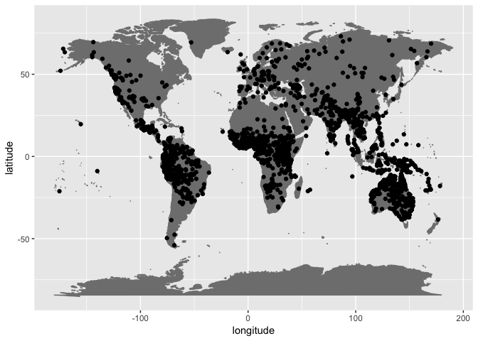

What's PHOIBLE's coverage of Glottolog?
================
Steven Moran
15 September, 2018

PHOIBLE data
============

``` r
phoible.csv <- read.table(url("https://raw.githubusercontent.com/phoible/dev/master/mappings/InventoryID-LanguageCodes.tsv"), sep="\t", header=TRUE, stringsAsFactors = FALSE, quote="\"")
glimpse(phoible.csv)
```

    ## Observations: 3,016
    ## Variables: 5
    ## $ InventoryID  <int> 1, 2, 3, 4, 5, 6, 7, 8, 9, 10, 11, 12, 13, 14, 15...
    ## $ LanguageCode <chr> "kor", "ket", "lbe", "kbd", "kat", "bsk", "kru", ...
    ## $ Glottocode   <chr> "kore1280", "kett1243", "lakk1252", "kaba1278", "...
    ## $ LanguageName <chr> "Korean", "Ket", "Lak", "Kabardian", "Georgian", ...
    ## $ Source       <chr> "spa", "spa", "spa", "spa", "spa", "spa", "spa", ...

``` r
# PHOIBLE inventory data contains duplicate Glottocodes -- remove for coverage analysis
phoible.gcodes <- phoible.csv %>% select(Glottocode) %>% distinct()
dim(phoible.gcodes)
```

    ## [1] 2139    1

Glottolog data
==============

``` r
load('/Users/stiv/Github/glottolog-scripts/coverage/glottolog-families-isolates.Rdata')
```

Isolates coverage
=================

``` r
# Isolates in phoible
isolates$in.phoible <- isolates$id %in% phoible.gcodes$Glottocode
table(isolates$in.phoible)
```

    ## 
    ## FALSE  TRUE 
    ##   116    72

``` r
# Add macroarea data
isolates <- left_join(isolates, languages.geo)
```

    ## Joining, by = c("name", "level", "latitude", "longitude")

``` r
# Isolates in and not in phoible
isolates.not.in.phoible <- isolates %>% filter(!in.phoible)
isolates.in.phoible <- isolates %>% filter(in.phoible)
```

``` r
# Isolates in phoible
ggplot(data=isolates.in.phoible, aes(x=longitude,y=latitude)) + borders("world", colour="gray50", fill="gray50") + geom_point()
```


``` r
# Isolates NOT in phoible
ggplot(data=isolates.not.in.phoible, aes(x=longitude,y=latitude)) + borders("world", colour="gray50", fill="gray50") + geom_point()
```


``` r
# isolates in phoible by macroarea
table(isolates.in.phoible$macroarea)
```

    ## 
    ##        Africa     Australia       Eurasia North America     Papunesia 
    ##             7             8             4            11             7 
    ## South America 
    ##            35

``` r
# isolates not in phoible by macroarea
table(isolates.not.in.phoible$macroarea)
```

    ## 
    ##        Africa     Australia       Eurasia North America     Papunesia 
    ##             9             1             9            20            48 
    ## South America 
    ##            29

Isolates missing in phoible
---------------------------

``` r
# Isolates missing in phoible
kable(isolates %>% filter(!in.phoible) %>% select(id, name, isocodes, macroarea), caption = "Isolates not in phoible.")
```

| id       | name                                 | isocodes | macroarea     |
|:---------|:-------------------------------------|:---------|:--------------|
| abin1243 | Abinomn                              | bsa      | Papunesia     |
| abun1252 | Abun                                 | kgr      | Papunesia     |
| adai1235 | Adai                                 | xad      | North America |
| alse1251 | Alsea-Yaquina                        | aes      | North America |
| anda1286 | Andaqui                              | ana      | South America |
| anem1249 | Anem                                 | anz      | Papunesia     |
| apma1241 | Ap Ma                                | kbx      | Papunesia     |
| arut1244 | Arutani                              | atx      | South America |
| atac1235 | Atacame                              |          | South America |
| atak1252 | Atakapa                              | aqp      | North America |
| bana1292 | Banaro                               | byz      | Papunesia     |
| bang1363 | Bangime                              | dba      | Africa        |
| beot1247 | Beothuk                              | bue      | North America |
| beto1236 | Betoi-Jirara                         |          | South America |
| bira1253 | Ongota                               | bxe      | Africa        |
| boga1247 | Bogaya                               | boq      | Papunesia     |
| burm1264 | Burmeso                              | bzu      | Papunesia     |
| cani1243 | Canichana                            | caz      | South America |
| cayu1241 | Cayuse                               | xcy      | North America |
| cent2045 | Jalaa                                | cet      | Africa        |
| chit1248 | Chitimacha                           | ctm      | North America |
| chon1248 | Chono                                |          | South America |
| coah1252 | Coahuilteco                          | xcw      | North America |
| come1251 | Comecrudan                           | xcm      | North America |
| coto1248 | Cotoname                             | xcn      | North America |
| cuit1236 | Cuitlatec                            |          | North America |
| cull1235 | Culli                                |          | South America |
| dama1272 | Damal                                | uhn      | Papunesia     |
| demm1245 | Dem                                  | dem      | Papunesia     |
| dibi1240 | Dibiyaso                             | dby      | Papunesia     |
| duna1248 | Duna                                 | duc      | Papunesia     |
| elam1244 | Elamite                              | elx      | Eurasia       |
| else1239 | Elseng                               | mrf      | Papunesia     |
| esse1238 | Esselen                              | esq      | North America |
| etru1241 | Etruscan                             | ett      | Eurasia       |
| guac1239 | Guachi                               |          | South America |
| guai1237 | Guaicurian                           |          | North America |
| guam1236 | Guamo                                |          | South America |
| gule1241 | Gule                                 | gly      | Africa        |
| guri1248 | Guriaso                              | grx      | Papunesia     |
| hatt1246 | Hattic                               | xht      | Eurasia       |
| hrus1242 | Hruso                                | hru      | Eurasia       |
| iber1250 | Iberian                              | xib      | Eurasia       |
| jira1235 | Jirajaran                            |          | South America |
| kaki1249 | Kaki Ae                              | tbd      | Papunesia     |
| kapo1250 | Kapori                               | khp      | Papunesia     |
| kara1289 | Karankawa                            | zkk      | North America |
| kara1497 | Karami                               | xar      | Papunesia     |
| kaur1271 | Kaure-Narau                          | bpp      | Papunesia     |
| kehu1238 | Kehu                                 | khh      | Papunesia     |
| kemb1250 | Kembra                               | xkw      | Papunesia     |
| kena1236 | Kenaboi                              | xbn      | Eurasia       |
| kibi1239 | Kibiri                               | prm      | Papunesia     |
| kimk1238 | Kimki                                | sbt      | Papunesia     |
| kolp1236 | Kol (Papua New Guinea)               | kol      | Papunesia     |
| kosa1251 | Kosadle                              | kiq      | Papunesia     |
| kuja1239 | Kujarge                              | vkj      | Africa        |
| kute1249 | Kutenai                              | kut      | North America |
| laal1242 | Laal                                 | gdm      | Africa        |
| lafo1243 | Lafofa                               | laf      | Africa        |
| lule1238 | Lule                                 |          | South America |
| maku1246 | Máku                                 | xak      | South America |
| mara1266 | Maratino                             |          | North America |
| mass1263 | Massep                               | mvs      | Papunesia     |
| mata1275 | Matanawí                             |          | South America |
| mawe1251 | Mawes                                | mgk      | Papunesia     |
| mero1237 | Meroitic                             | xmr      | Africa        |
| mimi1240 | Mimi-Gaudefroy                       |          | Africa        |
| molo1262 | Molof                                | msl      | Papunesia     |
| moro1289 | Marori                               | mok      | Papunesia     |
| mpur1239 | Mpur                                 | akc      | Papunesia     |
| mure1235 | Mure                                 |          | South America |
| natc1249 | Natchez                              | ncz      | North America |
| niha1238 | Nihali                               | nll      | Eurasia       |
| odia1239 | Odiai                                | bhf      | Papunesia     |
| omur1241 | Omurano                              | omu      | South America |
| otii1244 | Oti                                  | oti      | South America |
| otom1276 | Otomaco-Taparita                     |          | South America |
| oyst1235 | Oyster Bay-Big River-Little Swanport |          | Australia     |
| pank1250 | Pankararú                            | paz      | South America |
| papi1255 | Papi                                 | ppe      | Papunesia     |
| pawa1255 | Pawaia                               | pwa      | Papunesia     |
| paya1236 | Payagua                              |          | South America |
| pele1245 | Pele-Ata                             | ata      | Papunesia     |
| puqu1242 | Puquina                              | puq      | South America |
| pura1257 | Purari                               | iar      | Papunesia     |
| pyuu1245 | Pyu                                  | pby      | Papunesia     |
| rama1271 | Ramanos                              |          | South America |
| sali1253 | Salinan                              | sln      | North America |
| sape1238 | Sapé                                 | spc      | South America |
| saus1247 | Sause                                | sao      | Papunesia     |
| sech1236 | Sechuran                             |          | South America |
| shom1245 | Shom Peng                            | sii      | Eurasia       |
| sius1254 | Siuslaw                              | sis      | North America |
| suar1238 | Asabano                              | seo      | Papunesia     |
| sulk1246 | Sulka                                | sua      | Papunesia     |
| sume1241 | Sumerian                             | sux      | Eurasia       |
| tabo1241 | Tabo                                 | knv      | Papunesia     |
| taia1239 | Taiap                                | gpn      | Papunesia     |
| take1257 | Takelma                              | tkm      | North America |
| tall1235 | Tallán                               |          | South America |
| tamb1257 | Tambora                              | xxt      | Papunesia     |
| tana1288 | Tanahmerah                           | tcm      | Papunesia     |
| taru1236 | Taruma                               | tdm      | South America |
| timo1237 | Timote-Cuica                         |          | South America |
| timu1245 | Timucua                              | tjm      | North America |
| touo1238 | Touo                                 | tqu      | Papunesia     |
| tuxa1239 | Tuxá                                 | tud      | South America |
| usku1243 | Usku                                 | ulf      | Papunesia     |
| wiru1244 | Wiru                                 | wiu      | Papunesia     |
| xuku1239 | Xukurú                               | xoo      | South America |
| yale1246 | Yale                                 | nce      | Papunesia     |
| yele1255 | Yele                                 | yle      | Papunesia     |
| yera1243 | Yerakai                              | yra      | Papunesia     |
| yetf1238 | Yetfa                                | yet      | Papunesia     |
| yuru1243 | Yurumanguí                           |          | South America |

``` r
# Get phoible coverage for language families
families.glottocodes$in.phoible <- families.glottocodes$id %in% phoible.gcodes$Glottocode
glimpse(families.glottocodes)
```

    ## Observations: 8,293
    ## Variables: 17
    ## $ id                   <chr> "aari1239", "aari1240", "aasa1238", "abad...
    ## $ family_id            <chr> "sout2845", "book1242", "afro1255", "aust...
    ## $ parent_id            <chr> "aari1238", "book1242", "unun9872", "west...
    ## $ name                 <chr> "Aari", "Aariya", "Aasax", "Abadi", "Abag...
    ## $ bookkeeping          <chr> "False", "True", "False", "False", "False...
    ## $ level                <chr> "language", "language", "language", "lang...
    ## $ status               <chr> "safe", "safe", "extinct", "safe", "criti...
    ## $ latitude             <dbl> 5.950340, NA, -4.006790, -9.033890, -6.12...
    ## $ longitude            <dbl> 36.57210, NA, 36.86480, 146.99200, 145.66...
    ## $ iso639P3code         <chr> "aiw", "aay", "aas", "kbt", "abg", "abf",...
    ## $ description          <lgl> NA, NA, NA, NA, NA, NA, NA, NA, NA, NA, N...
    ## $ markup_description   <lgl> NA, NA, NA, NA, NA, NA, NA, NA, NA, NA, N...
    ## $ child_family_count   <int> 0, 0, 0, 0, 0, 0, 0, 0, 0, 0, 0, 0, 0, 0,...
    ## $ child_language_count <int> 0, 0, 0, 0, 0, 0, 0, 0, 0, 0, 0, 0, 0, 0,...
    ## $ child_dialect_count  <int> 0, 0, 0, 0, 0, 0, 0, 0, 0, 0, 3, 4, 0, 2,...
    ## $ country_ids          <chr> "ET", "IN", "TZ", "PG", "PG", "MY", "MY",...
    ## $ in.phoible           <lgl> TRUE, FALSE, FALSE, FALSE, FALSE, FALSE, ...

``` r
# How many data points in phoible in or not in Glottolog?
table(families.glottocodes$in.phoible)
```

    ## 
    ## FALSE  TRUE 
    ##  6342  1951

``` r
# Which Glottocodes are in phoible are not in the Glottolog?
table(phoible.gcodes$Glottocode %in% families.glottocodes$id)
```

    ## 
    ## FALSE  TRUE 
    ##   188  1951

``` r
# 188 FALSE -- some may be due to isolates
```

``` r
# which(!phoible.gcodes$Glottocode %in% families.glottocodes$id)
# phoible.gcodes$Glottocode
```

Global coverage of phoible
--------------------------

``` r
in.phoible <- families.glottocodes %>% filter(in.phoible)
ggplot(data=in.phoible, aes(x=longitude,y=latitude)) + borders("world", colour="gray50", fill="gray50") + geom_point()
```

    ## Warning: Removed 7 rows containing missing values (geom_point).



Languages not in phoible
------------------------

``` r
not.in.phoible <- families.glottocodes %>% filter(!in.phoible)
ggplot(data=not.in.phoible, aes(x=longitude,y=latitude)) + borders("world", colour="gray50", fill="gray50") + geom_point()
```

    ## Warning: Removed 703 rows containing missing values (geom_point).


What kind of macroarea coverage does phoible have?
==================================================

``` r
languages.geo$in.phoible <- languages.geo$glottocode %in% phoible.gcodes$Glottocode
table(languages.geo$in.phoible)
```

    ## 
    ## FALSE  TRUE 
    ##  6348  2023

``` r
# Get Glottolog macroareas
# This should be filtered in the Glottolog data extraction script, but just in case
languages.geo <- languages.geo %>% filter(level=="language") %>% filter(macroarea!="")
```

``` r
# Get Glottolog macroarea counts
glottolog.macroarea.counts <- languages.geo %>% group_by(macroarea) %>% summarise(glottolog.count=n())
glottolog.macroarea.counts
```

    ## # A tibble: 6 x 2
    ##   macroarea     glottolog.count
    ##   <chr>                   <int>
    ## 1 Africa                   2338
    ## 2 Australia                 383
    ## 3 Eurasia                  1966
    ## 4 North America             784
    ## 5 Papunesia                2197
    ## 6 South America             703

``` r
# Get phoible macroarea counts
phoible.macroarea.counts <- languages.geo %>% filter(in.phoible) %>% group_by(macroarea) %>% summarise(phoible.count=n())
```

``` r
# Join counts and get percentage
macroarea.counts <- left_join(glottolog.macroarea.counts, phoible.macroarea.counts)
```

    ## Joining, by = "macroarea"

``` r
macroarea.counts$percentage <- macroarea.counts$phoible.count / macroarea.counts$glottolog.count
kable(macroarea.counts)
```

| macroarea     |  glottolog.count|  phoible.count|  percentage|
|:--------------|----------------:|--------------:|-----------:|
| Africa        |             2338|            692|   0.2959795|
| Australia     |              383|            261|   0.6814621|
| Eurasia       |             1966|            417|   0.2121058|
| North America |              784|            143|   0.1823980|
| Papunesia     |             2197|            186|   0.0846609|
| South America |              703|            324|   0.4608819|

``` r
# We have very poor coverage of "Papunesia"
```

By language family
==================

``` r
# Get Glottolog family counts
glottolog.family.counts <- families.glottocodes %>% group_by(family_id) %>% summarize(glottolog.count=n())
# 241 families without isolates (?)
```

``` r
# Get phoible family counts
phoible.family.counts <- families.glottocodes %>% filter(in.phoible) %>% group_by(family_id) %>% summarise(phoible.count=n())
```

``` r
# Join the family counts and get percentage
family.counts <- left_join(glottolog.family.counts, phoible.family.counts)
```

    ## Joining, by = "family_id"

``` r
family.counts$percentage <- family.counts$phoible.count / family.counts$glottolog.count
kable(family.counts)
```

| family\_id |  glottolog.count|  phoible.count|  percentage|
|:-----------|----------------:|--------------:|-----------:|
| abkh1242   |                5|              3|   0.6000000|
| afro1255   |              373|            103|   0.2761394|
| ainu1252   |                3|              1|   0.3333333|
| algi1248   |               45|              6|   0.1333333|
| amto1249   |                2|             NA|          NA|
| anga1289   |               13|              1|   0.0769231|
| anim1240   |               17|             NA|          NA|
| araf1243   |                3|             NA|          NA|
| arau1255   |                2|              1|   0.5000000|
| araw1281   |               78|             42|   0.5384615|
| araw1282   |                6|              5|   0.8333333|
| arti1236   |               16|             NA|          NA|
| atha1245   |               45|             10|   0.2222222|
| atla1278   |             1435|            407|   0.2836237|
| aust1305   |              159|             39|   0.2452830|
| aust1307   |             1276|            112|   0.0877743|
| ayma1253   |                3|              2|   0.6666667|
| baib1250   |                2|             NA|          NA|
| bain1263   |                6|              1|   0.1666667|
| barb1265   |                6|              4|   0.6666667|
| bayo1259   |                2|             NA|          NA|
| book1242   |              399|              8|   0.0200501|
| bora1262   |                2|              2|   1.0000000|
| bord1247   |               15|              3|   0.2000000|
| boro1281   |                3|              2|   0.6666667|
| bosa1245   |                7|             NA|          NA|
| bula1259   |                2|             NA|          NA|
| buna1274   |                2|              2|   1.0000000|
| cadd1255   |                5|              2|   0.4000000|
| cahu1265   |                3|              2|   0.6666667|
| cari1283   |               42|             24|   0.5714286|
| cent2225   |               63|             22|   0.3492063|
| chap1271   |               12|              2|   0.1666667|
| char1238   |                3|             NA|          NA|
| chib1249   |               27|             11|   0.4074074|
| chim1311   |                2|              1|   0.5000000|
| chin1490   |                4|             NA|          NA|
| choc1280   |                9|              6|   0.6666667|
| chon1288   |                4|              2|   0.5000000|
| chuk1271   |                5|              4|   0.8000000|
| chum1262   |                6|              1|   0.1666667|
| coch1271   |               11|              2|   0.1818182|
| coos1248   |                2|             NA|          NA|
| daga1274   |                9|             NA|          NA|
| daju1249   |                7|              1|   0.1428571|
| dizo1235   |                3|              1|   0.3333333|
| dogo1299   |               20|              2|   0.1000000|
| doso1238   |                2|             NA|          NA|
| drav1251   |               80|             31|   0.3875000|
| east1459   |                3|             NA|          NA|
| east2374   |                2|              1|   0.5000000|
| east2386   |                4|              1|   0.2500000|
| east2433   |                6|              1|   0.1666667|
| east2499   |                2|             NA|          NA|
| east2503   |                4|             NA|          NA|
| eski1264   |               12|              5|   0.4166667|
| fura1235   |                2|              1|   0.5000000|
| garr1260   |                2|              2|   1.0000000|
| geel1240   |               10|             NA|          NA|
| giim1238   |                3|              3|   1.0000000|
| goil1242   |                6|              1|   0.1666667|
| gong1255   |               19|              9|   0.4736842|
| grea1241   |               10|              1|   0.1000000|
| guah1252   |                5|              4|   0.8000000|
| guai1249   |                5|              5|   1.0000000|
| gumu1250   |                3|              1|   0.3333333|
| gunw1250   |               12|              9|   0.7500000|
| haid1248   |                2|              1|   0.5000000|
| hara1260   |                2|              1|   0.5000000|
| hata1242   |                2|             NA|          NA|
| heib1242   |               10|              6|   0.6000000|
| hibi1242   |                2|              1|   0.5000000|
| hmon1336   |               39|              2|   0.0512821|
| huar1251   |                2|             NA|          NA|
| huav1256   |                4|              1|   0.2500000|
| huit1251   |                7|              4|   0.5714286|
| hurr1239   |                2|             NA|          NA|
| ijoi1239   |               10|              6|   0.6000000|
| inan1242   |                2|             NA|          NA|
| indo1319   |              584|            137|   0.2345890|
| iroq1247   |               11|              3|   0.2727273|
| iwai1246   |                4|              3|   0.7500000|
| japo1237   |               15|              3|   0.2000000|
| jara1244   |                2|              1|   0.5000000|
| jarr1235   |                3|              2|   0.6666667|
| jica1245   |                2|              1|   0.5000000|
| jiva1245   |                4|              4|   1.0000000|
| jodi1234   |                4|              3|   0.7500000|
| kadu1256   |                6|              6|   1.0000000|
| kaku1242   |                2|              2|   1.0000000|
| kala1402   |                3|             NA|          NA|
| kama1371   |                4|             NA|          NA|
| kamu1264   |                3|             NA|          NA|
| kari1254   |                2|             NA|          NA|
| kart1248   |                6|              4|   0.6666667|
| katl1246   |                3|             NA|          NA|
| katu1274   |                2|             NA|          NA|
| kawe1237   |                3|              1|   0.3333333|
| kaya1327   |                3|             NA|          NA|
| kere1287   |                2|              1|   0.5000000|
| khoe1240   |               14|              2|   0.1428571|
| kiow1265   |                8|              5|   0.6250000|
| kiwa1251   |                6|              1|   0.1666667|
| koia1260   |                8|              1|   0.1250000|
| kolo1268   |                3|              1|   0.3333333|
| koma1264   |                4|              4|   1.0000000|
| kond1302   |                2|              1|   0.5000000|
| kore1284   |                2|              1|   0.5000000|
| kres1240   |                2|              2|   1.0000000|
| kuli1252   |                3|              3|   1.0000000|
| kwal1257   |                3|             NA|          NA|
| kwer1242   |                8|             NA|          NA|
| kwom1263   |                2|             NA|          NA|
| kxaa1236   |                5|              2|   0.4000000|
| lake1255   |               20|             NA|          NA|
| left1242   |                6|             NA|          NA|
| lenc1239   |                2|             NA|          NA|
| leng1261   |                5|             NA|          NA|
| lepk1239   |                2|             NA|          NA|
| limi1242   |                2|              1|   0.5000000|
| lowe1437   |               30|             NA|          NA|
| maba1274   |               10|              2|   0.2000000|
| maid1262   |                4|              1|   0.2500000|
| mail1249   |                8|             NA|          NA|
| mair1253   |                3|             NA|          NA|
| mand1469   |               75|             43|   0.5733333|
| mang1423   |                4|              4|   1.0000000|
| mani1293   |                4|              4|   1.0000000|
| manu1261   |                2|             NA|          NA|
| maoo1243   |                4|              1|   0.2500000|
| marr1257   |                2|              2|   1.0000000|
| mata1289   |                7|              4|   0.5714286|
| maya1287   |               33|             12|   0.3636364|
| mirn1241   |                5|              5|   1.0000000|
| misu1242   |                5|              1|   0.2000000|
| miwo1274   |               11|              2|   0.1818182|
| mixe1284   |               19|              6|   0.3157895|
| mixe1287   |               24|              2|   0.0833333|
| momb1255   |                2|             NA|          NA|
| mong1329   |               17|             11|   0.6470588|
| mong1343   |                3|             NA|          NA|
| monu1249   |                2|             NA|          NA|
| more1255   |               19|             NA|          NA|
| musk1252   |                7|              4|   0.5714286|
| nada1235   |                4|              4|   1.0000000|
| nakh1245   |               34|             13|   0.3823529|
| namb1299   |                6|              4|   0.6666667|
| naml1239   |                2|             NA|          NA|
| narr1279   |                8|              5|   0.6250000|
| nduu1242   |               13|              3|   0.2307692|
| nilo1247   |               54|             26|   0.4814815|
| nimb1257   |                5|              1|   0.2000000|
| nort1442   |                2|             NA|          NA|
| nort1547   |                2|              1|   0.5000000|
| nort2923   |               15|              2|   0.1333333|
| nort2933   |                4|              1|   0.2500000|
| nubi1251   |               13|              1|   0.0769231|
| nucl1580   |                5|              1|   0.2000000|
| nucl1708   |               55|              6|   0.1090909|
| nucl1709   |              315|             28|   0.0888889|
| nucl1710   |               30|             18|   0.6000000|
| nyim1244   |                2|              2|   1.0000000|
| nyul1248   |               10|             10|   1.0000000|
| otom1299   |              180|             17|   0.0944444|
| paho1240   |                2|             NA|          NA|
| pala1350   |                2|              1|   0.5000000|
| pama1250   |              248|            183|   0.7379032|
| pano1259   |               45|             23|   0.5111111|
| pauw1244   |                5|             NA|          NA|
| peba1241   |                3|              2|   0.6666667|
| piaw1238   |                2|             NA|          NA|
| pidg1258   |               80|              1|   0.0125000|
| pomo1273   |                7|              2|   0.2857143|
| puri1261   |                2|              1|   0.5000000|
| quec1387   |               45|             23|   0.5111111|
| rash1249   |                2|             NA|          NA|
| saha1239   |                5|              1|   0.2000000|
| saha1256   |               10|              4|   0.4000000|
| sali1255   |               25|             10|   0.4000000|
| sena1264   |                2|              1|   0.5000000|
| sent1261   |                4|              1|   0.2500000|
| sepi1257   |               36|              7|   0.1944444|
| shas1238   |                3|              1|   0.3333333|
| sign1238   |              183|             NA|          NA|
| sino1245   |              491|             85|   0.1731161|
| siou1252   |               18|              3|   0.1666667|
| skoo1245   |                9|              3|   0.3333333|
| soma1242   |                2|             NA|          NA|
| song1307   |               10|              4|   0.4000000|
| sout1293   |                2|             NA|          NA|
| sout1516   |                6|              1|   0.1666667|
| sout2772   |                2|              2|   1.0000000|
| sout2845   |                5|              3|   0.6000000|
| sout2948   |                9|              1|   0.1111111|
| spee1234   |                7|             NA|          NA|
| suki1244   |                4|             NA|          NA|
| surm1244   |               11|              5|   0.4545455|
| taik1256   |               94|             18|   0.1914894|
| tama1329   |                4|              1|   0.2500000|
| tang1340   |                4|              3|   0.7500000|
| tara1323   |                2|              1|   0.5000000|
| taul1250   |                2|             NA|          NA|
| tebe1251   |                2|              1|   0.5000000|
| teme1251   |                2|              2|   1.0000000|
| tequ1244   |                3|             NA|          NA|
| ticu1244   |                2|              1|   0.5000000|
| timo1261   |               23|              2|   0.0869565|
| toro1256   |               13|             NA|          NA|
| toto1251   |               12|              3|   0.2500000|
| tsim1258   |                3|              2|   0.6666667|
| tuca1253   |               26|             18|   0.6923077|
| tung1282   |               13|              5|   0.3846154|
| tupi1275   |               71|             48|   0.6760563|
| tura1263   |                4|             NA|          NA|
| turk1311   |               44|             21|   0.4772727|
| tuuu1241   |                8|              1|   0.1250000|
| unat1236   |               68|             NA|          NA|
| uncl1493   |              121|              1|   0.0082645|
| ural1272   |               48|             28|   0.5833333|
| uruc1242   |                2|              2|   1.0000000|
| utoa1244   |               69|             15|   0.2173913|
| waka1280   |                6|              2|   0.3333333|
| wali1264   |                4|             NA|          NA|
| west1493   |                5|             NA|          NA|
| west1503   |                2|             NA|          NA|
| west2434   |               11|              6|   0.5454545|
| west2604   |                3|             NA|          NA|
| wint1258   |                2|              1|   0.5000000|
| worr1236   |               10|              6|   0.6000000|
| xinc1237   |                5|             NA|          NA|
| yang1287   |                3|              2|   0.6666667|
| yano1268   |                5|              4|   0.8000000|
| yare1250   |                5|              1|   0.2000000|
| yawa1259   |                2|              1|   0.5000000|
| yeni1252   |                5|              1|   0.2000000|
| yoku1255   |                4|             NA|          NA|
| yuat1252   |                5|             NA|          NA|
| yuka1259   |                4|              2|   0.5000000|
| yuki1242   |                2|              2|   1.0000000|
| zamu1243   |                3|              2|   0.6666667|
| zapa1251   |                6|              4|   0.6666667|
