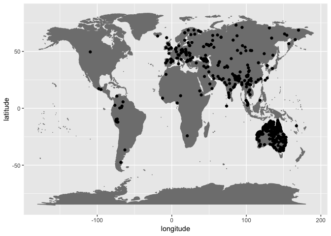

Which languages and which segments in PHOIBLE are missing feature vectors?
================
Steven Moran
21 November, 2018

``` r
# PHOIBLE dev data that includes ER inventories
load('phoible-by-phoneme.RData')

# Get segments missing feature vectors -- assuming that if [high] is NA, then the segment is not specified
df <- mutate(final.data, missing.segment = ifelse(is.na(high), TRUE, FALSE))
rm(final.data)

# TODO: fix the data types in the aggregated data... argh
df$InventoryID <- as.integer(as.character(df$InventoryID))
```

``` r
# The current aggregated phoible dev data does not contain Glottocodes -- add em via the phoible inventory
phoible.csv <- read.table(url("https://raw.githubusercontent.com/phoible/dev/master/mappings/InventoryID-LanguageCodes.tsv"), sep="\t", header=TRUE, stringsAsFactors = FALSE, quote="\"")

df <- left_join(df, phoible.csv)
```

    ## Joining, by = c("LanguageCode", "LanguageName", "Source", "InventoryID")

    ## Warning: Column `Source` joining factor and character vector, coercing into
    ## character vector

``` r
glimpse(df)
```

    ## Observations: 105,092
    ## Variables: 48
    ## $ LanguageCode           <chr> "kor", "kor", "kor", "kor", "kor", "kor...
    ## $ LanguageName           <chr> "Korean", "Korean", "Korean", "Korean",...
    ## $ SpecificDialect        <chr> NA, NA, NA, NA, NA, NA, NA, NA, NA, NA,...
    ## $ Phoneme                <chr> "a", "aː", "e", "eː", "h", "i", "iː", "...
    ## $ Allophones             <chr> "a", "aː", "e", "eː", "ç h ɦ", "i", "iː...
    ## $ Source                 <chr> "spa", "spa", "spa", "spa", "spa", "spa...
    ## $ Trump                  <lgl> FALSE, FALSE, FALSE, FALSE, FALSE, FALS...
    ## $ GlyphID                <chr> "0061", "0061+02D0", "0065", "0065+02D0...
    ## $ InventoryID            <int> 1, 1, 1, 1, 1, 1, 1, 1, 1, 1, 1, 1, 1, ...
    ## $ tone                   <chr> "0", "0", "0", "0", "0", "0", "0", "0",...
    ## $ stress                 <chr> "-", "-", "-", "-", "-", "-", "-", "-",...
    ## $ syllabic               <chr> "+", "+", "+", "+", "-", "+", "+", "-",...
    ## $ short                  <chr> "-", "-", "-", "-", "-", "-", "-", "-",...
    ## $ long                   <chr> "-", "+", "-", "+", "-", "-", "+", "-",...
    ## $ consonantal            <chr> "-", "-", "-", "-", "-", "-", "-", "-",...
    ## $ sonorant               <chr> "+", "+", "+", "+", "-", "+", "+", "+",...
    ## $ continuant             <chr> "+", "+", "+", "+", "+", "+", "+", "+",...
    ## $ delayedRelease         <chr> "0", "0", "0", "0", "+", "0", "0", "0",...
    ## $ approximant            <chr> "+", "+", "+", "+", "-", "+", "+", "+",...
    ## $ tap                    <chr> "-", "-", "-", "-", "-", "-", "-", "-",...
    ## $ trill                  <chr> "-", "-", "-", "-", "-", "-", "-", "-",...
    ## $ nasal                  <chr> "-", "-", "-", "-", "-", "-", "-", "-",...
    ## $ lateral                <chr> "-", "-", "-", "-", "-", "-", "-", "-",...
    ## $ labial                 <chr> "-", "-", "-", "-", "-", "-", "-", "-",...
    ## $ round                  <chr> "0", "0", "0", "0", "0", "0", "0", "0",...
    ## $ labiodental            <chr> "0", "0", "0", "0", "0", "0", "0", "0",...
    ## $ coronal                <chr> "-", "-", "-", "-", "-", "-", "-", "-",...
    ## $ anterior               <chr> "0", "0", "0", "0", "0", "0", "0", "0",...
    ## $ distributed            <chr> "0", "0", "0", "0", "0", "0", "0", "0",...
    ## $ strident               <chr> "0", "0", "0", "0", "0", "0", "0", "0",...
    ## $ dorsal                 <chr> "+", "+", "+", "+", "-", "+", "+", "+",...
    ## $ high                   <chr> "-", "-", "-", "-", "0", "+", "+", "+",...
    ## $ low                    <chr> "+", "+", "-", "-", "0", "-", "-", "-",...
    ## $ front                  <chr> "-", "-", "+", "+", "0", "+", "+", "+",...
    ## $ back                   <chr> "-", "-", "-", "-", "0", "-", "-", "-",...
    ## $ tense                  <chr> "0", "0", "+", "+", "0", "+", "+", "+",...
    ## $ retractedTongueRoot    <chr> "-", "-", "-", "-", "0", "-", "-", "0",...
    ## $ advancedTongueRoot     <chr> "-", "-", "-", "-", "0", "-", "-", "0",...
    ## $ periodicGlottalSource  <chr> "+", "+", "+", "+", "-", "+", "+", "+",...
    ## $ epilaryngealSource     <chr> "-", "-", "-", "-", "-", "-", "-", "-",...
    ## $ spreadGlottis          <chr> "-", "-", "-", "-", "+", "-", "-", "-",...
    ## $ constrictedGlottis     <chr> "-", "-", "-", "-", "-", "-", "-", "-",...
    ## $ fortis                 <chr> "0", "0", "0", "0", "-", "0", "0", "-",...
    ## $ raisedLarynxEjective   <chr> "-", "-", "-", "-", "-", "-", "-", "-",...
    ## $ loweredLarynxImplosive <chr> "-", "-", "-", "-", "-", "-", "-", "-",...
    ## $ click                  <chr> "0", "0", "0", "0", "-", "0", "0", "-",...
    ## $ missing.segment        <lgl> FALSE, FALSE, FALSE, FALSE, FALSE, FALS...
    ## $ Glottocode             <chr> "kore1280", "kore1280", "kore1280", "ko...

``` r
# Add in the Glottolog geo data
# See: https://github.com/bambooforest/glottolog-scripts/blob/master/coverage/get_glottolog_data.md
load('glottolog-families-isolates.Rdata')
rm(families.counts, families.glottocodes)
df <- left_join(df, languages.geo, by=c("Glottocode"="glottocode"))
```

``` r
# Identify which inventories have a missing segment feature vector
missing.ids <- df %>% group_by(InventoryID, Glottocode, LanguageName, Source, latitude, longitude, macroarea) %>% filter(missing.segment) %>% distinct(InventoryID)
```

``` r
# How many inventories contain segments without features AND no Glottocode?
table(is.na(missing.ids$Glottocode))
```

    ## 
    ## FALSE  TRUE 
    ##   609   116

``` r
# Which ones?
missing.ids %>% filter(is.na(Glottocode))
```

    ## # A tibble: 116 x 7
    ## # Groups:   InventoryID, Glottocode, LanguageName, Source, latitude,
    ## #   longitude, macroarea [116]
    ##    LanguageName Source InventoryID Glottocode macroarea latitude longitude
    ##    <chr>        <chr>        <int> <chr>      <chr>        <dbl>     <dbl>
    ##  1 !Xun         gm            1383 <NA>       <NA>            NA        NA
    ##  2 Estonian     uz            2181 <NA>       <NA>            NA        NA
    ##  3 Tod Tibetan  ea            2264 <NA>       <NA>            NA        NA
    ##  4 Beserman     ea            2268 <NA>       <NA>            NA        NA
    ##  5 Modern Aram… ea            2281 <NA>       <NA>            NA        NA
    ##  6 Puxi         ea            2298 <NA>       <NA>            NA        NA
    ##  7 Rgyalthang … ea            2327 <NA>       <NA>            NA        NA
    ##  8 Northern Cu… ea            2350 <NA>       <NA>            NA        NA
    ##  9 Lizu         ea            2352 <NA>       <NA>            NA        NA
    ## 10 Zuberoan Ba… ea            2381 <NA>       <NA>            NA        NA
    ## # ... with 106 more rows

``` r
# Of the inventories with missing segment feature vectors (that are not NA Glottocode), where are they?
ggplot(data=missing.ids, aes(x=longitude,y=latitude)) + borders("world", colour="gray50", fill="gray50") + geom_point()
```

    ## Warning: Removed 156 rows containing missing values (geom_point).



``` r
# And which sources do they belong to?
table(missing.ids$Source)
```

    ## 
    ##     ea     er     gm saphon  upsid     uz 
    ##    265    381      2     16      2     59

``` r
# And which areas do they belong to? This shows most are from Erich's Australian database or Dmitry's Eurasian.
table(missing.ids$macroarea)
```

    ## 
    ##        Africa     Australia       Eurasia North America     Papunesia 
    ##             7           274           274             3             3 
    ## South America 
    ##            17

``` r
# Total number of distinct segments in PHOIBLE
nrow(df %>% select(Phoneme) %>% group_by(Phoneme) %>% unique())
```

    ## [1] 3220

``` r
# Total number of distinct segments without feature vectors. These need to be added... by hand? Argh!
nrow(df %>% filter(missing.segment) %>% select(Phoneme) %>% group_by(Phoneme) %>% unique())
```

    ## [1] 1050

``` r
# Sort languages by number of segments missing feature vectors.
## Get phonemes per inventory counts
phoneme.counts <- df %>% select(InventoryID, Phoneme) %>% group_by(InventoryID) %>% summarize(phoneme.counts = n())
## Get phonemes per inventory counts where their feature vectors are NA
phoneme.counts.missing <- df %>% filter(missing.segment) %>% select(InventoryID, Phoneme) %>% group_by(InventoryID) %>% summarize(phoneme.counts.missing = n())

x <- left_join(phoneme.counts, phoneme.counts.missing)
```

    ## Joining, by = "InventoryID"

``` r
missing.ids <- left_join(missing.ids, x)
```

    ## Joining, by = "InventoryID"

``` r
rm(x, phoneme.counts, phoneme.counts.missing)

# How many lanugages have how many missing segments with feature vectors?
table(missing.ids$phoneme.counts.missing)
```

    ## 
    ##   1   2   3   4   5   6   7   8   9  10  11  12  13  14  17  18  20  24 
    ##  77  66 230 130  53  29  30  27  29  13  12   9   3   3   3   2   2   2 
    ##  29  33  39  43  48 
    ##   1   1   1   1   1

``` r
# What are the most frequently missing segments?
missing.segment.frequency <- df %>% filter(missing.segment) %>% select(Phoneme) %>% group_by(Phoneme) %>% summarize(segment.frequency = n()) %>% arrange(desc(segment.frequency))
head(missing.segment.frequency)
```

    ## # A tibble: 6 x 2
    ##   Phoneme segment.frequency
    ##   <chr>               <int>
    ## 1 ȵ                     375
    ## 2 ȶ                     310
    ## 3 ȴ                     201
    ## 4 l̺                     141
    ## 5 ɹ̺                     115
    ## 6 ȶ͈                      64

``` r
missing.segments <- df %>% filter(missing.segment) %>% select(InventoryID, Phoneme)
head(missing.segments)
```

    ##   InventoryID Phoneme
    ## 1        1379     kǀh
    ## 2        1379   kǀkxʼ
    ## 3        1379     kǀʔ
    ## 4        1379     kǁh
    ## 5        1379   kǁkxʼ
    ## 6        1379     kǁʔ

``` r
# No particular pattern for inventories missing 1 segment. 
# /N/ is purposely under-described for features.
# a-umlaut long knocks out 14 languages
x <- missing.ids %>% filter(phoneme.counts.missing == 1)
y <- left_join(x, missing.segments)
```

    ## Joining, by = "InventoryID"

``` r
table(y$Phoneme)
```

    ## 
    ##   ã̈  äː  cˀ d̠ːʒ  d̪z d̤ʒ̤ː   ɖ̟   ə̟̆  ɛʉ   ɚ  ɤˑ  ɢʁ  ʱd  ʱn  iɪ̯   ɪ̞  ɪu   j̊ 
    ##   1  14   1   1   1   1   1   1   2   1   1   1   1   1   1   1   1   1 
    ##   l̺   ɫ̪  ɬˠ   ɮ̺   N ntɕ  œj  ɔ̜ː  ɔe  ɵy   ɹ̥  t͉ɕ͉ tɕʼ  t̺ʰ t̠ʃˤ uei̯  ʉ̃ː  ʉ̟ː 
    ##   1   2   2   1  10   1   1   1   1   1   1   1   1   1   1   1   1   1 
    ##   ɯ̽   ɯ̝  ɯɑ  ʌu  ʷr  yo  ʏː   z̰̩   ʐ̩   θ̪  θː 
    ##   1   1   5   1   1   1   2   1   1   1   1

``` r
# Fixing 0235 (small letter n with curl) and 0236 (small letter t with curl)
x <- missing.ids %>% filter(phoneme.counts.missing == 2)
y <- left_join(x, missing.segments)
```

    ## Joining, by = "InventoryID"

``` r
table(y$Phoneme)
```

    ## 
    ##     äː    aːi̯      ɕ̟      d̪̺    d̤z̤ː     eɛ    ɡːʷ     ɢʁ     ʱn     ʱw 
    ##      3      1      1      1      1      1      1      1      1      1 
    ##      i̯     ĩã     i̯e     ĩõ      ɨ̹      ɟ̟      l̺      ʎ̟̥   ntsʰ      ɲ̊ 
    ##      5      1      1      1      1      1      2      1      1      1 
    ##      ɲ̟̥    ɲcʰ    ɲd̠ʒ \u0235      ŋ̊     oɔ     ɔj    pʷʼ      ɹ̺      s̠ 
    ##      1      1      1     34      1      1      1      1      2      1 
    ##      s̪̻      t̪̺    tɕʼ     t̺ʰ    tɬː   tɬːʼ     t̪̻s̪̻     t̠ʃ̺    t̠ʃˤ    tʷʼ 
    ##      1      1      1      1      1      1      1      1      1      1 
    ##     t̺ʼ \u0236      u̯     uœ     ɯɑ      ʊ̜     ʋʲ     ʌj     ʌu     yœ 
    ##      1     34      3      1      1      1      1      1      1      1 
    ##     ʏː      z̠     ʐʲ      ʑ̟     ʔj      ʢ 
    ##      1      1      1      1      1      1

``` r
# Shows that once you get to three, there may be three distinct segments in particular languages (like the tones, probably, or the dipthongs with intervening length).
x <- missing.ids %>% filter(phoneme.counts.missing == 3)
y <- left_join(x, missing.segments)
```

    ## Joining, by = "InventoryID"

``` r
table(y$Phoneme)
```

    ## 
    ##   ˥˩˩˥    ˦˩˨     ˩˧      ã̈     äː     ã̈ː    aːɪ    aːu      æ̰    æːi 
    ##      1      1      1      1     11      1      1      1      1      1 
    ##    æːʊ     æɛ     æi̯     aə     äu̯      ɐ̟     ɑi̯     ɑʊ̯     bʰ      c̠ 
    ##      1      1      2      1      2      1      1      1      1      1 
    ##     ð͇ˠ     dʰ     d̺ʱ    d̻z̻ː    d̠ʒʰ     eɪ̯      ə̠̃     əi̯     əɨ     əu̯ 
    ##      1      1      1      1      1      1      1      1      1      1 
    ##     əʊ      ɛ̠     ɛa     ɛu̯     ɚː     ɞʊ      ɤ̝      ɤ̟̹      f̩     ɡʰ 
    ##      3      1      1      2      1      1      1      1      1      1 
    ##      i̽      i̠      i̯     iɑ     iɪ     ḭu    iˤæ      ɪ̞      ɪ̞̈     ɪə 
    ##      1      1      4      1      1      1      1      1      1      3 
    ##     ɨɛ      j̪      ɟ̟      l̺      ɫ̪      ɫ̻      ɫ̺      ɬ̪̺ \u0234      m̼ 
    ##      1      1      2      9      2      1      1      1    167      1 
    ##      n̪̺     n̪ʱ      ɲ̊      ɲ̠ \u0235      ŋ̊    ŋ‼ʱ    ŋǀʱ      ø̞̠      ø̞̜ 
    ##      1      1      2      1    177      2      1      1      1      1 
    ##      o̠     ø̃ː     ø̞̜ː    oːˤ     œ̃ː     œ̞ɛ̞     œʏ     oə     øɪ     øu 
    ##      1      1      1      1      1      1      1      2      1      1 
    ##      ɔ̟̜     ɔa     ɔi̯     ɔʊ̯      ɵ̰̞     ɵə      p̼     r̺ʲ     ʀʁ      ɹ̺ 
    ##      1      1      1      1      1      1      1      1      1      2 
    ##      ɹ̥      ɺ̢      ɾ̻      s̠      s̩      s̺̠      s̻̠     ʂʰ    ʃːʲ      t̪̺ 
    ##      1      1      1      1      1      1      1      1      1      1 
    ##     t̺ʰ     t̻s̪̻    t̻s̻ː     t͉̠ʃ   t̠ʃːʲ \u0236      u̠      u̯      u̟     uɑ 
    ##      2      2      1      1      1    177      1      4      1      1 
    ##     u̯ɑ     uo̞     ʉu      ɯ̽      ɯ̟      ʊ̽      ʊ̞      ʊ̞̈     ʊə     ʊ̈i 
    ##      1      1      1      3      1      1      1      1      1      1 
    ##      v̼      ʋ̩      y̠     ỹː     yæ     yø     ʏː     z̻ː     ʐʲ    ʒːʲ 
    ##      1      1      1      1      1      1      1      1      1      1 
    ##     θʼ 
    ##      1

``` r
# What's the distribution at the character level? This doesn't show much because it separates the base 
# character(s) and diacritic(s) and it could be the diacritic that isn't specified in HayesPrime.
missing.segment.frequency
```

    ## # A tibble: 1,050 x 2
    ##    Phoneme segment.frequency
    ##    <chr>               <int>
    ##  1 ȵ                     375
    ##  2 ȶ                     310
    ##  3 ȴ                     201
    ##  4 l̺                     141
    ##  5 ɹ̺                     115
    ##  6 ȶ͈                      64
    ##  7 ȶ͉                      62
    ##  8 äː                     44
    ##  9 ʈ͈                      44
    ## 10 t̪͈                      43
    ## # ... with 1,040 more rows

``` r
chars <- unlist(strsplit(missing.segment.frequency$Phoneme, ""))
table(chars)
```

    ## chars
    ##       ̆       ̊       ̈       ̃       ̽       ̺       ͈       ͉       ̪       ̯ 
    ##     11     21     24    118     11     55      5      7     83    128 
    ##       ̠       ̝       ̞       ̻       ̟       ̜       ̙       ̩       ͇       ̼ 
    ##     49      5     46     45     58     26      9     11     12      3 
    ##       ̢       ̤       ̥       ̰       ̹      ‼      ˞      ˥      ˦      ˧ 
    ##      1     24     45     27      9      1     17      2      9      1 
    ##      ˨      ˩      ː      ˑ      a      æ      ɐ      ɑ      ɒ      b 
    ##      7      4    193     23     75     22     13     28      4     13 
    ##      c      ç      ɕ      d      ð      ɖ      e      ə \u1d4a      ɛ 
    ##      7      1     24     71      7     11     34     45      3     43 
    ##      ɘ      ɚ      ɜ      ɞ      ɤ      f      ɡ      ɢ      ɣ      ˠ 
    ##      3      2      7     12      5      4     19      6      2     10 
    ##      h      ʰ      ħ      ʜ      ʱ      i      ɪ      ɨ      j      ʲ 
    ##      5    111      1      3     34    121     50     12     31     70 
    ##      ʝ      ɟ      k      l      ɫ      ɬ      ɭ \u0234      ɮ      ʎ 
    ##      3      7     38     18      5     10      2      1      2      4 
    ##      m      n      N      ⁿ      ɲ      ɳ \u0235      ŋ      o      ø 
    ##     12     24      1     21     14      5      2     19     47     21 
    ##      œ      ɶ      ɔ      ɵ      p      q      r      ʀ      ɹ      ɺ 
    ##     24      2     44      6     13     15     12      2      2      1 
    ##      ɻ      ɽ      ɾ      ʁ      s      ʂ      ʃ      t      ʈ \u0236 
    ##      3      6      3      4     47      7     19     94     11      4 
    ##      u      ʉ      ɥ      ɯ      ʊ      v      ʋ      ʌ      w      ʷ 
    ##     99     11      3     20     32      4      2     14     26     53 
    ##      ʍ      x      y      ʏ      z      ʐ      ʑ      ʒ      ʔ      ˀ 
    ##      1     13     33      7     30     10     16     18     15      4 
    ##      ʼ      ʕ      ˤ      ʡ      ʢ      ǀ      ǁ      ǂ      ǃ      ʘ 
    ##     47      1     38      1      2      8      7      6      7      6 
    ##      β      θ      χ 
    ##      2      5      5

``` r
chars <- unique(chars)
```

``` r
s <- read.table(url('https://raw.githubusercontent.com/bambooforest/features/master/segments.csv'), header=T, stringsAsFactors = FALSE, sep="\t")

d <- read.table(url('https://raw.githubusercontent.com/bambooforest/features/master/diacritics.csv'), header=T, stringsAsFactors = FALSE, sep="\t")

# Which characters are in the new input that are not in the HayesPrime features
chars[which(!(chars %in% c(s$segment, d$diacritic)))]
```

    ##  [1] "\u0236" "\u0234" "N"      "̽"       "̢"       "\u1d4a" "ɚ"     
    ##  [8] "ǀ"      "ǁ"      "ǂ"      "ǃ"      "ʘ"      "̼"       "‼"
