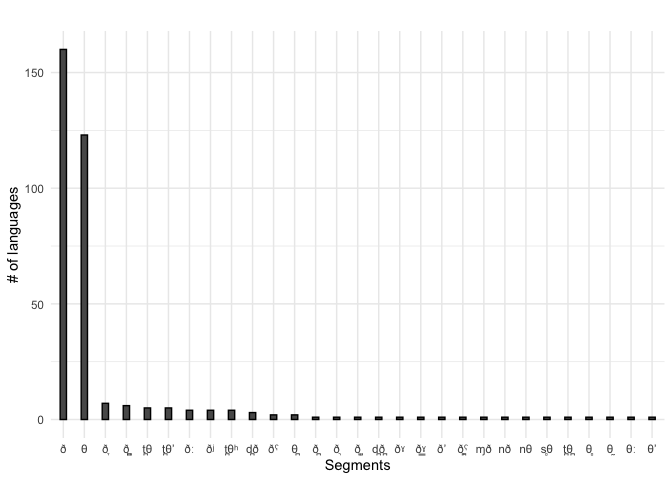
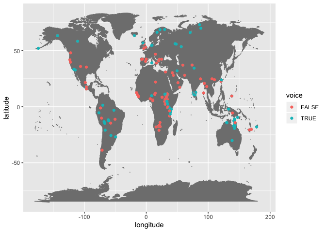
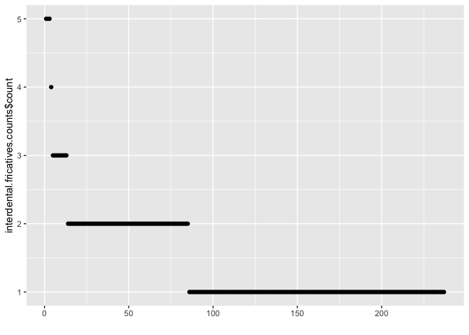

Interdental fricatives cross-linguistically
================
Steven Moran &lt;<steven.moran@uzh.ch>&gt;
02 December, 2019

``` r
library(dplyr)
library(ggplot2)
library(testthat)
library(knitr)
```

``` r
# Load the PHOIBLE development data from the GitHub repository
phoible <- read.csv('https://raw.githubusercontent.com/phoible/dev/master/data/phoible.csv', stringsAsFactors = F)

# Merge in Glottolog 3.3 data that has macroarea data
geo <- read.csv(url("https://cdstar.shh.mpg.de/bitstreams/EAEA0-E7DE-FA06-8817-0/languages_and_dialects_geo.csv"), stringsAsFactors = FALSE)

phoible <- left_join(phoible, geo, by=c("Glottocode"="glottocode"))
```

``` r
# Which rows in phoible have interdental fricatives?
interdental.fricatives <- phoible %>% filter(grepl("θ|ð", Phoneme))

# Assign whether they are voiced or voiceless
voiceless <- interdental.fricatives %>% filter(grepl("θ", Phoneme)) %>% select(Phoneme) %>% distinct()
voiced <- interdental.fricatives %>% filter(grepl("ð", Phoneme)) %>% select(Phoneme) %>% distinct()

interdental.fricatives <- interdental.fricatives %>% mutate(voice = ifelse(Phoneme %in% voiceless$Phoneme, FALSE, TRUE))
interdental.fricatives <- interdental.fricatives %>% mutate(voice = ifelse(Phoneme %in% voiced$Phoneme, TRUE, FALSE))

# Make sure all rows are assigned
table(interdental.fricatives$voice)
```

    ## 
    ## FALSE  TRUE 
    ##   146   196

``` r
expect_false(any(is.na(interdental.fricatives$voice)))
expect_true(nrow(interdental.fricatives %>% filter(voice) %>% select(Phoneme) %>% distinct()) == nrow(voiced))
expect_true(nrow(interdental.fricatives %>% filter(!voice) %>% select(Phoneme) %>% distinct()) == nrow(voiceless))

# Spot check
# interdental.fricatives %>% filter(voice) %>% select(Phoneme) %>% distinct()
# interdental.fricatives %>% filter(!voice) %>% select(Phoneme) %>% distinct()
```

``` r
# How many Glottocodes are there in phoible?
nrow(phoible %>% select(Glottocode) %>% distinct())
```

    ## [1] 2185

``` r
# How many phoible inventories have dental fricatives?
nrow(interdental.fricatives %>% select(InventoryID) %>% distinct())
```

    ## [1] 237

``` r
# How many distinct Glottocodes (languiods, i.e. languages, dialects) have dental fricatives?
gcodes.interdental.fricatives <- interdental.fricatives %>% select(Glottocode, macroarea, latitude, longitude, voice) %>% distinct()
nrow(gcodes.interdental.fricatives)
```

    ## [1] 220

``` r
# How are they distributed in phoible (across duplicate languages)?
distribution.interdental.fricatives <- interdental.fricatives %>% group_by(Phoneme, voice) %>% summarize(count=n()) %>% arrange(desc(count))
kable(distribution.interdental.fricatives)
```

| Phoneme | voice |  count|
|:--------|:------|------:|
| ð       | TRUE  |    160|
| θ       | FALSE |    123|
| ð̞       | TRUE  |      7|
| ð̪̺       | TRUE  |      6|
| t̪θ      | FALSE |      5|
| t̪θʼ     | FALSE |      5|
| ðː      | TRUE  |      4|
| ðʲ      | TRUE  |      4|
| t̪θʰ     | FALSE |      4|
| d̪ð      | TRUE  |      3|
| ðˤ      | TRUE  |      2|
| θ̪       | FALSE |      2|
| ð̪       | TRUE  |      1|
| ð͉       | TRUE  |      1|
| ð̺̞       | TRUE  |      1|
| d̪ð̪      | TRUE  |      1|
| ðˠ      | TRUE  |      1|
| ð͇ˠ      | TRUE  |      1|
| ðʼ      | TRUE  |      1|
| ð̪̙ˤ      | TRUE  |      1|
| ɱð      | TRUE  |      1|
| nð      | TRUE  |      1|
| nθ      | FALSE |      1|
| s̻θ      | FALSE |      1|
| t̪θ̪      | FALSE |      1|
| θ̻       | FALSE |      1|
| θ̰       | FALSE |      1|
| θː      | FALSE |      1|
| θʼ      | FALSE |      1|

``` r
# Order the frequency counts and plot the distribution of interdentals in the sample
distribution.interdental.fricatives$Phoneme <- factor(distribution.interdental.fricatives$Phoneme, levels=distribution.interdental.fricatives$Phoneme[order(-distribution.interdental.fricatives$count)])

# qplot(distribution.interdental.fricatives$Phoneme, distribution.interdental.fricatives$count)

p <- ggplot(aes(y=count, x=Phoneme), data=distribution.interdental.fricatives) +
  geom_bar(stat="identity", width = 0.3, color = "black") +
  xlab("Segments") +
  ylab("# of languages") +
  theme_minimal() +
  ggtitle("")
p
```



``` r
# How are they distributed via macroarea
table(gcodes.interdental.fricatives$macroarea)
```

    ## 
    ##                      Africa     Australia       Eurasia North America 
    ##             1            76            28            67            21 
    ##     Papunesia South America 
    ##            12            15

``` r
temp <- gcodes.interdental.fricatives %>% filter(macroarea!="")
ggplot(data=temp, aes(x=longitude,y=latitude, fill=macroarea, color=macroarea)) + 
  borders("world", colour="gray50", fill="gray50") + 
  geom_point()
```

    ## Warning: Removed 10 rows containing missing values (geom_point).


``` r
# Add more maps, e.g. with th vs TH.
temp <- gcodes.interdental.fricatives %>% filter(macroarea!="")
ggplot(data=temp, aes(x=longitude,y=latitude, fill=voice, color=voice)) + 
  borders("world", colour="gray50", fill="gray50") + 
  geom_point()
```

    ## Warning: Removed 10 rows containing missing values (geom_point).



``` r
# Distribution of interdentals per inventory
interdental.fricatives.counts <- interdental.fricatives %>% select(InventoryID, Glottocode, Phoneme) %>% group_by(InventoryID, Glottocode) %>% summarize(count=n()) %>% arrange(desc(count))
qplot(y=interdental.fricatives.counts$count)
```



``` r
interdental.fricatives %>% filter(Glottocode=="stan1293")
```

    ##    InventoryID Glottocode ISO6393          LanguageName
    ## 1          160   stan1293     eng               English
    ## 2          160   stan1293     eng               English
    ## 3         2175   stan1293     eng    English (American)
    ## 4         2175   stan1293     eng    English (American)
    ## 5         2176   stan1293     eng      American English
    ## 6         2176   stan1293     eng      American English
    ## 7         2177   stan1293     eng  English (Australian)
    ## 8         2177   stan1293     eng  English (Australian)
    ## 9         2178   stan1293     eng     English (British)
    ## 10        2178   stan1293     eng     English (British)
    ## 11        2179   stan1293     eng English (New Zealand)
    ## 12        2179   stan1293     eng English (New Zealand)
    ## 13        2180   stan1293     eng     English (British)
    ## 14        2180   stan1293     eng     English (British)
    ## 15        2252   stan1293     eng               English
    ## 16        2252   stan1293     eng               English
    ## 17        2515   stan1293     eng               English
    ## 18        2515   stan1293     eng               English
    ##                                    SpecificDialect GlyphID Phoneme
    ## 1                                             <NA>    00F0       ð
    ## 2                                             <NA>    03B8       θ
    ## 3  Western and Mid-Western US; Southern California    00F0       ð
    ## 4  Western and Mid-Western US; Southern California    03B8       θ
    ## 5                            Southeastern Michigan    00F0       ð
    ## 6                            Southeastern Michigan    03B8       θ
    ## 7                                             <NA>    00F0       ð
    ## 8                                             <NA>    03B8       θ
    ## 9                                        Liverpool    00F0       ð
    ## 10                                       Liverpool    03B8       θ
    ## 11                                          Pākehā    00F0       ð
    ## 12                                          Pākehā    03B8       θ
    ## 13          Tyneside English (spoken in Newcastle)    00F0       ð
    ## 14          Tyneside English (spoken in Newcastle)    03B8       θ
    ## 15                                    English (RP)    00F0       ð
    ## 16                                    English (RP)    03B8       θ
    ## 17                             English (Liverpool)    00F0       ð
    ## 18                             English (Liverpool)    03B8       θ
    ##    Allophones Marginal SegmentClass Source tone stress syllabic short long
    ## 1     ð̞ ð θ͉ ð       NA    consonant    spa    0      -        -     -    -
    ## 2           θ       NA    consonant    spa    0      -        -     -    -
    ## 3           ð    FALSE    consonant     uz    0      -        -     -    -
    ## 4           θ    FALSE    consonant     uz    0      -        -     -    -
    ## 5           ð    FALSE    consonant     uz    0      -        -     -    -
    ## 6           θ    FALSE    consonant     uz    0      -        -     -    -
    ## 7           ð    FALSE    consonant     uz    0      -        -     -    -
    ## 8           θ    FALSE    consonant     uz    0      -        -     -    -
    ## 9     ð d̪ v ð̥    FALSE    consonant     uz    0      -        -     -    -
    ## 10      θ t̪ f    FALSE    consonant     uz    0      -        -     -    -
    ## 11          ð    FALSE    consonant     uz    0      -        -     -    -
    ## 12          θ    FALSE    consonant     uz    0      -        -     -    -
    ## 13          ð    FALSE    consonant     uz    0      -        -     -    -
    ## 14          θ    FALSE    consonant     uz    0      -        -     -    -
    ## 15       <NA>    FALSE    consonant     ea    0      -        -     -    -
    ## 16       <NA>    FALSE    consonant     ea    0      -        -     -    -
    ## 17       <NA>    FALSE    consonant     ea    0      -        -     -    -
    ## 18       <NA>    FALSE    consonant     ea    0      -        -     -    -
    ##    consonantal sonorant continuant delayedRelease approximant tap trill
    ## 1            +        -          +              +           -   -     -
    ## 2            +        -          +              +           -   -     -
    ## 3            +        -          +              +           -   -     -
    ## 4            +        -          +              +           -   -     -
    ## 5            +        -          +              +           -   -     -
    ## 6            +        -          +              +           -   -     -
    ## 7            +        -          +              +           -   -     -
    ## 8            +        -          +              +           -   -     -
    ## 9            +        -          +              +           -   -     -
    ## 10           +        -          +              +           -   -     -
    ## 11           +        -          +              +           -   -     -
    ## 12           +        -          +              +           -   -     -
    ## 13           +        -          +              +           -   -     -
    ## 14           +        -          +              +           -   -     -
    ## 15           +        -          +              +           -   -     -
    ## 16           +        -          +              +           -   -     -
    ## 17           +        -          +              +           -   -     -
    ## 18           +        -          +              +           -   -     -
    ##    nasal lateral labial round labiodental coronal anterior distributed
    ## 1      -       -      -     0           0       +        +           +
    ## 2      -       -      -     0           0       +        +           +
    ## 3      -       -      -     0           0       +        +           +
    ## 4      -       -      -     0           0       +        +           +
    ## 5      -       -      -     0           0       +        +           +
    ## 6      -       -      -     0           0       +        +           +
    ## 7      -       -      -     0           0       +        +           +
    ## 8      -       -      -     0           0       +        +           +
    ## 9      -       -      -     0           0       +        +           +
    ## 10     -       -      -     0           0       +        +           +
    ## 11     -       -      -     0           0       +        +           +
    ## 12     -       -      -     0           0       +        +           +
    ## 13     -       -      -     0           0       +        +           +
    ## 14     -       -      -     0           0       +        +           +
    ## 15     -       -      -     0           0       +        +           +
    ## 16     -       -      -     0           0       +        +           +
    ## 17     -       -      -     0           0       +        +           +
    ## 18     -       -      -     0           0       +        +           +
    ##    strident dorsal high low front back tense retractedTongueRoot
    ## 1         -      -    0   0     0    0     0                   0
    ## 2         -      -    0   0     0    0     0                   0
    ## 3         -      -    0   0     0    0     0                   0
    ## 4         -      -    0   0     0    0     0                   0
    ## 5         -      -    0   0     0    0     0                   0
    ## 6         -      -    0   0     0    0     0                   0
    ## 7         -      -    0   0     0    0     0                   0
    ## 8         -      -    0   0     0    0     0                   0
    ## 9         -      -    0   0     0    0     0                   0
    ## 10        -      -    0   0     0    0     0                   0
    ## 11        -      -    0   0     0    0     0                   0
    ## 12        -      -    0   0     0    0     0                   0
    ## 13        -      -    0   0     0    0     0                   0
    ## 14        -      -    0   0     0    0     0                   0
    ## 15        -      -    0   0     0    0     0                   0
    ## 16        -      -    0   0     0    0     0                   0
    ## 17        -      -    0   0     0    0     0                   0
    ## 18        -      -    0   0     0    0     0                   0
    ##    advancedTongueRoot periodicGlottalSource epilaryngealSource
    ## 1                   0                     +                  -
    ## 2                   0                     -                  -
    ## 3                   0                     +                  -
    ## 4                   0                     -                  -
    ## 5                   0                     +                  -
    ## 6                   0                     -                  -
    ## 7                   0                     +                  -
    ## 8                   0                     -                  -
    ## 9                   0                     +                  -
    ## 10                  0                     -                  -
    ## 11                  0                     +                  -
    ## 12                  0                     -                  -
    ## 13                  0                     +                  -
    ## 14                  0                     -                  -
    ## 15                  0                     +                  -
    ## 16                  0                     -                  -
    ## 17                  0                     +                  -
    ## 18                  0                     -                  -
    ##    spreadGlottis constrictedGlottis fortis raisedLarynxEjective
    ## 1              -                  -      -                    -
    ## 2              -                  -      -                    -
    ## 3              -                  -      -                    -
    ## 4              -                  -      -                    -
    ## 5              -                  -      -                    -
    ## 6              -                  -      -                    -
    ## 7              -                  -      -                    -
    ## 8              -                  -      -                    -
    ## 9              -                  -      -                    -
    ## 10             -                  -      -                    -
    ## 11             -                  -      -                    -
    ## 12             -                  -      -                    -
    ## 13             -                  -      -                    -
    ## 14             -                  -      -                    -
    ## 15             -                  -      -                    -
    ## 16             -                  -      -                    -
    ## 17             -                  -      -                    -
    ## 18             -                  -      -                    -
    ##    loweredLarynxImplosive click    name isocodes    level macroarea
    ## 1                       -     - English      eng language   Eurasia
    ## 2                       -     - English      eng language   Eurasia
    ## 3                       -     - English      eng language   Eurasia
    ## 4                       -     - English      eng language   Eurasia
    ## 5                       -     - English      eng language   Eurasia
    ## 6                       -     - English      eng language   Eurasia
    ## 7                       -     - English      eng language   Eurasia
    ## 8                       -     - English      eng language   Eurasia
    ## 9                       -     - English      eng language   Eurasia
    ## 10                      -     - English      eng language   Eurasia
    ## 11                      -     - English      eng language   Eurasia
    ## 12                      -     - English      eng language   Eurasia
    ## 13                      -     - English      eng language   Eurasia
    ## 14                      -     - English      eng language   Eurasia
    ## 15                      -     - English      eng language   Eurasia
    ## 16                      -     - English      eng language   Eurasia
    ## 17                      -     - English      eng language   Eurasia
    ## 18                      -     - English      eng language   Eurasia
    ##    latitude longitude voice
    ## 1        53        -1  TRUE
    ## 2        53        -1 FALSE
    ## 3        53        -1  TRUE
    ## 4        53        -1 FALSE
    ## 5        53        -1  TRUE
    ## 6        53        -1 FALSE
    ## 7        53        -1  TRUE
    ## 8        53        -1 FALSE
    ## 9        53        -1  TRUE
    ## 10       53        -1 FALSE
    ## 11       53        -1  TRUE
    ## 12       53        -1 FALSE
    ## 13       53        -1  TRUE
    ## 14       53        -1 FALSE
    ## 15       53        -1  TRUE
    ## 16       53        -1 FALSE
    ## 17       53        -1  TRUE
    ## 18       53        -1 FALSE

``` r
# Which interndetals do languages have?
kable(interdental.fricatives.counts)
```

|  InventoryID| Glottocode |  count|
|------------:|:-----------|------:|
|           63| chip1261   |      5|
|          278| chip1261   |      5|
|         1168| tana1290   |      5|
|         2186| mode1248   |      4|
|          132| egyp1253   |      3|
|          694| luok1236   |      3|
|         1024| yape1248   |      3|
|         1098| liby1240   |      3|
|         1314| olub1238   |      3|
|         2157| stan1318   |      3|
|         2510| mehr1241   |      3|
|         2607| najd1235   |      3|
|         2621| sheh1240   |      3|
|           22| nucl1310   |      2|
|           39| iaai1238   |      2|
|          145| swah1253   |      2|
|          153| luok1236   |      2|
|          160| stan1293   |      2|
|          164| stan1288   |      2|
|          169| tosk1239   |      2|
|          170| mode1248   |      2|
|          215| tosk1239   |      2|
|          311| ruka1240   |      2|
|          318| mode1248   |      2|
|          363| iaai1238   |      2|
|          448| luok1236   |      2|
|          476| nucl1310   |      2|
|          553| stan1288   |      2|
|          564| gaam1241   |      2|
|          638| nene1249   |      2|
|          762| lend1245   |      2|
|          823| swah1253   |      2|
|          928| luch1239   |      2|
|          967| nubi1253   |      2|
|         1022| loxi1235   |      2|
|         1108| soch1239   |      2|
|         1115| halk1245   |      2|
|         1141| gali1258   |      2|
|         1255| here1253   |      2|
|         1269| ndon1254   |      2|
|         1270| mbuk1240   |      2|
|         1309| sout2833   |      2|
|         1312| jumj1238   |      2|
|         1313| buru1301   |      2|
|         1316| maba1273   |      2|
|         1359| shil1265   |      2|
|         1375| tira1254   |      2|
|         1384| ghom1247   |      2|
|         1391| bala1302   |      2|
|         1404| lama1288   |      2|
|         1431| didi1258   |      2|
|         1503| kwam1251   |      2|
|         1504| ngan1300   |      2|
|         1505| ndon1254   |      2|
|         1506| ndon1254   |      2|
|         1507| ndon1254   |      2|
|         1534| nuer1246   |      2|
|         1537| irig1241   |      2|
|         2164| nucl1310   |      2|
|         2175| stan1293   |      2|
|         2176| stan1293   |      2|
|         2177| stan1293   |      2|
|         2178| stan1293   |      2|
|         2179| stan1293   |      2|
|         2180| stan1293   |      2|
|         2187| mode1248   |      2|
|         2228| vlax1238   |      2|
|         2235| nort2671   |      2|
|         2252| stan1293   |      2|
|         2338| nucl1310   |      2|
|         2358| gheg1238   |      2|
|         2406| wels1247   |      2|
|         2438| arbe1236   |      2|
|         2458| mode1248   |      2|
|         2487| arbe1236   |      2|
|         2497| pite1240   |      2|
|         2498| east2304   |      2|
|         2500| bash1264   |      2|
|         2514| wakh1245   |      2|
|         2515| stan1293   |      2|
|         2566| skol1241   |      2|
|         2568| icel1247   |      2|
|         2592| tosk1239   |      2|
|         2595| turk1304   |      2|
|         2619| gali1258   |      2|
|           25| sgaw1245   |      1|
|           26| lakk1238   |      1|
|           28| bouy1240   |      1|
|           46| kunj1245   |      1|
|           54| tamn1235   |      1|
|           61| aleu1260   |      1|
|           88| karo1304   |      1|
|           93| tewa1260   |      1|
|           94| luis1253   |      1|
|           99| chiq1250   |      1|
|          100| sanm1295   |      1|
|          104| sout2991   |      1|
|          106| mapu1245   |      1|
|          119| para1311   |      1|
|          120| amah1246   |      1|
|          158| icel1247   |      1|
|          181| east2328   |      1|
|          198| afad1236   |      1|
|          213| aleu1260   |      1|
|          216| amah1246   |      1|
|          230| mapu1245   |      1|
|          237| bash1264   |      1|
|          295| cube1242   |      1|
|          301| daha1245   |      1|
|          328| fiji1243   |      1|
|          345| para1311   |      1|
|          360| huas1242   |      1|
|          393| gras1249   |      1|
|          430| sgaw1245   |      1|
|          439| lakk1238   |      1|
|          450| chiq1250   |      1|
|          460| east2328   |      1|
|          461| sanm1295   |      1|
|          465| moro1285   |      1|
|          473| murl1244   |      1|
|          494| ngan1291   |      1|
|          515| bouy1240   |      1|
|          524| sout2991   |      1|
|          583| taca1256   |      1|
|          613| wint1259   |      1|
|          621| bert1248   |      1|
|          748| kiku1240   |      1|
|          755| gbay1288   |      1|
|          766| west2450   |      1|
|          831| timn1235   |      1|
|          865| cupe1243   |      1|
|          885| huro1249   |      1|
|          921| kwaz1243   |      1|
|          952| quec1382   |      1|
|         1001| taro1264   |      1|
|         1012| shaw1249   |      1|
|         1055| arag1245   |      1|
|         1110| yekh1238   |      1|
|         1111| nort2626   |      1|
|         1116| huas1242   |      1|
|         1166| aran1237   |      1|
|         1183| bang1356   |      1|
|         1228| anei1239   |      1|
|         1249| baka1274   |      1|
|         1250| ajas1235   |      1|
|         1351| kara1483   |      1|
|         1366| otuh1238   |      1|
|         1374| otor1240   |      1|
|         1443| kamb1297   |      1|
|         1493| nari1240   |      1|
|         1499| shwa1239   |      1|
|         1570| krio1253   |      1|
|         1586| chon1287   |      1|
|         1587| digo1243   |      1|
|         1588| duru1249   |      1|
|         1589| giry1241   |      1|
|         1590| giry1241   |      1|
|         1591| kamb1298   |      1|
|         1592| kaum1238   |      1|
|         1593| giry1241   |      1|
|         1594| giry1241   |      1|
|         1638| gwen1239   |      1|
|         1702| apuc1241   |      1|
|         1709| balt1258   |      1|
|         1730| irul1243   |      1|
|         1743| koda1255   |      1|
|         1763| saur1249   |      1|
|         1788| tami1289   |      1|
|         1793| toda1252   |      1|
|         1796| ural1274   |      1|
|         1802| mapu1245   |      1|
|         1828| pare1272   |      1|
|         1860| jebe1250   |      1|
|         1962| kara1500   |      1|
|         1978| xokl1240   |      1|
|         2048| reye1240   |      1|
|         2049| taca1256   |      1|
|         2051| cube1242   |      1|
|         2094| kuru1309   |      1|
|         2118| aika1237   |      1|
|         2129| muru1274   |      1|
|         2167| dani1285   |      1|
|         2210| stan1288   |      1|
|         2241| east2328   |      1|
|         2249| bakh1245   |      1|
|         2273| west2392   |      1|
|         2303| stan1288   |      1|
|         2308| stan1288   |      1|
|         2339| saur1249   |      1|
|         2375| arag1245   |      1|
|         2402| nene1249   |      1|
|         2413| east2328   |      1|
|         2461| ngan1291   |      1|
|         2469| fore1265   |      1|
|         2473| elfd1234   |      1|
|         2482| nene1249   |      1|
|         2505| scot1243   |      1|
|         2506| east2328   |      1|
|         2516| astu1245   |      1|
|         2532| east2328   |      1|
|         2546| camp1261   |      1|
|         2571| astu1245   |      1|
|         2581| west2392   |      1|
|         2596| jerr1238   |      1|
|         2601| scot1245   |      1|
|         2603| nene1249   |      1|
|         2638| mari1419   |      1|
|         2640| mart1254   |      1|
|         2878| ikar1243   |      1|
|         2879| ikar1243   |      1|
|         2881| thay1248   |      1|
|         2882| kawa1290   |      1|
|         2883| kawa1290   |      1|
|         2884| angu1242   |      1|
|         2894| lamu1254   |      1|
|         2895| mbar1253   |      1|
|         2905| gurd1238   |      1|
|         2907| wala1263   |      1|
|         2908| alng1239   |      1|
|         2909| arit1239   |      1|
|         2910| ndra1239   |      1|
|         2911| tyan1235   |      1|
|         2912| leni1238   |      1|
|         2913| luth1234   |      1|
|         2914| mbiy1238   |      1|
|         2915| mpal1238   |      1|
|         2916| ngko1236   |      1|
|         2918| angg1238   |      1|
|         2919| atam1239   |      1|
|         2920| yadh1237   |      1|
|         2921| yinw1236   |      1|
|         2924| ulku1238   |      1|
|         2927| mbar1254   |      1|
|         2929| umbu1256   |      1|
|         2930| oyka1239   |      1|
|         2931| adny1235   |      1|
|         3020| lamu1254   |      1|

``` r
library(tidyr)
```

    ## Warning: package 'tidyr' was built under R version 3.5.2

    ## 
    ## Attaching package: 'tidyr'

    ## The following object is masked from 'package:testthat':
    ## 
    ##     matches

``` r
library(stringi)
```

    ## Warning: package 'stringi' was built under R version 3.5.2

``` r
interdental.fricatives.wide <- interdental.fricatives %>% group_by(InventoryID) %>% summarize(interdentals = paste(Phoneme, collapse = ", "))

interdental.fricatives.counts <- left_join(interdental.fricatives.counts, interdental.fricatives.wide)
```

    ## Joining, by = "InventoryID"

``` r
kable(interdental.fricatives.counts)
```

|  InventoryID| Glottocode |  count| interdentals       |
|------------:|:-----------|------:|:-------------------|
|           63| chip1261   |      5| t̪θ, t̪θʰ, t̪θʼ, ð, θ |
|          278| chip1261   |      5| t̪θ, t̪θʰ, t̪θʼ, ð, θ |
|         1168| tana1290   |      5| t̪θ, t̪θʰ, t̪θʼ, ð, θ |
|         2186| mode1248   |      4| ð, ðː, θ, θː       |
|          132| egyp1253   |      3| ð, ðˤ, θ           |
|          694| luok1236   |      3| nð, ð, θ           |
|         1024| yape1248   |      3| ð, θ, θ̰            |
|         1098| liby1240   |      3| ð, ðˠ, θ           |
|         1314| olub1238   |      3| ð, ɱð, θ           |
|         2157| stan1318   |      3| ð̪, ð̪̙ˤ, θ̪           |
|         2510| mehr1241   |      3| ð, θ, θʼ           |
|         2607| najd1235   |      3| ð, ðˤ, θ           |
|         2621| sheh1240   |      3| ð, ðʼ, θ           |
|           22| nucl1310   |      2| ð, θ               |
|           39| iaai1238   |      2| ð, θ               |
|          145| swah1253   |      2| ð, θ               |
|          153| luok1236   |      2| d̪ð, t̪θʰ            |
|          160| stan1293   |      2| ð, θ               |
|          164| stan1288   |      2| ð͉, θ               |
|          169| tosk1239   |      2| ð, θ               |
|          170| mode1248   |      2| ð, θ               |
|          215| tosk1239   |      2| ð, θ               |
|          311| ruka1240   |      2| ð, θ               |
|          318| mode1248   |      2| ð, θ               |
|          363| iaai1238   |      2| ð, θ               |
|          448| luok1236   |      2| d̪ð, t̪θ             |
|          476| nucl1310   |      2| ð, θ               |
|          553| stan1288   |      2| ð, θ               |
|          564| gaam1241   |      2| ð, θ               |
|          638| nene1249   |      2| ð, ðʲ              |
|          762| lend1245   |      2| ð, θ               |
|          823| swah1253   |      2| ð, θ               |
|          928| luch1239   |      2| ð, θ               |
|          967| nubi1253   |      2| ð, θ               |
|         1022| loxi1235   |      2| ð, θ               |
|         1108| soch1239   |      2| ð, θ               |
|         1115| halk1245   |      2| t̪θʼ, θ             |
|         1141| gali1258   |      2| ð̞, θ               |
|         1255| here1253   |      2| ð, θ               |
|         1269| ndon1254   |      2| ð, θ               |
|         1270| mbuk1240   |      2| ð, θ               |
|         1309| sout2833   |      2| ð, θ               |
|         1312| jumj1238   |      2| ð, θ               |
|         1313| buru1301   |      2| ð, θ               |
|         1316| maba1273   |      2| ð, θ               |
|         1359| shil1265   |      2| ð, θ               |
|         1375| tira1254   |      2| ð, θ               |
|         1384| ghom1247   |      2| d̪ð, t̪θ             |
|         1391| bala1302   |      2| nθ, θ              |
|         1404| lama1288   |      2| ð, θ               |
|         1431| didi1258   |      2| ð, ðː              |
|         1503| kwam1251   |      2| ð, θ               |
|         1504| ngan1300   |      2| ð, θ               |
|         1505| ndon1254   |      2| ð, θ               |
|         1506| ndon1254   |      2| ð, θ               |
|         1507| ndon1254   |      2| ð, θ               |
|         1534| nuer1246   |      2| ð, θ               |
|         1537| irig1241   |      2| ð, ðʲ              |
|         2164| nucl1310   |      2| d̪ð̪, t̪θ̪             |
|         2175| stan1293   |      2| ð, θ               |
|         2176| stan1293   |      2| ð, θ               |
|         2177| stan1293   |      2| ð, θ               |
|         2178| stan1293   |      2| ð, θ               |
|         2179| stan1293   |      2| ð, θ               |
|         2180| stan1293   |      2| ð, θ               |
|         2187| mode1248   |      2| ð, θ               |
|         2228| vlax1238   |      2| ð, θ               |
|         2235| nort2671   |      2| ð, ðː              |
|         2252| stan1293   |      2| ð, θ               |
|         2338| nucl1310   |      2| ð, θ               |
|         2358| gheg1238   |      2| ð, θ               |
|         2406| wels1247   |      2| ð, θ               |
|         2438| arbe1236   |      2| ð, θ               |
|         2458| mode1248   |      2| ð, θ               |
|         2487| arbe1236   |      2| ð, θ               |
|         2497| pite1240   |      2| ð, ðː              |
|         2498| east2304   |      2| ð, θ               |
|         2500| bash1264   |      2| ð, θ               |
|         2514| wakh1245   |      2| ð, θ               |
|         2515| stan1293   |      2| ð, θ               |
|         2566| skol1241   |      2| ð, ðʲ              |
|         2568| icel1247   |      2| ð̺̞, θ̻               |
|         2592| tosk1239   |      2| ð͇ˠ, θ              |
|         2595| turk1304   |      2| ð, θ               |
|         2619| gali1258   |      2| ð̞, θ               |
|           25| sgaw1245   |      1| θ                  |
|           26| lakk1238   |      1| θ                  |
|           28| bouy1240   |      1| θ                  |
|           46| kunj1245   |      1| ð                  |
|           54| tamn1235   |      1| θ                  |
|           61| aleu1260   |      1| ð                  |
|           88| karo1304   |      1| s̻θ                 |
|           93| tewa1260   |      1| θ                  |
|           94| luis1253   |      1| ð                  |
|           99| chiq1250   |      1| ð                  |
|          100| sanm1295   |      1| ð                  |
|          104| sout2991   |      1| ð                  |
|          106| mapu1245   |      1| θ                  |
|          119| para1311   |      1| ð                  |
|          120| amah1246   |      1| θ                  |
|          158| icel1247   |      1| θ                  |
|          181| east2328   |      1| ð                  |
|          198| afad1236   |      1| t̪θʼ                |
|          213| aleu1260   |      1| ð                  |
|          216| amah1246   |      1| θ                  |
|          230| mapu1245   |      1| θ                  |
|          237| bash1264   |      1| θ                  |
|          295| cube1242   |      1| ð                  |
|          301| daha1245   |      1| ð                  |
|          328| fiji1243   |      1| ð                  |
|          345| para1311   |      1| ð                  |
|          360| huas1242   |      1| θ                  |
|          393| gras1249   |      1| ð                  |
|          430| sgaw1245   |      1| θ                  |
|          439| lakk1238   |      1| θ                  |
|          450| chiq1250   |      1| ð                  |
|          460| east2328   |      1| ð                  |
|          461| sanm1295   |      1| ð                  |
|          465| moro1285   |      1| ð                  |
|          473| murl1244   |      1| θ                  |
|          494| ngan1291   |      1| ð                  |
|          515| bouy1240   |      1| θ                  |
|          524| sout2991   |      1| ð                  |
|          583| taca1256   |      1| ð                  |
|          613| wint1259   |      1| θ                  |
|          621| bert1248   |      1| θ                  |
|          748| kiku1240   |      1| ð                  |
|          755| gbay1288   |      1| θ                  |
|          766| west2450   |      1| θ                  |
|          831| timn1235   |      1| θ                  |
|          865| cupe1243   |      1| ð                  |
|          885| huro1249   |      1| θ                  |
|          921| kwaz1243   |      1| ð                  |
|          952| quec1382   |      1| ð                  |
|         1001| taro1264   |      1| ð                  |
|         1012| shaw1249   |      1| θ                  |
|         1055| arag1245   |      1| θ                  |
|         1110| yekh1238   |      1| θ                  |
|         1111| nort2626   |      1| ð                  |
|         1116| huas1242   |      1| θ                  |
|         1166| aran1237   |      1| ð                  |
|         1183| bang1356   |      1| θ                  |
|         1228| anei1239   |      1| θ                  |
|         1249| baka1274   |      1| θ                  |
|         1250| ajas1235   |      1| θ                  |
|         1351| kara1483   |      1| ð                  |
|         1366| otuh1238   |      1| θ                  |
|         1374| otor1240   |      1| ð                  |
|         1443| kamb1297   |      1| ð                  |
|         1493| nari1240   |      1| ð                  |
|         1499| shwa1239   |      1| ð                  |
|         1570| krio1253   |      1| θ                  |
|         1586| chon1287   |      1| ð                  |
|         1587| digo1243   |      1| ð                  |
|         1588| duru1249   |      1| ð                  |
|         1589| giry1241   |      1| ð                  |
|         1590| giry1241   |      1| ð                  |
|         1591| kamb1298   |      1| ð                  |
|         1592| kaum1238   |      1| ð                  |
|         1593| giry1241   |      1| ð                  |
|         1594| giry1241   |      1| ð                  |
|         1638| gwen1239   |      1| θ                  |
|         1702| apuc1241   |      1| θ                  |
|         1709| balt1258   |      1| ð                  |
|         1730| irul1243   |      1| ð                  |
|         1743| koda1255   |      1| ð                  |
|         1763| saur1249   |      1| θ                  |
|         1788| tami1289   |      1| ð                  |
|         1793| toda1252   |      1| θ                  |
|         1796| ural1274   |      1| ð                  |
|         1802| mapu1245   |      1| θ                  |
|         1828| pare1272   |      1| θ                  |
|         1860| jebe1250   |      1| ð̞                  |
|         1962| kara1500   |      1| θ                  |
|         1978| xokl1240   |      1| ð                  |
|         2048| reye1240   |      1| ð                  |
|         2049| taca1256   |      1| ð                  |
|         2051| cube1242   |      1| ð̞                  |
|         2094| kuru1309   |      1| ð                  |
|         2118| aika1237   |      1| ð̞                  |
|         2129| muru1274   |      1| θ                  |
|         2167| dani1285   |      1| ð̞                  |
|         2210| stan1288   |      1| θ                  |
|         2241| east2328   |      1| ð̪̺                  |
|         2249| bakh1245   |      1| ð̞                  |
|         2273| west2392   |      1| ð̪̺                  |
|         2303| stan1288   |      1| θ                  |
|         2308| stan1288   |      1| θ                  |
|         2339| saur1249   |      1| θ̪                  |
|         2375| arag1245   |      1| θ                  |
|         2402| nene1249   |      1| ð                  |
|         2413| east2328   |      1| ð̪̺                  |
|         2461| ngan1291   |      1| ð                  |
|         2469| fore1265   |      1| ð                  |
|         2473| elfd1234   |      1| ð                  |
|         2482| nene1249   |      1| ð                  |
|         2505| scot1243   |      1| θ                  |
|         2506| east2328   |      1| ð̪̺                  |
|         2516| astu1245   |      1| θ                  |
|         2532| east2328   |      1| ð̪̺                  |
|         2546| camp1261   |      1| ð                  |
|         2571| astu1245   |      1| θ                  |
|         2581| west2392   |      1| ð̪̺                  |
|         2596| jerr1238   |      1| ð                  |
|         2601| scot1245   |      1| ðʲ                 |
|         2603| nene1249   |      1| ð                  |
|         2638| mari1419   |      1| ð                  |
|         2640| mart1254   |      1| ð                  |
|         2878| ikar1243   |      1| ð                  |
|         2879| ikar1243   |      1| ð                  |
|         2881| thay1248   |      1| ð                  |
|         2882| kawa1290   |      1| ð                  |
|         2883| kawa1290   |      1| ð                  |
|         2884| angu1242   |      1| ð                  |
|         2894| lamu1254   |      1| θ                  |
|         2895| mbar1253   |      1| ð                  |
|         2905| gurd1238   |      1| ð                  |
|         2907| wala1263   |      1| ð                  |
|         2908| alng1239   |      1| ð                  |
|         2909| arit1239   |      1| ð                  |
|         2910| ndra1239   |      1| ð                  |
|         2911| tyan1235   |      1| ð                  |
|         2912| leni1238   |      1| ð                  |
|         2913| luth1234   |      1| ð                  |
|         2914| mbiy1238   |      1| ð                  |
|         2915| mpal1238   |      1| ð                  |
|         2916| ngko1236   |      1| ð                  |
|         2918| angg1238   |      1| ð                  |
|         2919| atam1239   |      1| ð                  |
|         2920| yadh1237   |      1| ð                  |
|         2921| yinw1236   |      1| ð                  |
|         2924| ulku1238   |      1| ð                  |
|         2927| mbar1254   |      1| ð                  |
|         2929| umbu1256   |      1| θ                  |
|         2930| oyka1239   |      1| ð                  |
|         2931| adny1235   |      1| ð                  |
|         3020| lamu1254   |      1| θ                  |

``` r
# How many proto-languages in BDPROTO have interdental fricatives?
bdproto <- read.csv(url("https://raw.githubusercontent.com/bdproto/bdproto/master/bdproto.csv"), stringsAsFactors = FALSE)

# Get the interdental fricatives
bdproto.interdental.fricatives <- bdproto %>% filter(grepl("θ|ð", Phoneme))

# How are they distributed?
bdproto.distribution.interdental.fricatives <- bdproto.interdental.fricatives %>% group_by(Phoneme) %>% summarize(count=n()) %>% arrange(desc(count))
bdproto.distribution.interdental.fricatives
```

    ## # A tibble: 21 x 2
    ##    Phoneme count
    ##    <chr>   <int>
    ##  1 ð          21
    ##  2 θ          16
    ##  3 θ̪           6
    ##  4 ð̪ʲ          5
    ##  5 θː          4
    ##  6 ðː          2
    ##  7 θˁ          2
    ##  8 ð’          1
    ##  9 d̪ð̪          1
    ## 10 ðʲ          1
    ## # … with 11 more rows

``` r
# How many distinct Glottocodes (languiods, i.e. languages, dialects) have dental fricatives?
bdproto.gcodes.interdental.fricatives <- bdproto.interdental.fricatives %>% select(Glottocode) %>% distinct()

# Total unique Glottocodes in BDPROTO
nrow(bdproto %>% select(Glottocode) %>% distinct())
```

    ## [1] 188

``` r
# Glottocodes with interdentals
nrow(bdproto.gcodes.interdental.fricatives)
```

    ## [1] 25
