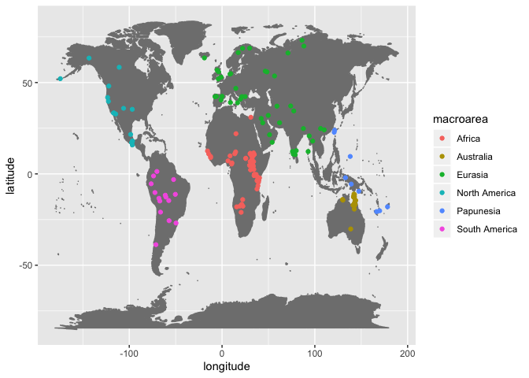

Interdental fricatives cross-linguistically
================
Steven Moran &lt;<steven.moran@uzh.ch>&gt;

``` r
library(dplyr)
```

``` r
# Load the PHOIBLE development data from the GitHub repository
phoible <- read.csv('https://raw.githubusercontent.com/phoible/dev/master/data/phoible.csv', stringsAsFactors = F)

# Merge in Glottolog 3.3 data that has macroarea data
geo <- read.csv(url("https://cdstar.shh.mpg.de/bitstreams/EAEA0-E7DE-FA06-8817-0/languages_and_dialects_geo.csv"), stringsAsFactors = FALSE)

phoible <- left_join(phoible, geo, by=c("Glottocode"="glottocode"))
```

``` r
# Which rows in phoible have interdental fricatives?
interdental.fricatives <- phoible %>% filter(grepl("θ|ð", Phoneme))
```

``` r
# How many Glottocodes are there in phoible?
nrow(phoible %>% select(Glottocode) %>% distinct())
```

    ## [1] 2185

``` r
# How many phoible inventories have dental fricatives?
nrow(interdental.fricatives %>% select(InventoryID) %>% distinct())
```

    ## [1] 237

``` r
# How many distinct Glottocodes (languiods, i.e. languages, dialects) have dental fricatives?
gcodes.interdental.fricatives <- interdental.fricatives %>% select(Glottocode, macroarea, latitude, longitude) %>% distinct()
nrow(gcodes.interdental.fricatives)
```

    ## [1] 171

``` r
# How are they distributed in phoible (across duplicate languages)?
distribution.interdental.fricatives <- interdental.fricatives %>% group_by(Phoneme) %>% summarize(count=n()) %>% arrange(desc(count))
distribution.interdental.fricatives
```

    ## # A tibble: 29 x 2
    ##    Phoneme count
    ##    <chr>   <int>
    ##  1 ð         160
    ##  2 θ         123
    ##  3 ð̞           7
    ##  4 ð̪̺           6
    ##  5 t̪θ          5
    ##  6 t̪θʼ         5
    ##  7 ðː          4
    ##  8 ðʲ          4
    ##  9 t̪θʰ         4
    ## 10 d̪ð          3
    ## # … with 19 more rows

``` r
# How are they distributed via macroarea
table(gcodes.interdental.fricatives$macroarea)
```

    ## 
    ##                      Africa     Australia       Eurasia North America 
    ##             1            53            28            48            17 
    ##     Papunesia South America 
    ##             9            15

``` r
library(ggplot2)
```

    ## Warning: package 'ggplot2' was built under R version 3.5.2

``` r
temp <- gcodes.interdental.fricatives %>% filter(macroarea!="")
ggplot(data=temp, aes(x=longitude,y=latitude, fill=macroarea, color=macroarea)) + 
  borders("world", colour="gray50", fill="gray50") + 
  geom_point()
```

    ## Warning: Removed 10 rows containing missing values (geom_point).



``` r
# How many proto-languages in BDPROTO have interdental fricatives?
bdproto <- read.csv(url("https://raw.githubusercontent.com/bdproto/bdproto/master/bdproto.csv"), stringsAsFactors = FALSE)

# Get the interdental fricatives
bdproto.interdental.fricatives <- bdproto %>% filter(grepl("θ|ð", Phoneme))

# How are they distributed?
bdproto.distribution.interdental.fricatives <- bdproto.interdental.fricatives %>% group_by(Phoneme) %>% summarize(count=n()) %>% arrange(desc(count))
bdproto.distribution.interdental.fricatives
```

    ## # A tibble: 21 x 2
    ##    Phoneme count
    ##    <chr>   <int>
    ##  1 ð          21
    ##  2 θ          16
    ##  3 θ̪           6
    ##  4 ð̪ʲ          5
    ##  5 θː          4
    ##  6 ðː          2
    ##  7 θˁ          2
    ##  8 ð’          1
    ##  9 d̪ð̪          1
    ## 10 ðʲ          1
    ## # … with 11 more rows

``` r
# How many distinct Glottocodes (languiods, i.e. languages, dialects) have dental fricatives?
bdproto.gcodes.interdental.fricatives <- bdproto.interdental.fricatives %>% select(Glottocode) %>% distinct()

# Total unique Glottocodes in BDPROTO
nrow(bdproto %>% select(Glottocode) %>% distinct())
```

    ## [1] 188

``` r
# Glottocodes with interdentals
nrow(bdproto.gcodes.interdental.fricatives)
```

    ## [1] 25
