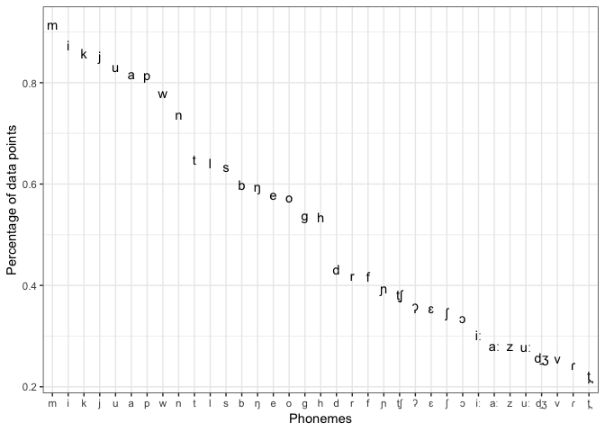
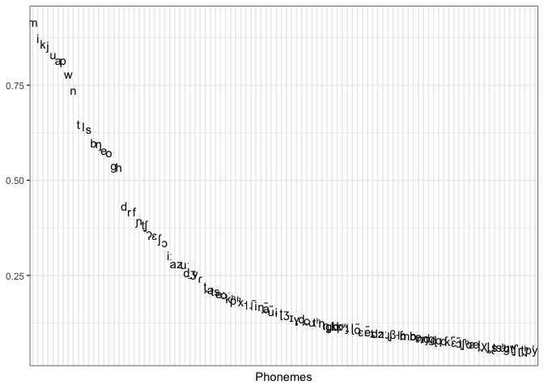
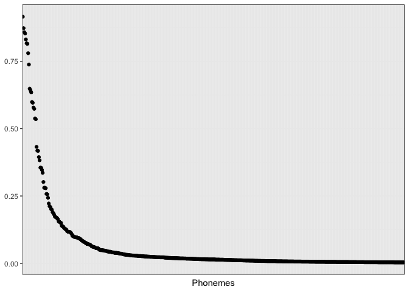

PHOIBLE phoneme frequencies
================
Steven Moran &lt;<steven.moran@uzh.ch>&gt;

``` r
library(dplyr)
library(ggplot2)

theme_set(
  theme_bw()
)
```

``` r
# Get data
phoible <- read.csv('https://raw.githubusercontent.com/phoible/dev/master/data/phoible.csv', stringsAsFactors = F)
# phoible <- read.csv('../../phoible/data/phoible.csv', stringsAsFactors = F)
```

``` r
# Get cross-linguistic phoneme counts from all inventories
phonemes <- phoible %>% group_by(Phoneme, SegmentClass) %>% summarize(count=n())
phonemes$coverage <- phonemes$count/nrow(phonemes)
phonemes.sorted <- phonemes %>% arrange(desc(coverage))
# phonemes.sorted <- phonemes.sorted %>% head(n=25)
head(phonemes.sorted)
```

    ## # A tibble: 6 x 4
    ## # Groups:   Phoneme [6]
    ##   Phoneme SegmentClass count coverage
    ##   <chr>   <chr>        <int>    <dbl>
    ## 1 m       consonant     2914    0.915
    ## 2 i       vowel         2779    0.873
    ## 3 k       consonant     2730    0.858
    ## 4 j       consonant     2716    0.853
    ## 5 u       vowel         2646    0.831
    ## 6 a       vowel         2600    0.817

``` r
# temp <- head(phonemes.sorted, n=35)
# cairo_pdf("segment-frequency_files/all_phonemes_35.pdf", family="Helvetica")
temp <- head(phonemes.sorted, n=35)
rownames(temp) <- temp$Phoneme
```

    ## Warning: Setting row names on a tibble is deprecated.

``` r
p <- ggplot(aes(y=coverage, x=reorder(Phoneme, -coverage)), data=temp) +
  geom_point(alpha=0) +
  geom_text(label=rownames(temp)) +
  xlab("Phonemes") +
  ylab("Percentage of data points")
p
```



``` r
temp <- head(phonemes.sorted, n=100)
rownames(temp) <- temp$Phoneme
```

    ## Warning: Setting row names on a tibble is deprecated.

``` r
p <- ggplot(aes(y=coverage, x=reorder(Phoneme, -coverage)), data=temp) +
  geom_point(alpha=0) +
  geom_text(label=rownames(temp)) +
  xlab("Phonemes") +
  ylab("Percentage of data points") +
  theme(axis.title.y=element_blank(),
        axis.text.x=element_blank(),
        axis.ticks.x=element_blank())
p
```



``` r
temp <- head(phonemes.sorted, n=500)
p <- ggplot(aes(y=coverage, x=reorder(Phoneme, -coverage)), data=temp) +
  geom_point() +
  theme(axis.title.y=element_blank(),
        axis.text.x=element_blank(),
        axis.ticks.x=element_blank()) +
  xlab("Phonemes") +
  ylab("Percentage of data points")
p
```


