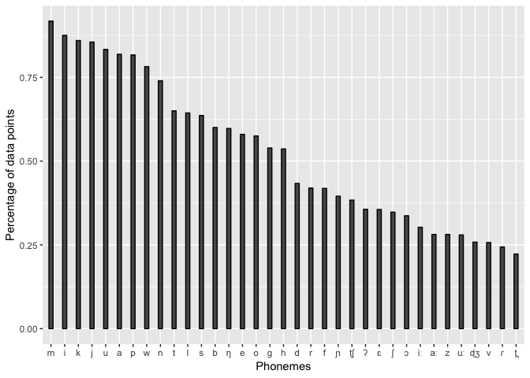
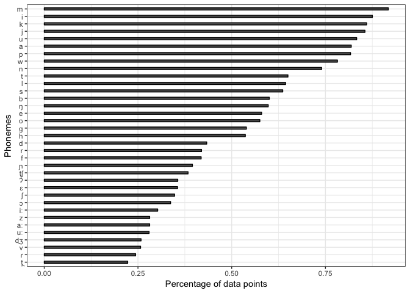

PHOIBLE phoneme frequencies
================
Steven Moran &lt;<steven.moran@uzh.ch>&gt;

``` r
library(dplyr)
library(ggplot2)
```

``` r
# Get data
phoible <- read.csv('https://raw.githubusercontent.com/phoible/dev/master/data/phoible.csv', stringsAsFactors = F)
```

``` r
# Get cross-linguistic phoneme counts from all inventories
phonemes <- phoible %>% group_by(Phoneme) %>% summarize(count=n())
phonemes$coverage <- phonemes$count/nrow(phonemes)
phonemes.sorted <- phonemes %>% arrange(desc(coverage))
# phonemes.sorted <- phonemes.sorted %>% head(n=25)
head(phonemes.sorted)
```

    ## # A tibble: 6 x 3
    ##   Phoneme count coverage
    ##   <chr>   <int>    <dbl>
    ## 1 m        2914    0.918
    ## 2 i        2779    0.875
    ## 3 k        2730    0.860
    ## 4 j        2716    0.855
    ## 5 u        2646    0.833
    ## 6 a        2600    0.819

``` r
# All phonemes
temp <- head(phonemes.sorted, n=35)
p <- ggplot(aes(y=coverage, x=reorder(Phoneme, -coverage)), data=temp) +
  geom_bar(stat="identity", width = 0.3, color = "black") +
  xlab("Phonemes") +
  ylab("Percentage of data points")
p
```



``` r
# Get cross-linguistic phoneme counts by grouping all ISO codes
phonemes.per.iso <- phoible %>% group_by(ISO6393, Phoneme) %>% summarize(count=n())
distinct.isos <- phonemes.per.iso %>% select(ISO6393) %>% distinct()
phonemes <- phonemes.per.iso %>% group_by(Phoneme) %>% summarize(count=n())
phonemes$coverage <- phonemes$count/nrow(distinct.isos)
phonemes.sorted <- phonemes %>% arrange(desc(coverage))
# phonemes.sorted <- phonemes.sorted %>% head(n=25)
head(phonemes.sorted)
```

    ## # A tibble: 6 x 3
    ##   Phoneme count coverage
    ##   <chr>   <int>    <dbl>
    ## 1 m        2034    0.969
    ## 2 i        2004    0.954
    ## 3 k        1945    0.926
    ## 4 j        1922    0.915
    ## 5 u        1922    0.915
    ## 6 a        1911    0.91

``` r
# All phonemes across all ISOs
temp <- head(phonemes.sorted, n=35)
p <- ggplot(aes(y=coverage, x=reorder(Phoneme, -coverage)), data=temp) +
  geom_bar(stat="identity", width = 0.3, color = "black") +
  xlab("Phonemes") +
  ylab("Percentage of data points")
p
```


