PHOIBLE phoneme frequencies
================
Steven Moran

``` r
library(knitr)
library(dplyr)
library(ggplot2)
library(Cairo)

theme_set(
  theme_bw()
)
```

``` r
# Get data
phoible <- read.csv('https://raw.githubusercontent.com/phoible/dev/master/data/phoible.csv', stringsAsFactors = F)
# phoible <- read.csv('../../phoible/data/phoible.csv', stringsAsFactors = F)
```

``` r
# Merge in Glottolog data
# Glottolog 3.3 data
# https://cdstar.shh.mpg.de/bitstreams/EAEA0-E7DE-FA06-8817-0/glottolog_languoid.csv.zip
languoids <- read.csv('../data/glottolog_languoid/languoid.csv', stringsAsFactors = FALSE) 
geo <- read.csv(url("https://cdstar.shh.mpg.de/bitstreams/EAEA0-E7DE-FA06-8817-0/languages_and_dialects_geo.csv"), stringsAsFactors = FALSE)

phoible <- left_join(phoible, languoids, by=c("Glottocode"="id"))
phoible <- left_join(phoible, geo)
```

    ## Joining, by = c("name", "level", "latitude", "longitude")

``` r
# Get cross-linguistic phoneme counts from all inventories
phonemes <- phoible %>% group_by(Phoneme, SegmentClass) %>% summarize(count=n())
```

    ## `summarise()` has grouped output by 'Phoneme'. You can override using the
    ## `.groups` argument.

``` r
phonemes$coverage <- phonemes$count/nrow(phonemes)
phonemes.sorted <- phonemes %>% arrange(desc(coverage))
# phonemes.sorted <- phonemes.sorted %>% head(n=25)
head(phonemes.sorted)
```

    ## # A tibble: 6 × 4
    ## # Groups:   Phoneme [6]
    ##   Phoneme SegmentClass count coverage
    ##   <chr>   <chr>        <int>    <dbl>
    ## 1 m       consonant     2915    0.927
    ## 2 i       vowel         2779    0.883
    ## 3 k       consonant     2729    0.867
    ## 4 j       consonant     2716    0.863
    ## 5 u       vowel         2646    0.841
    ## 6 a       vowel         2600    0.826

``` r
# All phonemes across all inventories in the full sample
temp <- head(phonemes.sorted, n=35)
cairo_pdf("segment-frequency_files/all_phonemes_35.pdf", family="Helvetica")
p <- ggplot(aes(y=coverage, x=reorder(Phoneme, -coverage)), data=temp) +
  geom_bar(stat="identity", width = 0.3, color = "black") +
  xlab("Phonemes") +
  ylab("Percentage of data points")
print(p)
dev.off()
```

    ## quartz_off_screen 
    ##                 2

``` r
p
```

<!-- -->

``` r
# All phonemes across all inventories in the full sample - flipped
temp <- head(phonemes.sorted, n=35)
p <- ggplot(aes(y=coverage, x=reorder(Phoneme, coverage)), data=temp) +
  geom_bar(stat="identity", width = 0.3, color = "black") +
  xlab("Phonemes") +
  ylab("Percentage of data points")
p + coord_flip()
```

<!-- -->

``` r
# Get cross-linguistic phoneme counts by grouping all ISO codes
phonemes.per.iso <- phoible %>% group_by(ISO6393, Phoneme) %>% summarize(count=n())
```

    ## `summarise()` has grouped output by 'ISO6393'. You can override using the
    ## `.groups` argument.

``` r
distinct.isos <- phonemes.per.iso %>% select(ISO6393) %>% distinct()
phonemes <- phonemes.per.iso %>% group_by(Phoneme) %>% summarize(count=n())
phonemes$coverage <- phonemes$count/nrow(distinct.isos)
phonemes.sorted <- phonemes %>% arrange(desc(coverage))
# phonemes.sorted <- phonemes.sorted %>% head(n=25)
head(phonemes.sorted)
```

    ## # A tibble: 6 × 3
    ##   Phoneme count coverage
    ##   <chr>   <int>    <dbl>
    ## 1 m        2036    0.970
    ## 2 i        2003    0.954
    ## 3 k        1942    0.925
    ## 4 j        1922    0.916
    ## 5 u        1921    0.915
    ## 6 a        1913    0.911

``` r
# Merge in SegmentClass values
segment.class <- phoible %>% select(Phoneme, SegmentClass) %>% distinct()
phonemes.sorted <- left_join(phonemes.sorted, segment.class)
```

    ## Joining, by = "Phoneme"

``` r
# All phonemes across all ISOs
temp <- head(phonemes.sorted, n=35)
p <- ggplot(aes(y=coverage, x=reorder(Phoneme, -coverage)), data=temp) +
  geom_bar(stat="identity", width = 0.3, color = "black") +
  xlab("Phonemes") +
  ylab("Percentage of data points")
p
```

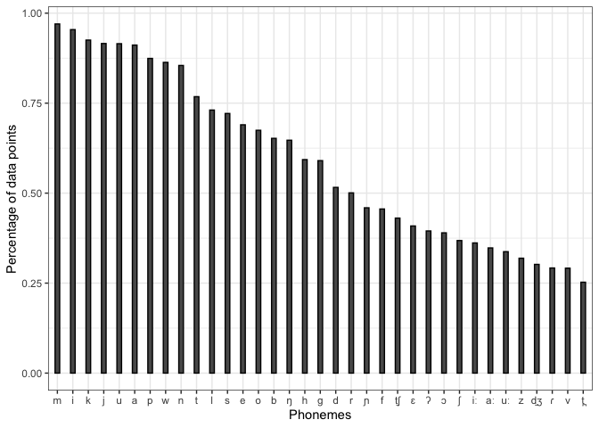<!-- -->

``` r
# All phonemes across all ISOs - flipped
temp <- head(phonemes.sorted, n=35)
p <- ggplot(aes(y=coverage, x=reorder(Phoneme, coverage)), data=temp) +
  geom_bar(stat="identity", width = 0.3, color = "black") +
  xlab("Phonemes") +
  ylab("Percentage of data points")
p + coord_flip()
```

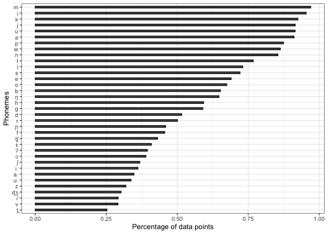<!-- -->

``` r
# Consonants only
temp <- phonemes.sorted %>% filter(SegmentClass == "consonant") %>% head(phonemes.sorted, n=35)
p <- ggplot(aes(y=coverage, x=reorder(Phoneme, -coverage)), data=temp) +
  geom_bar(stat="identity", width = 0.3, color = "black") +
  xlab("Phonemes") +
  ylab("Percentage of data points")
p
```

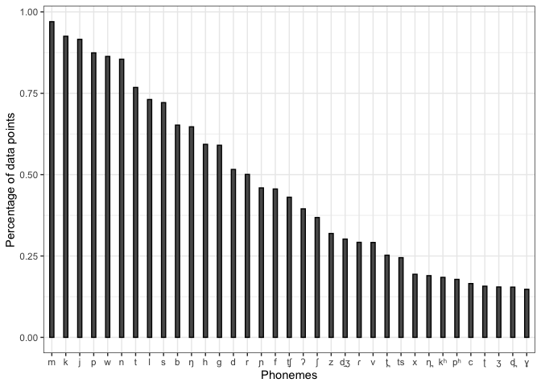<!-- -->

``` r
# Consonants only flipped
p <- ggplot(aes(y=coverage, x=reorder(Phoneme, coverage)), data=temp) +
  geom_bar(stat="identity", width = 0.3, color = "black") +
  xlab("Phonemes") +
  ylab("Percentage of data points")
p + coord_flip()
```

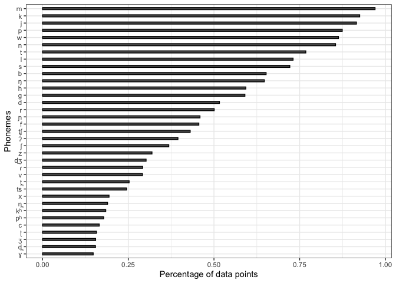<!-- -->

``` r
# Vowels only
temp <- phonemes.sorted %>% filter(SegmentClass == "vowel") %>% head(phonemes.sorted, n=35)
p <- ggplot(aes(y=coverage, x=reorder(Phoneme, -coverage)), data=temp) +
  geom_bar(stat="identity", width = 0.3, color = "black") +
  xlab("Phonemes") +
  ylab("Percentage of data points")
p
```

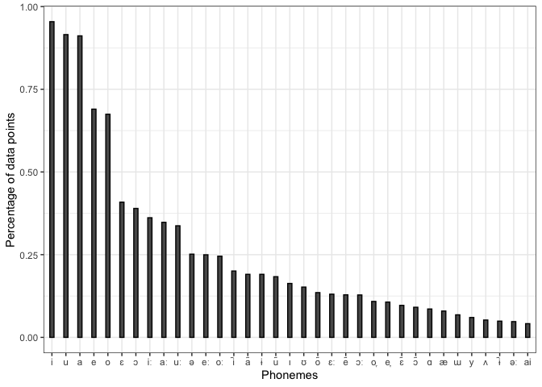<!-- -->

``` r
# Vowels only
temp <- phonemes.sorted %>% filter(SegmentClass == "vowel") %>% head(phonemes.sorted, n=35)
p <- ggplot(aes(y=coverage, x=reorder(Phoneme, coverage)), data=temp) +
  geom_bar(stat="identity", width = 0.3, color = "black") +
  xlab("Phonemes") +
  ylab("Percentage of data points")
p + coord_flip()
```

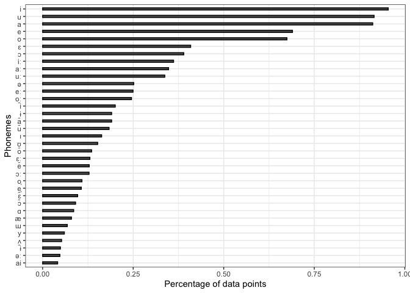<!-- -->

``` r
# Summarize how frequent infrequent sounds are
temp <- phonemes.sorted %>% group_by(count) %>% summarize(segments=n())
temp <- temp %>% head(n=10)
p <- ggplot(aes(y=segments, x=reorder(count, -segments)), data=temp) +
  geom_bar(stat="identity", width = 0.3, color = "black") +
  xlab("How many languages they occur in") +
  ylab("Number of segment types")
p
```

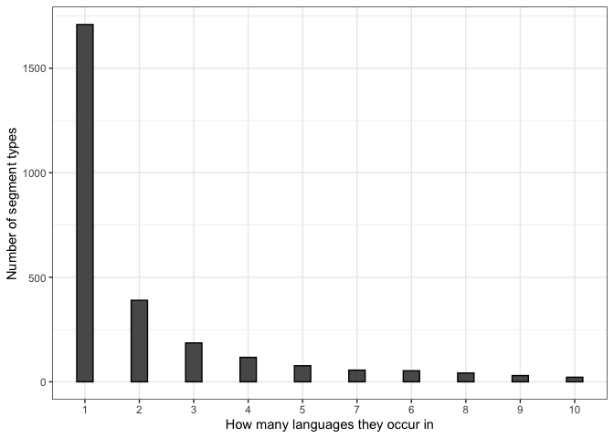<!-- -->

``` r
# Summarize how frequent infrequent sounds are - flipped
temp <- phonemes.sorted %>% group_by(count) %>% summarize(segments=n())
temp <- temp %>% head(n=10)
p <- ggplot(aes(y=segments, x=reorder(count, segments)), data=temp) +
  geom_bar(stat="identity", width = 0.3, color = "black") +
  xlab("How many languages they occur in") +
  ylab("Number of segment types")
p + coord_flip()
```

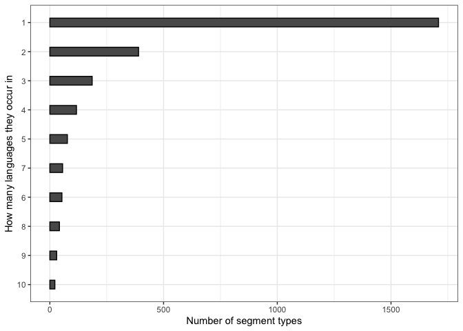<!-- -->

``` r
iso.marcoareas <- phoible %>% select(ISO6393, macroarea) %>% distinct()
phonemes.per.iso.with.geo <- left_join(phonemes.per.iso, iso.marcoareas)
```

    ## Joining, by = "ISO6393"

``` r
phonemes.per.iso.with.geo
```

    ## # A tibble: 82,138 × 4
    ## # Groups:   ISO6393 [2,099]
    ##    ISO6393 Phoneme count macroarea
    ##    <chr>   <chr>   <int> <chr>    
    ##  1 aae     a           2 Eurasia  
    ##  2 aae     b           2 Eurasia  
    ##  3 aae     c           1 Eurasia  
    ##  4 aae     ç           2 Eurasia  
    ##  5 aae     d           2 Eurasia  
    ##  6 aae     ð           2 Eurasia  
    ##  7 aae     dz          2 Eurasia  
    ##  8 aae     d̠ʒ          2 Eurasia  
    ##  9 aae     ə           1 Eurasia  
    ## 10 aae     ɛ           2 Eurasia  
    ## # … with 82,128 more rows

``` r
# How many data points do we have per macroregion (by ISO code)
x <- phonemes.per.iso.with.geo %>% group_by(ISO6393, macroarea) %>% summarize(count=n())
```

    ## `summarise()` has grouped output by 'ISO6393'. You can override using the
    ## `.groups` argument.

``` r
geo.counts <- x %>% group_by(macroarea) %>% summarise(totals=n())

# 
macro.area.phoneme.counts <- phonemes.per.iso.with.geo %>% group_by(macroarea, Phoneme) %>% summarize(count = n()) %>% filter(macroarea!="")  %>% filter(!is.na(macroarea))
```

    ## `summarise()` has grouped output by 'macroarea'. You can override using the
    ## `.groups` argument.

``` r
y <- left_join(macro.area.phoneme.counts, geo.counts)
```

    ## Joining, by = "macroarea"

``` r
y$coverage <- y$count/y$totals
y
```

    ## # A tibble: 5,299 × 5
    ## # Groups:   macroarea [6]
    ##    macroarea Phoneme count totals coverage
    ##    <chr>     <chr>   <int>  <int>    <dbl>
    ##  1 Africa    ˥          40    707  0.0566 
    ##  2 Africa    ˥˦          4    707  0.00566
    ##  3 Africa    ˥˧          1    707  0.00141
    ##  4 Africa    ˥˨          1    707  0.00141
    ##  5 Africa    ˥˨˧         1    707  0.00141
    ##  6 Africa    ˥˩         40    707  0.0566 
    ##  7 Africa    ˦         451    707  0.638  
    ##  8 Africa    ˦˥          3    707  0.00424
    ##  9 Africa    ˦˦˨         1    707  0.00141
    ## 10 Africa    ˦˧          9    707  0.0127 
    ## # … with 5,289 more rows

``` r
z <- left_join(y, phonemes.sorted, by=c("Phoneme"="Phoneme"))
```

``` r
# Get top n by area
top.by.area <- z %>% group_by(macroarea) %>% filter(SegmentClass=="consonant") %>% top_n(n = 10, wt = coverage.y)

p <- ggplot(aes(y=coverage.x, x=reorder(Phoneme, -count.y), fill=macroarea), data=top.by.area) +
  geom_bar(stat="identity", width = 0.9, position=position_dodge(0.9)) +
  xlab("Phonemes") +
  ylab("Percentage of data points") +
  scale_fill_manual(values=c(alpha('#4477aa', .8), alpha('#66ccee', .8), alpha('#228833', .8), alpha('#ccbb44', .8), alpha('#ee6677', .8), alpha('#aa3377', .8)))
p
```

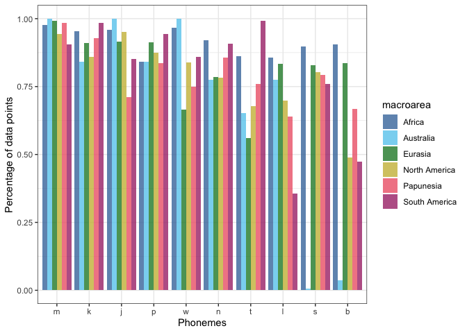<!-- -->

``` r
# Rank with each bar
test <- top.by.area %>% group_by(Phoneme) %>% mutate(counts_rank = rank(-coverage.x)) %>% ungroup()

p <- ggplot(aes(y=coverage.x, x=reorder(Phoneme, -count.y), fill=macroarea, group=counts_rank), data=test) +
  geom_bar(stat="identity", width = 0.9, position=position_dodge(0.9)) +
  xlab("Phonemes") +
  ylab("Percentage of data points") +
  scale_fill_manual(values=c(alpha('#4477aa', .8), alpha('#66ccee', .8), alpha('#228833', .8), alpha('#ccbb44', .8), alpha('#ee6677', .8), alpha('#aa3377', .8)))
p
```

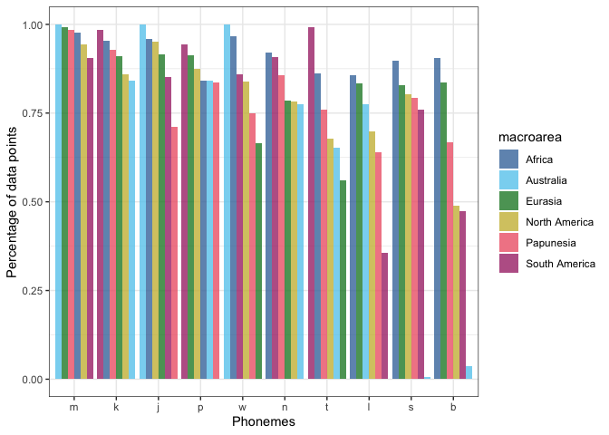<!-- -->

``` r
# Get top n by area with phonemes on y axis
top.by.area <- z %>% group_by(macroarea) %>% filter(SegmentClass=="consonant") %>% top_n(n = 20, wt = coverage.y)

p <- ggplot(aes(y=coverage.x, x=reorder(Phoneme, count.y), fill=macroarea), data=top.by.area) +
  geom_bar(stat="identity", width = 0.9, position=position_dodge(0.9)) +
  xlab("Phonemes") +
  ylab("Percentage of data points") +
  scale_fill_manual(values=c(alpha('#4477aa', .8), alpha('#66ccee', .8), alpha('#228833', .8), alpha('#ccbb44', .8), alpha('#ee6677', .8), alpha('#aa3377', .8)))
p + coord_flip()
```

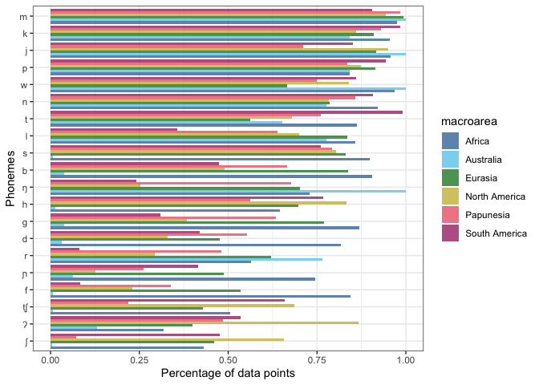<!-- -->

``` r
# Rank with each bar
test <- top.by.area %>% group_by(Phoneme) %>% mutate(counts_rank = rank(coverage.x)) %>% ungroup()

p <- ggplot(aes(y=coverage.x, x=reorder(Phoneme, count.y), fill=macroarea, group=counts_rank), data=test) +
  geom_bar(stat="identity", width = 0.9, position=position_dodge(0.9)) +
  xlab("Phonemes") +
  ylab("Percentage of data points") +
  scale_fill_manual(values=c(alpha('#4477aa', .8), alpha('#66ccee', .8), alpha('#228833', .8), alpha('#ccbb44', .8), alpha('#ee6677', .8), alpha('#aa3377', .8)))
p + coord_flip()
```

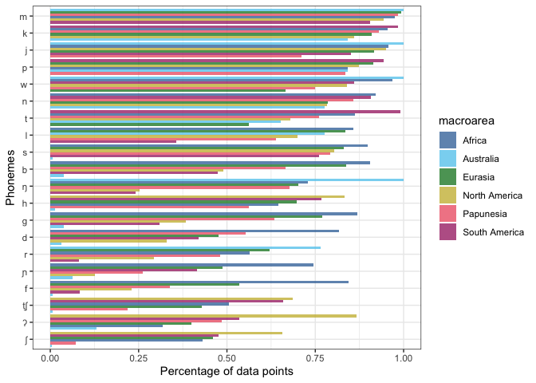<!-- -->

``` r
# Reshape data for phoneme frequency by area
library(reshape2)
head(z)
```

    ## # A tibble: 6 × 8
    ## # Groups:   macroarea [1]
    ##   macroarea Phoneme count.x totals coverage.x count.y coverage.y SegmentClass
    ##   <chr>     <chr>     <int>  <int>      <dbl>   <int>      <dbl> <chr>       
    ## 1 Africa    ˥            40    707    0.0566       77   0.0367   tone        
    ## 2 Africa    ˥˦            4    707    0.00566      16   0.00762  tone        
    ## 3 Africa    ˥˧            1    707    0.00141       2   0.000953 tone        
    ## 4 Africa    ˥˨            1    707    0.00141       1   0.000476 tone        
    ## 5 Africa    ˥˨˧           1    707    0.00141       1   0.000476 tone        
    ## 6 Africa    ˥˩           40    707    0.0566       65   0.0310   tone

``` r
# Extract worldwide coverage
temp <- as.data.frame(z %>% select(Phoneme, coverage.y) %>% ungroup())
```

    ## Adding missing grouping variables: `macroarea`

``` r
temp <- temp[,2:3]
temp <- temp %>% distinct()

# Recast coverage by area
coverage.by.area <- dcast(z, Phoneme ~ macroarea, value.var = "coverage.x")
coverage.by.area <- left_join(temp, coverage.by.area)
```

    ## Joining, by = "Phoneme"

``` r
colnames(coverage.by.area) <- c("Phoneme", "Worldwide", "Africa", "Australia", "Eurasia", "NorthAmerica", "Papunesia", "SouthAmerica")

coverage.by.area <- coverage.by.area %>% arrange(desc(Worldwide))
```

``` r
# By area
p.test <- coverage.by.area %>% head(n=75)
p.test$Phoneme <- factor(p.test$Phoneme, levels = p.test$Phoneme)

ggplot(p.test, aes(Phoneme, group=1)) +
  geom_line(aes(y = Worldwide, colour = "Worldwide"), size=1.5) + 
  geom_line(aes(y = Africa, colour = "Africa")) + 
  geom_line(aes(y = Australia, colour = "Australia")) +
  geom_line(aes(y = Eurasia, colour = "Eurasia")) +
  geom_line(aes(y = NorthAmerica, colour = "NorthAmerica")) +
  geom_line(aes(y = Papunesia, colour = "Papunesia")) +
  geom_line(aes(y = SouthAmerica, colour = "SouthAmerica")) 
```

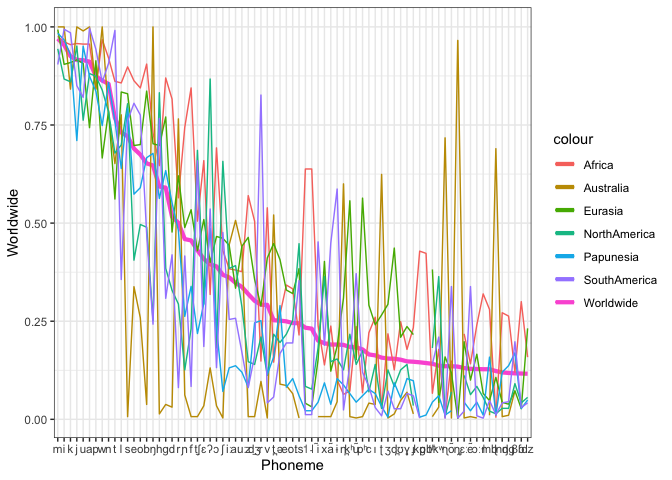<!-- -->

``` r
# By area with points
ggplot(p.test, aes(Phoneme, group=1)) +
  geom_line(aes(y = Worldwide, colour = "Worldwide"), size=1.5) + 
  geom_point(aes(y = Africa, colour = "Africa")) + 
  geom_point(aes(y = Australia, colour = "Australia")) +
  geom_point(aes(y = Eurasia, colour = "Eurasia")) +
  geom_point(aes(y = NorthAmerica, colour = "NorthAmerica")) +
  geom_point(aes(y = Papunesia, colour = "Papunesia")) +
  geom_point(aes(y = SouthAmerica, colour = "SouthAmerica")) 
```

    ## Warning: Removed 1 rows containing missing values (geom_point).

    ## Warning: Removed 6 rows containing missing values (geom_point).

    ## Warning: Removed 2 rows containing missing values (geom_point).

    ## Warning: Removed 3 rows containing missing values (geom_point).

    ## Warning: Removed 1 rows containing missing values (geom_point).
    ## Removed 1 rows containing missing values (geom_point).

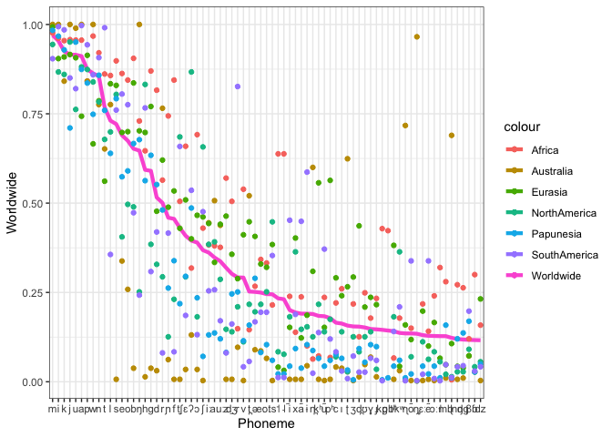<!-- -->

``` r
# Compare genealogically stratied UPSID sample for PHOIBLE

# Get UPSID counts
upsid <- phoible %>% filter(Source=="upsid")
upsid.counts <- upsid %>% select(Phoneme) %>% group_by(Phoneme) %>% summarize(count=n()) %>% arrange(desc(count))
upsid.counts$coverage <- upsid.counts$count/length(unique(upsid$InventoryID))

# Join with PHOIBLE counts
temp <- left_join(phonemes.sorted, upsid.counts, by=c("Phoneme"="Phoneme"))

# Reformaulate Phoneme as an order factor
temp$Phoneme <- factor(temp$Phoneme, levels = temp$Phoneme)
```

``` r
# Plot all data points
ggplot(temp, aes(Phoneme, group=1)) +
  geom_line(aes(y = coverage.x, colour = "PHOIBLE")) + 
  geom_point(aes(y = coverage.y, colour = "UPSID"))
```

    ## Warning: Removed 2227 rows containing missing values (geom_point).

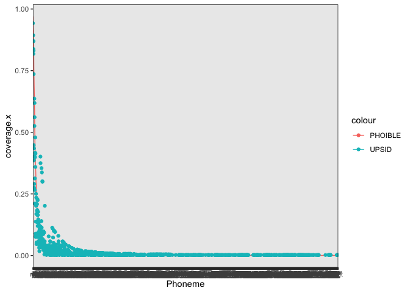<!-- -->

``` r
# Plot a subset of UPSID and PHOIBLE segments
test <- temp %>% head(n=100)

ggplot(test, aes(Phoneme, group=1)) +
  geom_line(aes(y = coverage.x, colour = "PHOIBLE")) + 
  geom_point(aes(y = coverage.y, colour = "UPSID"))
```

    ## Warning: Removed 6 rows containing missing values (geom_point).

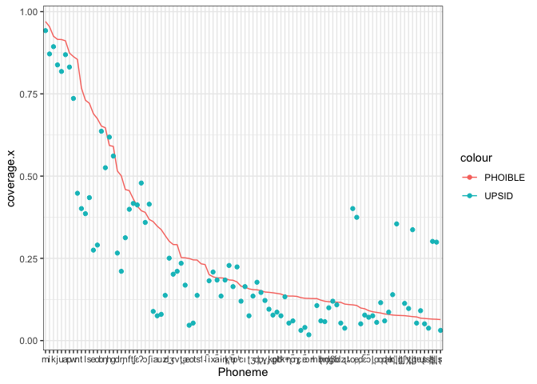<!-- -->
