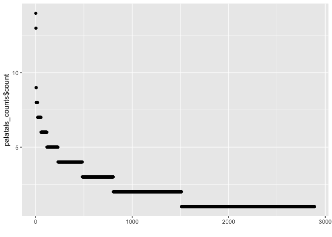

Palatal consonants in PHOIBLE
================
Steven Moran

14 April, 2021

-   [Overview](#overview)
    -   [Data preparation](#data-preparation)
    -   [Exploratory](#exploratory)
    -   [Some searches](#some-searches)
-   [References](#references)

# Overview

This report does tasks like extracting [palatal
consonants](https://en.wikipedia.org/wiki/Palatal_consonant) from
[PHOIBLE](https://phoible.org/) (Moran and McCloy 2019).

## Data preparation

This report uses these [R](https://cran.r-project.org/) libraries
(Wickham et al. 2019; Xie 2020):

``` r
library(tidyverse)
library(knitr)
```

Get the PHOIBLE data and merge in the metadata from
[Glottolog](https://glottolog.org/) (Hammarström et al. 2020).

PHOIBLE data is released periodically be version because the editors add
new data, make reported corrections, etc. Here we use the PHOIBLE dev
version from [May
2020](https://github.com/phoible/dev/tree/646f5e4f64bfefb7868bf4a3b65bcd1da243976a).

``` r
phoible <- read_csv(url("https://github.com/phoible/dev/blob/646f5e4f64bfefb7868bf4a3b65bcd1da243976a/data/phoible.csv?raw=true"), 
                    col_types = c(InventoryID = "i", Marginal = "l", .default = "c"))
```

Merge in [Glottolog 4.1](https://glottolog.org/meta/downloads) data.

``` r
languoids <- read.csv("glottolog_languoid.csv/languoid.csv", stringsAsFactors = FALSE)
geo <- read.csv("languages_and_dialects_geo.csv", stringsAsFactors = FALSE)
phoible <- left_join(phoible, languoids, by = c("Glottocode" = "id"))
phoible <- left_join(phoible, geo)
```

    ## Joining, by = c("name", "level", "latitude", "longitude")

``` r
rm(geo, languoids)
```

Create a PHOIBLE index.

``` r
index <- phoible %>%
  select(InventoryID, 
         Glottocode, 
         ISO6393, 
         name, 
         LanguageName, 
         SpecificDialect, 
         Source, 
         family_id, 
         level, 
         status, 
         latitude, 
         longitude, 
         country_ids, 
         macroarea) %>%
    distinct()

index <- index %>% rename(GlottologName = name, PhoibleName = LanguageName)
```

Get palatal consonant counts and their number of marginals.

``` r
palatals <- phoible %>% filter(grepl("j|ɲ|c|ɟ|ç|ʝ|ʎ", Phoneme))

palatal_counts <- palatals %>%
  group_by(InventoryID) %>%
  summarize(palatals = n())

palatals_marginals <- palatals %>%
  filter(Marginal) %>%
  group_by(InventoryID) %>%
  summarize(Marginal_palatals = n())
```

Let’s write the palatals count data to disk. The output data format is a
[CSV](https://en.wikipedia.org/wiki/Comma-separated_values) file with
the following columns:

    InventoryID | Glottocode | ... | Palatals | Marginal_palatals | ...
    1 | aaaa1111 | ... |

``` r
write_csv(palatals, 'palatals.csv')
```

## Exploratory

Merge together the palatal and marginal palatal counts.

``` r
df <- left_join(palatal_counts, palatals_marginals)
```

    ## Joining, by = "InventoryID"

Have a look at the data.

``` r
df %>%
  head() %>%
  kable()
```

| InventoryID | palatals | Marginal\_palatals |
|------------:|---------:|-------------------:|
|           1 |        1 |                 NA |
|           2 |        1 |                 NA |
|           3 |        1 |                 NA |
|           4 |        3 |                 NA |
|           5 |        1 |                 NA |
|           6 |        1 |                 NA |

Do any languages contain palatals that are always marginal? Yes.

``` r
temp <- df[which(df$palatals == df$Marginal_palatals), ]
temp %>% kable()
```

| InventoryID | palatals | Marginal\_palatals |
|------------:|---------:|-------------------:|
|         519 |        1 |                  1 |
|         562 |        1 |                  1 |
|         894 |        1 |                  1 |
|        1189 |        2 |                  2 |
|        1205 |        1 |                  1 |
|        1214 |        3 |                  3 |
|        1247 |        1 |                  1 |
|        1652 |        1 |                  1 |

Which languages and which palatals are in that set?

``` r
phoible %>% select(InventoryID, Glottocode, LanguageName, Phoneme) %>% filter(InventoryID %in% temp$InventoryID) %>% filter(grepl("j|ɲ|c|ɟ|ç|ʝ|ʎ", Phoneme))
```

    ## # A tibble: 11 x 4
    ##    InventoryID Glottocode LanguageName    Phoneme
    ##          <int> <chr>      <chr>           <chr>  
    ##  1         519 pohn1238   POHNPEIAN       j      
    ##  2         562 atay1247   ATAYAL          j      
    ##  3         894 kris1246   Isaka           j      
    ##  4        1189 berb1259   Berbice Dutch   j      
    ##  5        1189 berb1259   Berbice Dutch   ç      
    ##  6        1205 nort2845   North Marquesan ç      
    ##  7        1214 muna1247   Muna            c      
    ##  8        1214 muna1247   Muna            j      
    ##  9        1214 muna1247   Muna            ɟ      
    ## 10        1247 dibo1245   babole          j      
    ## 11        1652 sand1273   Sandawe         j

How many Glottocodes are there in phoible?

``` r
nrow(phoible %>% select(Glottocode) %>% distinct())
```

    ## [1] 2177

How many phoible inventories have palatal consonants?

``` r
nrow(palatals %>% select(InventoryID) %>% distinct())
```

    ## [1] 2888

How many are marginal?

``` r
nrow(palatals %>% filter(Marginal) %>% group_by(InventoryID, Marginal)) # 70 rows
```

    ## [1] 70

``` r
kable(palatals %>% filter(Marginal) %>% group_by(InventoryID, Marginal))
```

| InventoryID | Glottocode | ISO6393 | LanguageName         | SpecificDialect          | GlyphID   | Phoneme | Allophones  | Marginal | SegmentClass | Source | tone | stress | syllabic | short | long | consonantal | sonorant | continuant | delayedRelease | approximant | tap | trill | nasal | lateral | labial | round | labiodental | coronal | anterior | distributed | strident | dorsal | high | low | front | back | tense | retractedTongueRoot | advancedTongueRoot | periodicGlottalSource | epilaryngealSource | spreadGlottis | constrictedGlottis | fortis | raisedLarynxEjective | loweredLarynxImplosive | click | family\_id | parent\_id | name                                | bookkeeping | level    | status                |   latitude |  longitude | iso639P3code | description | markup\_description | child\_family\_count | child\_language\_count | child\_dialect\_count | country\_ids                        | glottocode | isocodes | macroarea     |
|------------:|:-----------|:--------|:---------------------|:-------------------------|:----------|:--------|:------------|:---------|:-------------|:-------|:-----|:-------|:---------|:------|:-----|:------------|:---------|:-----------|:---------------|:------------|:----|:------|:------|:--------|:-------|:------|:------------|:--------|:---------|:------------|:---------|:-------|:-----|:----|:------|:-----|:------|:--------------------|:-------------------|:----------------------|:-------------------|:--------------|:-------------------|:-------|:---------------------|:-----------------------|:------|:-----------|:-----------|:------------------------------------|:------------|:---------|:----------------------|-----------:|-----------:|:-------------|:------------|:--------------------|---------------------:|-----------------------:|----------------------:|:------------------------------------|:-----------|:---------|:--------------|
|         206 | ahte1237   | aht     | AHTNA                | NA                       | 006A+0325 | j̥       | NA          | TRUE     | consonant    | upsid  | 0    | \-     | \-       | \-    | \-   | \-          | \+       | \+         | 0              | \+          | \-  | \-    | \-    | \-      | \-     | 0     | 0           | \-      | 0        | 0           | 0        | \+     | \+   | \-  | \+    | \-   | \+    | 0                   | 0                  | \-                    | \-                 | \-            | \-                 | \-     | \-                   | \-                     | \-    | atha1245   | nort2940   | Ahtena                              | False       | language | critically endangered |  61.706800 | -144.88900 | aht          | NA          | NA                  |                    0 |                      0 |                     0 | US                                  | ahte1237   | aht      | North America |
|         260 | bret1244   | bre     | BRETON               | NA                       | 0063      | c       | NA          | TRUE     | consonant    | upsid  | 0    | \-     | \-       | \-    | \-   | \+          | \-       | \-         | \-             | \-          | \-  | \-    | \-    | \-      | \-     | 0     | 0           | \+      | \-       | \+          | \-       | \+     | \+   | \-  | \+    | \-   | 0     | 0                   | 0                  | \-                    | \-                 | \-            | \-                 | \-     | \-                   | \-                     | \-    | indo1319   | sout3176   | Breton                              | False       | language | safe                  |  48.245200 |   -3.78934 | bre          | NA          | NA                  |                    0 |                      0 |                     4 | FR                                  | bret1244   | bre      | Eurasia       |
|         260 | bret1244   | bre     | BRETON               | NA                       | 025F      | ɟ       | NA          | TRUE     | consonant    | upsid  | 0    | \-     | \-       | \-    | \-   | \+          | \-       | \-         | \-             | \-          | \-  | \-    | \-    | \-      | \-     | 0     | 0           | \+      | \-       | \+          | \-       | \+     | \+   | \-  | \+    | \-   | 0     | 0                   | 0                  | \+                    | \-                 | \-            | \-                 | \-     | \-                   | \-                     | \-    | indo1319   | sout3176   | Breton                              | False       | language | safe                  |  48.245200 |   -3.78934 | bre          | NA          | NA                  |                    0 |                      0 |                     4 | FR                                  | bret1244   | bre      | Eurasia       |
|         274 | nyah1250   | cbn     | NYAH KUR             | NA                       | 00E7      | ç       | NA          | TRUE     | consonant    | upsid  | 0    | \-     | \-       | \-    | \-   | \+          | \-       | \+         | \+             | \-          | \-  | \-    | \-    | \-      | \-     | 0     | 0           | \+      | \-       | \+          | \-       | \+     | \+   | \-  | \+    | \-   | 0     | 0                   | 0                  | \-                    | \-                 | \-            | \-                 | \-     | \-                   | \-                     | \-    | aust1305   | moni1258   | Nyahkur                             | False       | language | definitely endangered |  15.890900 |  101.51500 | cbn          | NA          | NA                  |                    0 |                      0 |                     0 | TH                                  | nyah1250   | cbn      | Eurasia       |
|         289 | cofa1242   | con     | COFAN                | NA                       | 0063      | c       | NA          | TRUE     | consonant    | upsid  | 0    | \-     | \-       | \-    | \-   | \+          | \-       | \-         | \-             | \-          | \-  | \-    | \-    | \-      | \-     | 0     | 0           | \+      | \-       | \+          | \-       | \+     | \+   | \-  | \+    | \-   | 0     | 0                   | 0                  | \-                    | \-                 | \-            | \-                 | \-     | \-                   | \-                     | \-    |            |            | Cofán                               | False       | language | definitely endangered |   0.276675 |  -77.06430 | con          | NA          | NA                  |                    0 |                      0 |                     2 | CO EC                               | cofa1242   | con      | South America |
|         289 | cofa1242   | con     | COFAN                | NA                       | 0063+02B0 | cʰ      | NA          | TRUE     | consonant    | upsid  | 0    | \-     | \-       | \-    | \-   | \+          | \-       | \-         | \-             | \-          | \-  | \-    | \-    | \-      | \-     | 0     | 0           | \+      | \-       | \+          | \-       | \+     | \+   | \-  | \+    | \-   | 0     | 0                   | 0                  | \-                    | \-                 | \+            | \-                 | \-     | \-                   | \-                     | \-    |            |            | Cofán                               | False       | language | definitely endangered |   0.276675 |  -77.06430 | con          | NA          | NA                  |                    0 |                      0 |                     2 | CO EC                               | cofa1242   | con      | South America |
|         289 | cofa1242   | con     | COFAN                | NA                       | 025F      | ɟ       | NA          | TRUE     | consonant    | upsid  | 0    | \-     | \-       | \-    | \-   | \+          | \-       | \-         | \-             | \-          | \-  | \-    | \-    | \-      | \-     | 0     | 0           | \+      | \-       | \+          | \-       | \+     | \+   | \-  | \+    | \-   | 0     | 0                   | 0                  | \+                    | \-                 | \-            | \-                 | \-     | \-                   | \-                     | \-    |            |            | Cofán                               | False       | language | definitely endangered |   0.276675 |  -77.06430 | con          | NA          | NA                  |                    0 |                      0 |                     2 | CO EC                               | cofa1242   | con      | South America |
|         332 | fuln1247   | fun     | IATE                 | NA                       | 0063+00E7 | cç      | NA          | TRUE     | consonant    | upsid  | 0    | \-     | \-       | \-    | \-   | \+          | \-       | \-         | \+             | \-          | \-  | \-    | \-    | \-      | \-     | 0     | 0           | \+      | \-       | \+          | \-       | \+     | \+   | \-  | \+    | \-   | 0     | 0                   | 0                  | \-                    | \-                 | \-            | \-                 | \-     | \-                   | \-                     | \-    |            |            | Fulniô                              | False       | language | definitely endangered |  -9.025910 |  -37.14020 | fun          | NA          | NA                  |                    0 |                      0 |                     2 | BR                                  | fuln1247   | fun      | South America |
|         332 | fuln1247   | fun     | IATE                 | NA                       | 025F+029D | ɟʝ      | NA          | TRUE     | consonant    | upsid  | 0    | \-     | \-       | \-    | \-   | \+          | \-       | \-         | \+             | \-          | \-  | \-    | \-    | \-      | \-     | 0     | 0           | \+      | \-       | \+          | \-       | \+     | \+   | \-  | \+    | \-   | 0     | 0                   | 0                  | \+                    | \-                 | \-            | \-                 | \-     | \-                   | \-                     | \-    |            |            | Fulniô                              | False       | language | definitely endangered |  -9.025910 |  -37.14020 | fun          | NA          | NA                  |                    0 |                      0 |                     2 | BR                                  | fuln1247   | fun      | South America |
|         345 | para1311   | gug     | GUARANI              | NA                       | 028E      | ʎ       | NA          | TRUE     | consonant    | upsid  | 0    | \-     | \-       | \-    | \-   | \+          | \+       | \+         | 0              | \+          | \-  | \-    | \-    | \+      | \-     | 0     | 0           | \+      | \-       | \+          | \-       | \+     | \+   | \-  | \+    | \-   | 0     | 0                   | 0                  | \+                    | \-                 | \-            | \-                 | \-     | \-                   | \-                     | \-    | tupi1275   | para1319   | Paraguayan Guaraní                  | False       | language | safe                  | -25.605510 |  -57.08816 | gug          | NA          | NA                  |                    0 |                      0 |                     1 | AR PY                               | para1311   | gug      | South America |
|         398 | kera1255   | ker     | KERA                 | NA                       | 0272      | ɲ       | NA          | TRUE     | consonant    | upsid  | 0    | \-     | \-       | \-    | \-   | \+          | \+       | \-         | 0              | \-          | \-  | \-    | \+    | \-      | \-     | 0     | 0           | \+      | \-       | \+          | \-       | \+     | \+   | \-  | \+    | \-   | 0     | 0                   | 0                  | \+                    | \-                 | \-            | \-                 | \-     | \-                   | \-                     | \-    | afro1255   | east2641   | Kera                                | False       | language | safe                  |   9.881650 |   15.14190 | ker          | NA          | NA                  |                    0 |                      0 |                     1 | CM TD                               | kera1255   | ker      | Africa        |
|         425 | koho1244   | kpm     | SRE                  | NA                       | 0272+0325 | ɲ̥       | NA          | TRUE     | consonant    | upsid  | 0    | \-     | \-       | \-    | \-   | \+          | \+       | \-         | 0              | \-          | \-  | \-    | \+    | \-      | \-     | 0     | 0           | \+      | \-       | \+          | \-       | \+     | \+   | \-  | \+    | \-   | 0     | 0                   | 0                  | \-                    | \-                 | \-            | \-                 | \-     | \-                   | \-                     | \-    | aust1305   | koho1243   | Koho                                | False       | language | safe                  |  11.644400 |  108.05700 | kpm          | NA          | NA                  |                    0 |                      0 |                    12 | VN                                  | koho1244   | kpm      | Eurasia       |
|         427 | kory1246   | kpy     | KORYAK               | NA                       | 028E      | ʎ       | NA          | TRUE     | consonant    | upsid  | 0    | \-     | \-       | \-    | \-   | \+          | \+       | \+         | 0              | \+          | \-  | \-    | \-    | \+      | \-     | 0     | 0           | \+      | \-       | \+          | \-       | \+     | \+   | \-  | \+    | \-   | 0     | 0                   | 0                  | \+                    | \-                 | \-            | \-                 | \-     | \-                   | \-                     | \-    | chuk1271   | chuk1272   | Koryak                              | False       | language | definitely endangered |  63.897700 |  166.69500 | kpy          | NA          | NA                  |                    0 |                      0 |                     5 | RU                                  | kory1246   | kpy      | Eurasia       |
|         430 | sgaw1245   | ksw     | KAREN                | NA                       | 0063      | c       | NA          | TRUE     | consonant    | upsid  | 0    | \-     | \-       | \-    | \-   | \+          | \-       | \-         | \-             | \-          | \-  | \-    | \-    | \-      | \-     | 0     | 0           | \+      | \-       | \+          | \-       | \+     | \+   | \-  | \+    | \-   | 0     | 0                   | 0                  | \-                    | \-                 | \-            | \-                 | \-     | \-                   | \-                     | \-    | sino1245   | sgaw1244   | S’gaw Karen                         | False       | language | safe                  |  17.987200 |   97.71260 | ksw          | NA          | NA                  |                    0 |                      0 |                     2 | MM TH                               | sgaw1245   | ksw      | Eurasia       |
|         430 | sgaw1245   | ksw     | KAREN                | NA                       | 0063+02B0 | cʰ      | NA          | TRUE     | consonant    | upsid  | 0    | \-     | \-       | \-    | \-   | \+          | \-       | \-         | \-             | \-          | \-  | \-    | \-    | \-      | \-     | 0     | 0           | \+      | \-       | \+          | \-       | \+     | \+   | \-  | \+    | \-   | 0     | 0                   | 0                  | \-                    | \-                 | \+            | \-                 | \-     | \-                   | \-                     | \-    | sino1245   | sgaw1244   | S’gaw Karen                         | False       | language | safe                  |  17.987200 |   97.71260 | ksw          | NA          | NA                  |                    0 |                      0 |                     2 | MM TH                               | sgaw1245   | ksw      | Eurasia       |
|         430 | sgaw1245   | ksw     | KAREN                | NA                       | 0272      | ɲ       | NA          | TRUE     | consonant    | upsid  | 0    | \-     | \-       | \-    | \-   | \+          | \+       | \-         | 0              | \-          | \-  | \-    | \+    | \-      | \-     | 0     | 0           | \+      | \-       | \+          | \-       | \+     | \+   | \-  | \+    | \-   | 0     | 0                   | 0                  | \+                    | \-                 | \-            | \-                 | \-     | \-                   | \-                     | \-    | sino1245   | sgaw1244   | S’gaw Karen                         | False       | language | safe                  |  17.987200 |   97.71260 | ksw          | NA          | NA                  |                    0 |                      0 |                     2 | MM TH                               | sgaw1245   | ksw      | Eurasia       |
|         519 | pohn1238   | pon     | POHNPEIAN            | NA                       | 006A      | j       | NA          | TRUE     | consonant    | upsid  | 0    | \-     | \-       | \-    | \-   | \-          | \+       | \+         | 0              | \+          | \-  | \-    | \-    | \-      | \-     | 0     | 0           | \-      | 0        | 0           | 0        | \+     | \+   | \-  | \+    | \-   | \+    | 0                   | 0                  | \+                    | \-                 | \-            | \-                 | \-     | \-                   | \-                     | \-    | aust1307   | pona1248   | Pohnpeian                           | False       | language | safe                  |   6.872120 |  158.22300 | pon          | NA          | NA                  |                    0 |                      0 |                     3 | FM                                  | pohn1238   | pon      | Papunesia     |
|         545 | sinh1246   | sin     | SINHALESE            | NA                       | 0272      | ɲ       | NA          | TRUE     | consonant    | upsid  | 0    | \-     | \-       | \-    | \-   | \+          | \+       | \-         | 0              | \-          | \-  | \-    | \+    | \-      | \-     | 0     | 0           | \+      | \-       | \+          | \-       | \+     | \+   | \-  | \+    | \-   | 0     | 0                   | 0                  | \+                    | \-                 | \-            | \-                 | \-     | \-                   | \-                     | \-    | indo1319   | sinh1247   | Sinhala                             | False       | language | safe                  |   8.000000 |   81.00000 | sin          | NA          | NA                  |                    0 |                      0 |                     1 | LK                                  | sinh1246   | sin      | Eurasia       |
|         562 | atay1247   | tay     | ATAYAL               | NA                       | 006A      | j       | NA          | TRUE     | consonant    | upsid  | 0    | \-     | \-       | \-    | \-   | \-          | \+       | \+         | 0              | \+          | \-  | \-    | \-    | \-      | \-     | 0     | 0           | \-      | 0        | 0           | 0        | \+     | \+   | \-  | \+    | \-   | \+    | 0                   | 0                  | \+                    | \-                 | \-            | \-                 | \-     | \-                   | \-                     | \-    | aust1307   | atay1246   | Atayal                              | False       | language | vulnerable            |  24.520900 |  121.38800 | tay          | NA          | NA                  |                    0 |                      0 |                     2 | TW                                  | atay1247   | tay      | Papunesia     |
|         594 | pure1242   | tsz     | TARASCAN             | NA                       | 0272      | ɲ       | NA          | TRUE     | consonant    | upsid  | 0    | \-     | \-       | \-    | \-   | \+          | \+       | \-         | 0              | \-          | \-  | \-    | \+    | \-      | \-     | 0     | 0           | \+      | \-       | \+          | \-       | \+     | \+   | \-  | \+    | \-   | 0     | 0                   | 0                  | \+                    | \-                 | \-            | \-                 | \-     | \-                   | \-                     | \-    | tara1323   | tara1323   | Purepecha                           | False       | language | definitely endangered |  19.246700 | -101.63100 | tsz          | NA          | NA                  |                    0 |                      0 |                     0 | MX US                               | pure1242   | tsz      | North America |
|         597 | nucl1301   | tur     | TURKISH              | NA                       | 0063      | c       | NA          | TRUE     | consonant    | upsid  | 0    | \-     | \-       | \-    | \-   | \+          | \-       | \-         | \-             | \-          | \-  | \-    | \-    | \-      | \-     | 0     | 0           | \+      | \-       | \+          | \-       | \+     | \+   | \-  | \+    | \-   | 0     | 0                   | 0                  | \-                    | \-                 | \-            | \-                 | \-     | \-                   | \-                     | \-    | turk1311   | west2406   | Turkish                             | False       | language | safe                  |  39.866700 |   32.86670 | tur          | NA          | NA                  |                    0 |                      0 |                    10 | AL AM AZ BG CY GE GR IQ IR MK SY TR | nucl1301   | tur      | Eurasia       |
|         597 | nucl1301   | tur     | TURKISH              | NA                       | 025F      | ɟ       | NA          | TRUE     | consonant    | upsid  | 0    | \-     | \-       | \-    | \-   | \+          | \-       | \-         | \-             | \-          | \-  | \-    | \-    | \-      | \-     | 0     | 0           | \+      | \-       | \+          | \-       | \+     | \+   | \-  | \+    | \-   | 0     | 0                   | 0                  | \+                    | \-                 | \-            | \-                 | \-     | \-                   | \-                     | \-    | turk1311   | west2406   | Turkish                             | False       | language | safe                  |  39.866700 |   32.86670 | tur          | NA          | NA                  |                    0 |                      0 |                    10 | AL AM AZ BG CY GE GR IQ IR MK SY TR | nucl1301   | tur      | Eurasia       |
|         597 | nucl1301   | tur     | TURKISH              | NA                       | 028E      | ʎ       | NA          | TRUE     | consonant    | upsid  | 0    | \-     | \-       | \-    | \-   | \+          | \+       | \+         | 0              | \+          | \-  | \-    | \-    | \+      | \-     | 0     | 0           | \+      | \-       | \+          | \-       | \+     | \+   | \-  | \+    | \-   | 0     | 0                   | 0                  | \+                    | \-                 | \-            | \-                 | \-     | \-                   | \-                     | \-    | turk1311   | west2406   | Turkish                             | False       | language | safe                  |  39.866700 |   32.86670 | tur          | NA          | NA                  |                    0 |                      0 |                    10 | AL AM AZ BG CY GE GR IQ IR MK SY TR | nucl1301   | tur      | Eurasia       |
|         894 | kris1246   | ksi     | Isaka                | NA                       | 006A      | j       | j j̃         | TRUE     | consonant    | ph     | 0    | \-     | \-       | \-    | \-   | \-          | \+       | \+         | 0              | \+          | \-  | \-    | \-    | \-      | \-     | 0     | 0           | \-      | 0        | 0           | 0        | \+     | \+   | \-  | \+    | \-   | \+    | 0                   | 0                  | \+                    | \-                 | \-            | \-                 | \-     | \-                   | \-                     | \-    | skoo1245   | skoo1245   | I’saka                              | False       | language | severely endangered   |  -2.800840 |  141.30300 | ksi          | NA          | NA                  |                    0 |                      0 |                     0 | PG                                  | kris1246   | ksi      | Papunesia     |
|         898 | jeme1245   | tow     | Jemez                | NA                       | 006A+0330 | j̰       | j̰           | TRUE     | consonant    | ph     | 0    | \-     | \-       | \-    | \-   | \-          | \+       | \+         | 0              | \+          | \-  | \-    | \-    | \-      | \-     | 0     | 0           | \-      | 0        | 0           | 0        | \+     | \+   | \-  | \+    | \-   | \+    | 0                   | 0                  | \+                    | \-                 | \-            | \+                 | \-     | \-                   | \-                     | \-    | kiow1265   | kiow1265   | Towa                                | False       | language | definitely endangered |  35.599400 | -106.76600 | tow          | NA          | NA                  |                    0 |                      0 |                     0 | US                                  | jeme1245   | tow      | North America |
|         898 | jeme1245   | tow     | Jemez                | NA                       | 025F      | ɟ       | ɟ           | TRUE     | consonant    | ph     | 0    | \-     | \-       | \-    | \-   | \+          | \-       | \-         | \-             | \-          | \-  | \-    | \-    | \-      | \-     | 0     | 0           | \+      | \-       | \+          | \-       | \+     | \+   | \-  | \+    | \-   | 0     | 0                   | 0                  | \+                    | \-                 | \-            | \-                 | \-     | \-                   | \-                     | \-    | kiow1265   | kiow1265   | Towa                                | False       | language | definitely endangered |  35.599400 | -106.76600 | tow          | NA          | NA                  |                    0 |                      0 |                     0 | US                                  | jeme1245   | tow      | North America |
|         919 | kusu1250   | kgg     | Kusunda              | NA                       | 0272      | ɲ       | ɲ           | TRUE     | consonant    | ph     | 0    | \-     | \-       | \-    | \-   | \+          | \+       | \-         | 0              | \-          | \-  | \-    | \+    | \-      | \-     | 0     | 0           | \+      | \-       | \+          | \-       | \+     | \+   | \-  | \+    | \-   | 0     | 0                   | 0                  | \+                    | \-                 | \-            | \-                 | \-     | \-                   | \-                     | \-    |            |            | Kusunda                             | False       | language | critically endangered |  29.176600 |   80.63090 | kgg          | NA          | NA                  |                    0 |                      0 |                     0 | NP                                  | NA         | NA       | NA            |
|         921 | kwaz1243   | xwa     | Kwaza                | NA                       | 0063      | c       | c           | TRUE     | consonant    | ph     | 0    | \-     | \-       | \-    | \-   | \+          | \-       | \-         | \-             | \-          | \-  | \-    | \-    | \-      | \-     | 0     | 0           | \+      | \-       | \+          | \-       | \+     | \+   | \-  | \+    | \-   | 0     | 0                   | 0                  | \-                    | \-                 | \-            | \-                 | \-     | \-                   | \-                     | \-    |            |            | Kwaza                               | False       | language | severely endangered   | -11.666700 |  -61.18330 | xwa          | NA          | NA                  |                    0 |                      0 |                     0 | BR                                  | kwaz1243   | xwa      | South America |
|         950 | ndem1249   | nml     | Ndemli               | NA                       | 006A      | j       | j           | TRUE     | consonant    | ph     | 0    | \-     | \-       | \-    | \-   | \-          | \+       | \+         | 0              | \+          | \-  | \-    | \-    | \-      | \-     | 0     | 0           | \-      | 0        | 0           | 0        | \+     | \+   | \-  | \+    | \-   | \+    | 0                   | 0                  | \+                    | \-                 | \-            | \-                 | \-     | \-                   | \-                     | \-    | atla1278   | narr1282   | Ndemli                              | False       | language | safe                  |   4.580610 |   10.21970 | nml          | NA          | NA                  |                    0 |                      0 |                     0 | CM                                  | ndem1249   | nml      | Africa        |
|         957 | mich1245   | ncl     | Michoacan Nahual     | NA                       | 0272      | ɲ       | ɲ           | TRUE     | consonant    | ph     | 0    | \-     | \-       | \-    | \-   | \+          | \+       | \-         | 0              | \-          | \-  | \-    | \+    | \-      | \-     | 0     | 0           | \+      | \-       | \+          | \-       | \+     | \+   | \-  | \+    | \-   | 0     | 0                   | 0                  | \+                    | \-                 | \-            | \-                 | \-     | \-                   | \-                     | \-    | utoa1244   | west2825   | Michoacán Nahuatl                   | False       | language | vulnerable            |  18.341200 | -103.36100 | ncl          | NA          | NA                  |                    0 |                      0 |                     0 | MX                                  | mich1245   | ncl      | North America |
|         991 | marw1260   | rwr     | Marwari              | NA                       | 0272      | ɲ       | ɲ           | TRUE     | consonant    | ph     | 0    | \-     | \-       | \-    | \-   | \+          | \+       | \-         | 0              | \-          | \-  | \-    | \+    | \-      | \-     | 0     | 0           | \+      | \-       | \+          | \-       | \+     | \+   | \-  | \+    | \-   | 0     | 0                   | 0                  | \+                    | \-                 | \-            | \-                 | \-     | \-                   | \-                     | \-    | indo1319   | mewa1254   | Marwari (India)                     | False       | language | safe                  |  27.002000 |   75.06560 | rwr          | NA          | NA                  |                    0 |                      0 |                     1 | IN NP PK                            | marw1260   | rwr      | Eurasia       |
|         993 | sout2844   | sbd     | Samo de Toma         | NA                       | 0272      | ɲ       | ɲ           | TRUE     | consonant    | ph     | 0    | \-     | \-       | \-    | \-   | \+          | \+       | \-         | 0              | \-          | \-  | \-    | \+    | \-      | \-     | 0     | 0           | \+      | \-       | \+          | \-       | \+     | \+   | \-  | \+    | \-   | 0     | 0                   | 0                  | \+                    | \-                 | \-            | \-                 | \-     | \-                   | \-                     | \-    | mand1469   | mand1437   | Southern Samo                       | False       | language | safe                  |  12.713000 |   -2.90520 | sbd          | NA          | NA                  |                    0 |                      0 |                     1 | BF                                  | sout2844   | sbd      | Africa        |
|        1050 | dutc1256   | nld     | Dutch                | Belgian Standard         | 0272      | ɲ       | ɲ           | TRUE     | consonant    | ph     | 0    | \-     | \-       | \-    | \-   | \+          | \+       | \-         | 0              | \-          | \-  | \-    | \+    | \-      | \-     | 0     | 0           | \+      | \-       | \+          | \-       | \+     | \+   | \-  | \+    | \-   | 0     | 0                   | 0                  | \+                    | \-                 | \-            | \-                 | \-     | \-                   | \-                     | \-    | indo1319   | mode1257   | Dutch                               | False       | language | safe                  |  52.000000 |    5.00000 | nld          | NA          | NA                  |                    0 |                      0 |                     5 | BE BR DE GF GY NL SR                | dutc1256   | nld      | Eurasia       |
|        1050 | dutc1256   | nld     | Dutch                | Belgian Standard         | 028E      | ʎ       | ʎ           | TRUE     | consonant    | ph     | 0    | \-     | \-       | \-    | \-   | \+          | \+       | \+         | 0              | \+          | \-  | \-    | \-    | \+      | \-     | 0     | 0           | \+      | \-       | \+          | \-       | \+     | \+   | \-  | \+    | \-   | 0     | 0                   | 0                  | \+                    | \-                 | \-            | \-                 | \-     | \-                   | \-                     | \-    | indo1319   | mode1257   | Dutch                               | False       | language | safe                  |  52.000000 |    5.00000 | nld          | NA          | NA                  |                    0 |                      0 |                     5 | BE BR DE GF GY NL SR                | dutc1256   | nld      | Eurasia       |
|        1058 | tami1289   | tam     | Tamil                | Standard Spoken Tamil    | 0272      | ɲ       | ɲ           | TRUE     | consonant    | ph     | 0    | \-     | \-       | \-    | \-   | \+          | \+       | \-         | 0              | \-          | \-  | \-    | \+    | \-      | \-     | 0     | 0           | \+      | \-       | \+          | \-       | \+     | \+   | \-  | \+    | \-   | 0     | 0                   | 0                  | \+                    | \-                 | \-            | \-                 | \-     | \-                   | \-                     | \-    | drav1251   | tami1300   | Tamil                               | False       | language | safe                  |  10.520219 |   78.82599 | tam          | NA          | NA                  |                    0 |                      0 |                    19 | IN LK                               | tami1289   | tam      | Eurasia       |
|        1111 | nort2626   | frr     | Frisian              | Sölring North            | 00E7      | ç       | ç           | TRUE     | consonant    | ph     | 0    | \-     | \-       | \-    | \-   | \+          | \-       | \+         | \+             | \-          | \-  | \-    | \-    | \-      | \-     | 0     | 0           | \+      | \-       | \+          | \-       | \+     | \+   | \-  | \+    | \-   | 0     | 0                   | 0                  | \-                    | \-                 | \-            | \-                 | \-     | \-                   | \-                     | \-    | indo1319   | fris1239   | Northern Frisian                    | False       | language | definitely endangered |  54.640900 |    8.58489 | frr          | NA          | NA                  |                    0 |                      0 |                     4 | DE DK                               | nort2626   | frr      | Eurasia       |
|        1128 | mamm1241   | mam     | Western Mam; Tacanec | Tacaná                   | 0272      | ɲ       | ɲ           | TRUE     | consonant    | ph     | 0    | \-     | \-       | \-    | \-   | \+          | \+       | \-         | 0              | \-          | \-  | \-    | \+    | \-      | \-     | 0     | 0           | \+      | \-       | \+          | \-       | \+     | \+   | \-  | \+    | \-   | 0     | 0                   | 0                  | \+                    | \-                 | \-            | \-                 | \-     | \-                   | \-                     | \-    | maya1287   | mame1240   | Mam                                 | False       | language | vulnerable            |  14.803400 |  -91.72310 | mam          | NA          | NA                  |                    0 |                      0 |                     0 | GT MX                               | mamm1241   | mam      | North America |
|        1137 | khan1273   | kca     | Eastern Khanty       | NA                       | 0063      | c       | c           | TRUE     | consonant    | ph     | 0    | \-     | \-       | \-    | \-   | \+          | \-       | \-         | \-             | \-          | \-  | \-    | \-    | \-      | \-     | 0     | 0           | \+      | \-       | \+          | \-       | \+     | \+   | \-  | \+    | \-   | 0     | 0                   | 0                  | \-                    | \-                 | \-            | \-                 | \-     | \-                   | \-                     | \-    | ural1272   | nort3264   | Kazym-Berezover-Suryskarer Khanty   | False       | language | definitely endangered |  62.430800 |   66.12180 | kca          | NA          | NA                  |                    0 |                      0 |                     4 | RU                                  | khan1273   | kca      | Eurasia       |
|        1143 | mono1270   | mnh     | Mono                 | Bili, Bosobolo Zone, DRC | 0272      | ɲ       | ɲ           | TRUE     | consonant    | ph     | 0    | \-     | \-       | \-    | \-   | \+          | \+       | \-         | 0              | \-          | \-  | \-    | \+    | \-      | \-     | 0     | 0           | \+      | \-       | \+          | \-       | \+     | \+   | \-  | \+    | \-   | 0     | 0                   | 0                  | \+                    | \-                 | \-            | \-                 | \-     | \-                   | \-                     | \-    | atla1278   | mids1242   | Mono (Democratic Republic of Congo) | False       | language | vulnerable            |   4.579150 |   19.82640 | mnh          | NA          | NA                  |                    0 |                      0 |                     5 | CD CF                               | mono1270   | mnh      | Africa        |
|        1189 | berb1259   | brc     | Berbice Dutch        | NA                       | 006A      | j       | j           | TRUE     | consonant    | ph     | 0    | \-     | \-       | \-    | \-   | \-          | \+       | \+         | 0              | \+          | \-  | \-    | \-    | \-      | \-     | 0     | 0           | \-      | 0        | 0           | 0        | \+     | \+   | \-  | \+    | \-   | \+    | 0                   | 0                  | \+                    | \-                 | \-            | \-                 | \-     | \-                   | \-                     | \-    | indo1319   | dutc1257   | Berbice Creole Dutch                | False       | language | extinct               |   5.382900 |  -58.00020 | brc          | NA          | NA                  |                    0 |                      0 |                     0 | GY                                  | berb1259   | brc      | South America |
|        1189 | berb1259   | brc     | Berbice Dutch        | NA                       | 00E7      | ç       | ç           | TRUE     | consonant    | ph     | 0    | \-     | \-       | \-    | \-   | \+          | \-       | \+         | \+             | \-          | \-  | \-    | \-    | \-      | \-     | 0     | 0           | \+      | \-       | \+          | \-       | \+     | \+   | \-  | \+    | \-   | 0     | 0                   | 0                  | \-                    | \-                 | \-            | \-                 | \-     | \-                   | \-                     | \-    | indo1319   | dutc1257   | Berbice Creole Dutch                | False       | language | extinct               |   5.382900 |  -58.00020 | brc          | NA          | NA                  |                    0 |                      0 |                     0 | GY                                  | berb1259   | brc      | South America |
|        1205 | nort2845   | mrq     | North Marquesan      | Nuku Hiva                | 00E7      | ç       | ç           | TRUE     | consonant    | ph     | 0    | \-     | \-       | \-    | \-   | \+          | \-       | \+         | \+             | \-          | \-  | \-    | \-    | \-      | \-     | 0     | 0           | \+      | \-       | \+          | \-       | \+     | \+   | \-  | \+    | \-   | 0     | 0                   | 0                  | \-                    | \-                 | \-            | \-                 | \-     | \-                   | \-                     | \-    | aust1307   | marq1246   | North Marquesan                     | False       | language | definitely endangered |  -8.894120 | -140.10800 | mrq          | NA          | NA                  |                    0 |                      0 |                     4 | PF                                  | nort2845   | mrq      | Papunesia     |
|        1214 | muna1247   | mnb     | Muna                 | NA                       | 0063      | c       | c           | TRUE     | consonant    | ph     | 0    | \-     | \-       | \-    | \-   | \+          | \-       | \-         | \-             | \-          | \-  | \-    | \-    | \-      | \-     | 0     | 0           | \+      | \-       | \+          | \-       | \+     | \+   | \-  | \+    | \-   | 0     | 0                   | 0                  | \-                    | \-                 | \-            | \-                 | \-     | \-                   | \-                     | \-    | aust1307   | west2847   | Muna                                | False       | language | vulnerable            |  -5.404190 |  122.54100 | mnb          | NA          | NA                  |                    0 |                      0 |                    23 | ID                                  | muna1247   | mnb      | Papunesia     |
|        1214 | muna1247   | mnb     | Muna                 | NA                       | 006A      | j       | j           | TRUE     | consonant    | ph     | 0    | \-     | \-       | \-    | \-   | \-          | \+       | \+         | 0              | \+          | \-  | \-    | \-    | \-      | \-     | 0     | 0           | \-      | 0        | 0           | 0        | \+     | \+   | \-  | \+    | \-   | \+    | 0                   | 0                  | \+                    | \-                 | \-            | \-                 | \-     | \-                   | \-                     | \-    | aust1307   | west2847   | Muna                                | False       | language | vulnerable            |  -5.404190 |  122.54100 | mnb          | NA          | NA                  |                    0 |                      0 |                    23 | ID                                  | muna1247   | mnb      | Papunesia     |
|        1214 | muna1247   | mnb     | Muna                 | NA                       | 025F      | ɟ       | ɟ           | TRUE     | consonant    | ph     | 0    | \-     | \-       | \-    | \-   | \+          | \-       | \-         | \-             | \-          | \-  | \-    | \-    | \-      | \-     | 0     | 0           | \+      | \-       | \+          | \-       | \+     | \+   | \-  | \+    | \-   | 0     | 0                   | 0                  | \+                    | \-                 | \-            | \-                 | \-     | \-                   | \-                     | \-    | aust1307   | west2847   | Muna                                | False       | language | vulnerable            |  -5.404190 |  122.54100 | mnb          | NA          | NA                  |                    0 |                      0 |                    23 | ID                                  | muna1247   | mnb      | Papunesia     |
|        1247 | dibo1245   | bvx     | babole               | NA                       | 006A      | j       | j           | TRUE     | consonant    | gm     | 0    | \-     | \-       | \-    | \-   | \-          | \+       | \+         | 0              | \+          | \-  | \-    | \-    | \-      | \-     | 0     | 0           | \-      | 0        | 0           | 0        | \+     | \+   | \-  | \+    | \-   | \+    | 0                   | 0                  | \+                    | \-                 | \-            | \-                 | \-     | \-                   | \-                     | \-    | atla1278   | liko1251   | Dibole                              | False       | language | definitely endangered |   1.077730 |   17.23050 | bvx          | NA          | NA                  |                    0 |                      0 |                     3 | CG                                  | dibo1245   | bvx      | Africa        |
|        1373 | kamb1316   | ktb     | Kambaata             | NA                       | 0272      | ɲ       | ɲ           | TRUE     | consonant    | gm     | 0    | \-     | \-       | \-    | \-   | \+          | \+       | \-         | 0              | \-          | \-  | \-    | \+    | \-      | \-     | 0     | 0           | \+      | \-       | \+          | \-       | \+     | \+   | \-  | \+    | \-   | 0     | 0                   | 0                  | \+                    | \-                 | \-            | \-                 | \-     | \-                   | \-                     | \-    | afro1255   | kamb1318   | Kambaata                            | False       | language | safe                  |   7.375820 |   37.90880 | ktb          | NA          | NA                  |                    0 |                      0 |                     3 | ET                                  | kamb1316   | ktb      | Africa        |
|        1416 | tuli1249   | tey     | Tulishi              | Kamda                    | 0063      | c       | c           | TRUE     | consonant    | gm     | 0    | \-     | \-       | \-    | \-   | \+          | \-       | \-         | \-             | \-          | \-  | \-    | \-    | \-      | \-     | 0     | 0           | \+      | \-       | \+          | \-       | \+     | \+   | \-  | \+    | \-   | 0     | 0                   | 0                  | \-                    | \-                 | \-            | \-                 | \-     | \-                   | \-                     | \-    | kadu1256   | cent2229   | Tulishi                             | False       | language | definitely endangered |  11.450700 |   29.10800 | tey          | NA          | NA                  |                    0 |                      0 |                     3 | SD                                  | tuli1249   | tey      | Africa        |
|        1429 | toch1257   | taz     | Tocco                | NA                       | 006A      | j       | j           | TRUE     | consonant    | gm     | 0    | \-     | \-       | \-    | \-   | \-          | \+       | \+         | 0              | \+          | \-  | \-    | \-    | \-      | \-     | 0     | 0           | \-      | 0        | 0           | 0        | \+     | \+   | \-  | \+    | \-   | \+    | 0                   | 0                  | \+                    | \-                 | \-            | \-                 | \-     | \-                   | \-                     | \-    | narr1279   | ache1247   | Tocho                               | False       | language | definitely endangered |  10.882800 |   30.15670 | taz          | NA          | NA                  |                    0 |                      0 |                     0 | SD                                  | toch1257   | taz      | Africa        |
|        1509 | zagh1240   | zag     | Beria                | NA                       | 0063      | c       | c c̚         | TRUE     | consonant    | gm     | 0    | \-     | \-       | \-    | \-   | \+          | \-       | \-         | \-             | \-          | \-  | \-    | \-    | \-      | \-     | 0     | 0           | \+      | \-       | \+          | \-       | \+     | \+   | \-  | \+    | \-   | 0     | 0                   | 0                  | \-                    | \-                 | \-            | \-                 | \-     | \-                   | \-                     | \-    | saha1256   | east2432   | Beria                               | False       | language | safe                  |  17.484200 |   23.46260 | zag          | NA          | NA                  |                    0 |                      0 |                     6 | LY SD TD                            | zagh1240   | zag      | Africa        |
|        1528 | tiag1235   | ahi     | Aizi, Tiagba         | NA                       | 0063      | c       | c           | TRUE     | consonant    | gm     | 0    | \-     | \-       | \-    | \-   | \+          | \-       | \-         | \-             | \-          | \-  | \-    | \-    | \-      | \-     | 0     | 0           | \+      | \-       | \+          | \-       | \+     | \+   | \-  | \+    | \-   | 0     | 0                   | 0                  | \-                    | \-                 | \-            | \-                 | \-     | \-                   | \-                     | \-    | atla1278   | aizi1248   | Tiagbamrin Aizi                     | False       | language | safe                  |   5.280220 |   -4.62352 | ahi          | NA          | NA                  |                    0 |                      0 |                     0 | CI                                  | tiag1235   | ahi      | Africa        |
|        1528 | tiag1235   | ahi     | Aizi, Tiagba         | NA                       | 025F      | ɟ       | ɟ           | TRUE     | consonant    | gm     | 0    | \-     | \-       | \-    | \-   | \+          | \-       | \-         | \-             | \-          | \-  | \-    | \-    | \-      | \-     | 0     | 0           | \+      | \-       | \+          | \-       | \+     | \+   | \-  | \+    | \-   | 0     | 0                   | 0                  | \+                    | \-                 | \-            | \-                 | \-     | \-                   | \-                     | \-    | atla1278   | aizi1248   | Tiagbamrin Aizi                     | False       | language | safe                  |   5.280220 |   -4.62352 | ahi          | NA          | NA                  |                    0 |                      0 |                     0 | CI                                  | tiag1235   | ahi      | Africa        |
|        1548 | sout2790   | biv     | Birifor              | NA                       | 006A+02C0 | jˀ      | jˀ          | TRUE     | consonant    | gm     | 0    | \-     | \-       | \-    | \-   | \-          | \+       | \+         | 0              | \+          | \-  | \-    | \-    | \-      | \-     | 0     | 0           | \-      | 0        | 0           | 0        | \+     | \+   | \-  | \+    | \-   | \+    | 0                   | 0                  | \+                    | \-                 | \-            | \+                 | \-     | \-                   | \-                     | \-    | atla1278   | biri1257   | Southern Birifor                    | False       | language | safe                  |   9.287300 |   -2.72672 | biv          | NA          | NA                  |                    0 |                      0 |                     0 | BF CI GH                            | sout2790   | biv      | Africa        |
|        1550 | atti1239   | ati     | Attie                | Memni                    | 0063      | c       | c           | TRUE     | consonant    | gm     | 0    | \-     | \-       | \-    | \-   | \+          | \-       | \-         | \-             | \-          | \-  | \-    | \-    | \-      | \-     | 0     | 0           | \+      | \-       | \+          | \-       | \+     | \+   | \-  | \+    | \-   | 0     | 0                   | 0                  | \-                    | \-                 | \-            | \-                 | \-     | \-                   | \-                     | \-    | atla1278   | nyoa1234   | Attié                               | False       | language | safe                  |   5.997700 |   -3.82090 | ati          | NA          | NA                  |                    0 |                      0 |                     3 | CI                                  | atti1239   | ati      | Africa        |
|        1550 | atti1239   | ati     | Attie                | Memni                    | 025F      | ɟ       | ɟ           | TRUE     | consonant    | gm     | 0    | \-     | \-       | \-    | \-   | \+          | \-       | \-         | \-             | \-          | \-  | \-    | \-    | \-      | \-     | 0     | 0           | \+      | \-       | \+          | \-       | \+     | \+   | \-  | \+    | \-   | 0     | 0                   | 0                  | \+                    | \-                 | \-            | \-                 | \-     | \-                   | \-                     | \-    | atla1278   | nyoa1234   | Attié                               | False       | language | safe                  |   5.997700 |   -3.82090 | ati          | NA          | NA                  |                    0 |                      0 |                     3 | CI                                  | atti1239   | ati      | Africa        |
|        1552 | east2652   | hae     | Oromo, Eastern       | Harar                    | 0272      | ɲ       | ɲ           | TRUE     | consonant    | gm     | 0    | \-     | \-       | \-    | \-   | \+          | \+       | \-         | 0              | \-          | \-  | \-    | \+    | \-      | \-     | 0     | 0           | \+      | \-       | \+          | \-       | \+     | \+   | \-  | \+    | \-   | 0     | 0                   | 0                  | \+                    | \-                 | \-            | \-                 | \-     | \-                   | \-                     | \-    | afro1255   | sout3218   | Eastern Oromo                       | False       | language | safe                  |   8.674280 |   41.43950 | hae          | NA          | NA                  |                    0 |                      0 |                     4 | ET                                  | east2652   | hae      | Africa        |
|        1562 | gagu1242   | ggu     | Gban                 | NA                       | 0063      | c       | c           | TRUE     | consonant    | gm     | 0    | \-     | \-       | \-    | \-   | \+          | \-       | \-         | \-             | \-          | \-  | \-    | \-    | \-      | \-     | 0     | 0           | \+      | \-       | \+          | \-       | \+     | \+   | \-  | \+    | \-   | 0     | 0                   | 0                  | \-                    | \-                 | \-            | \-                 | \-     | \-                   | \-                     | \-    | mand1469   | beng1285   | Gban                                | False       | language | safe                  |   6.408590 |   -5.51851 | ggu          | NA          | NA                  |                    0 |                      0 |                     4 | CI                                  | gagu1242   | ggu      | Africa        |
|        1562 | gagu1242   | ggu     | Gban                 | NA                       | 025F      | ɟ       | ɟ           | TRUE     | consonant    | gm     | 0    | \-     | \-       | \-    | \-   | \+          | \-       | \-         | \-             | \-          | \-  | \-    | \-    | \-      | \-     | 0     | 0           | \+      | \-       | \+          | \-       | \+     | \+   | \-  | \+    | \-   | 0     | 0                   | 0                  | \+                    | \-                 | \-            | \-                 | \-     | \-                   | \-                     | \-    | mand1469   | beng1285   | Gban                                | False       | language | safe                  |   6.408590 |   -5.51851 | ggu          | NA          | NA                  |                    0 |                      0 |                     4 | CI                                  | gagu1242   | ggu      | Africa        |
|        1566 | saot1239   | cri     | Saotomense           | NA                       | 0272      | ɲ       | ɲ           | TRUE     | consonant    | gm     | 0    | \-     | \-       | \-    | \-   | \+          | \+       | \-         | 0              | \-          | \-  | \-    | \+    | \-      | \-     | 0     | 0           | \+      | \-       | \+          | \-       | \+     | \+   | \-  | \+    | \-   | 0     | 0                   | 0                  | \+                    | \-                 | \-            | \-                 | \-     | \-                   | \-                     | \-    | indo1319   | saot1240   | Sãotomense                          | False       | language | vulnerable            |   0.283320 |    6.61935 | cri          | NA          | NA                  |                    0 |                      0 |                     0 | ST                                  | saot1239   | cri      | Africa        |
|        1566 | saot1239   | cri     | Saotomense           | NA                       | 028E      | ʎ       | ʎ           | TRUE     | consonant    | gm     | 0    | \-     | \-       | \-    | \-   | \+          | \+       | \+         | 0              | \+          | \-  | \-    | \-    | \+      | \-     | 0     | 0           | \+      | \-       | \+          | \-       | \+     | \+   | \-  | \+    | \-   | 0     | 0                   | 0                  | \+                    | \-                 | \-            | \-                 | \-     | \-                   | \-                     | \-    | indo1319   | saot1240   | Sãotomense                          | False       | language | vulnerable            |   0.283320 |    6.61935 | cri          | NA          | NA                  |                    0 |                      0 |                     0 | ST                                  | saot1239   | cri      | Africa        |
|        1601 | mfum1238   | nfu     | Mfumte               | NA                       | 006A      | j       | j           | TRUE     | consonant    | gm     | 0    | \-     | \-       | \-    | \-   | \-          | \+       | \+         | 0              | \+          | \-  | \-    | \-    | \-      | \-     | 0     | 0           | \-      | 0        | 0           | 0        | \+     | \+   | \-  | \+    | \-   | \+    | 0                   | 0                  | \+                    | \-                 | \-            | \-                 | \-     | \-                   | \-                     | \-    | atla1278   | cent2313   | Southern Mfumte                     | False       | language | safe                  |   6.600000 |   10.93639 | nfu          | NA          | NA                  |                    0 |                      0 |                    10 | CM NG                               | mfum1238   | nfu      | Africa        |
|        1622 | kura1250   | knk     | Kuranko              | NA                       | 0063      | c       | c           | TRUE     | consonant    | gm     | 0    | \-     | \-       | \-    | \-   | \+          | \-       | \-         | \-             | \-          | \-  | \-    | \-    | \-      | \-     | 0     | 0           | \+      | \-       | \+          | \-       | \+     | \+   | \-  | \+    | \-   | 0     | 0                   | 0                  | \-                    | \-                 | \-            | \-                 | \-     | \-                   | \-                     | \-    | mand1469   | nucl1445   | Kuranko                             | False       | language | safe                  |   9.493250 |  -10.61220 | knk          | NA          | NA                  |                    0 |                      0 |                     7 | GN SL                               | kura1250   | knk      | Africa        |
|        1652 | sand1273   | sad     | Sandawe              | NA                       | 006A      | j       | j           | TRUE     | consonant    | gm     | 0    | \-     | \-       | \-    | \-   | \-          | \+       | \+         | 0              | \+          | \-  | \-    | \-    | \-      | \-     | 0     | 0           | \-      | 0        | 0           | 0        | \+     | \+   | \-  | \+    | \-   | \+    | 0                   | 0                  | \+                    | \-                 | \-            | \-                 | \-     | \-                   | \-                     | \-    |            |            | Sandawe                             | False       | language | vulnerable            |  -5.269180 |   35.48080 | sad          | NA          | NA                  |                    0 |                      0 |                     0 | TZ                                  | sand1273   | sad      | Africa        |
|        1656 | bafa1249   | bfj     | Nchufie              | NA                       | 0272      | ɲ       | ɲ           | TRUE     | consonant    | gm     | 0    | \-     | \-       | \-    | \-   | \+          | \+       | \-         | 0              | \-          | \-  | \-    | \+    | \-      | \-     | 0     | 0           | \+      | \-       | \+          | \-       | \+     | \+   | \-  | \+    | \-   | 0     | 0                   | 0                  | \+                    | \-                 | \-            | \-                 | \-     | \-                   | \-                     | \-    | atla1278   | bamo1241   | Bafanji                             | False       | language | safe                  |   5.846120 |   10.45180 | bfj          | NA          | NA                  |                    0 |                      0 |                     0 | CM                                  | bafa1249   | bfj      | Africa        |
|        1663 | tumt1243   | tbr     | Talasa               | NA                       | 025F      | ɟ       | ɟ           | TRUE     | consonant    | gm     | 0    | \-     | \-       | \-    | \-   | \+          | \-       | \-         | \-             | \-          | \-  | \-    | \-    | \-      | \-     | 0     | 0           | \+      | \-       | \+          | \-       | \+     | \+   | \-  | \+    | \-   | 0     | 0                   | 0                  | \+                    | \-                 | \-            | \-                 | \-     | \-                   | \-                     | \-    | kadu1256   | east2424   | Tumtum                              | False       | language | definitely endangered |  10.637800 |   30.41280 | tbr          | NA          | NA                  |                    0 |                      0 |                     3 | SD                                  | tumt1243   | tbr      | Africa        |
|        1666 | taga1270   | tgl     | Tagalog              | NA                       | 0063      | c       | c           | TRUE     | consonant    | gm     | 0    | \-     | \-       | \-    | \-   | \+          | \-       | \-         | \-             | \-          | \-  | \-    | \-    | \-      | \-     | 0     | 0           | \+      | \-       | \+          | \-       | \+     | \+   | \-  | \+    | \-   | 0     | 0                   | 0                  | \-                    | \-                 | \-            | \-                 | \-     | \-                   | \-                     | \-    | aust1307   | taga1269   | Tagalog                             | False       | language | safe                  |  14.060000 |  121.74700 | tgl          | NA          | NA                  |                    0 |                      0 |                     8 | PH                                  | taga1270   | tgl      | Papunesia     |
|        1666 | taga1270   | tgl     | Tagalog              | NA                       | 025F      | ɟ       | ɟ           | TRUE     | consonant    | gm     | 0    | \-     | \-       | \-    | \-   | \+          | \-       | \-         | \-             | \-          | \-  | \-    | \-    | \-      | \-     | 0     | 0           | \+      | \-       | \+          | \-       | \+     | \+   | \-  | \+    | \-   | 0     | 0                   | 0                  | \+                    | \-                 | \-            | \-                 | \-     | \-                   | \-                     | \-    | aust1307   | taga1269   | Tagalog                             | False       | language | safe                  |  14.060000 |  121.74700 | tgl          | NA          | NA                  |                    0 |                      0 |                     8 | PH                                  | taga1270   | tgl      | Papunesia     |
|        1691 | nucl1460   | mad     | Madurese             | Bangkalan                | 006A      | j       | j           | TRUE     | consonant    | gm     | 0    | \-     | \-       | \-    | \-   | \-          | \+       | \+         | 0              | \+          | \-  | \-    | \-    | \-      | \-     | 0     | 0           | \-      | 0        | 0           | 0        | \+     | \+   | \-  | \+    | \-   | \+    | 0                   | 0                  | \+                    | \-                 | \-            | \-                 | \-     | \-                   | \-                     | \-    | aust1307   | madu1247   | Madurese                            | False       | language | safe                  |  -7.000000 |  113.00000 | mad          | NA          | NA                  |                    0 |                      0 |                     6 | ID                                  | nucl1460   | mad      | Papunesia     |
|        1695 | cent2087   | bcl     | Bikol (Bicolano)     | Central                  | 028E      | ʎ       | ʎ           | TRUE     | consonant    | gm     | 0    | \-     | \-       | \-    | \-   | \+          | \+       | \+         | 0              | \+          | \-  | \-    | \-    | \+      | \-     | 0     | 0           | \+      | \-       | \+          | \-       | \+     | \+   | \-  | \+    | \-   | 0     | 0                   | 0                  | \+                    | \-                 | \-            | \-                 | \-     | \-                   | \-                     | \-    | aust1307   | coas1315   | Coastal-Naga Bikol                  | False       | language | safe                  |  13.757400 |  123.40300 | bcl          | NA          | NA                  |                    0 |                      0 |                     2 | PH                                  | cent2087   | bcl      | Papunesia     |
|        2230 | shix1238   | sxg     | Xumi                 | Lower Xumi               | 0272+031F | ɲ̟       | ɲ̟ &lt;ɲ̟&gt; | TRUE     | consonant    | uz     | 0    | \-     | \-       | \-    | \-   | \+          | \+       | \-         | 0              | \-          | \-  | \-    | \+    | \-      | \-     | 0     | 0           | \+      | \+       | \+          | \-       | \+     | \+   | \-  | \+    | \-   | 0     | 0                   | 0                  | \+                    | \-                 | \-            | \-                 | \-     | \-                   | \-                     | \-    | sino1245   | naic1235   | Shixing                             | False       | language | definitely endangered |  28.389500 |  100.40000 | sxg          | NA          | NA                  |                    0 |                      0 |                     0 | CN                                  | shix1238   | sxg      | Eurasia       |

How are palatals distributed in phoible (across duplicate languages)?

``` r
distribution_palatals <- palatals %>%
  group_by(Phoneme) %>%
  summarize(count = n()) %>%
  arrange(desc(count))
kable(distribution_palatals)
```

| Phoneme | count |
|:--------|------:|
| j       |  2716 |
| ɲ       |  1255 |
| c       |   418 |
| ɟ       |   368 |
| ʎ       |   147 |
| ç       |   137 |
| cç      |   124 |
| ɟʝ      |   111 |
| cʰ      |    99 |
| ʝ       |    61 |
| jː      |    50 |
| cçʰ     |    49 |
| ɲɟ      |    44 |
| ɲː      |    42 |
| j̰       |    33 |
| ɲ̟       |    31 |
| cʼ      |    28 |
| ɟ̤ʝ      |    26 |
| ɲ̥       |    26 |
| jʷ      |    24 |
| j̥       |    22 |
| ɲʷ      |    18 |
| ʎ̟       |    16 |
| ɲ̊       |    15 |
| ɟː      |    14 |
| j̃       |    13 |
| c̟       |    11 |
| ˀj      |    11 |
| ɟʰ      |    10 |
| cː      |     9 |
| jˀ      |     9 |
| cʷ      |     7 |
| j̊       |     7 |
| cçː     |     5 |
| cçʼ     |     5 |
| j̪       |     5 |
| ɲ̤       |     5 |
| ɲʒ      |     5 |
| ˀɲ      |     5 |
| çː      |     4 |
| ɟ̟       |     4 |
| ɟʱ      |     4 |
| ɟʝʷ     |     4 |
| ɟʷ      |     4 |
| ɲ̰       |     4 |
| ɲc      |     4 |
| ç̟       |     3 |
| c̤       |     3 |
| cçʷ     |     3 |
| cʲ      |     3 |
| çʷ      |     3 |
| cʼː     |     3 |
| ɟ̤       |     3 |
| ɟ̰       |     3 |
| ɟʲ      |     3 |
| ɟʝː     |     3 |
| ɲcʰ     |     3 |
| c̰       |     2 |
| çʲ      |     2 |
| cʷʰ     |     2 |
| ʰc      |     2 |
| ʱj      |     2 |
| ʱɟ      |     2 |
| ʎ̟̥       |     2 |
| ʎː      |     2 |
| nɟ      |     2 |
| ɲ̩       |     2 |
| ɲ̟̥       |     2 |
| ɲʱ      |     2 |
| ɲj      |     2 |
| ɲᶣ      |     2 |
| ʼj      |     2 |
| ʼɲ      |     2 |
| c̻       |     1 |
| c̠       |     1 |
| c̻̟       |     1 |
| cçʷʰ    |     1 |
| çʰ      |     1 |
| cʰː     |     1 |
| cn̠      |     1 |
| cɲ      |     1 |
| cˀ      |     1 |
| ʱɲ      |     1 |
| j̟       |     1 |
| j̻       |     1 |
| j̤       |     1 |
| jʱ      |     1 |
| j̥ʷ      |     1 |
| jʔ      |     1 |
| jˤ      |     1 |
| ʝ̟       |     1 |
| ʝː      |     1 |
| ɟ̰̩       |     1 |
| ɟɦ      |     1 |
| ɟʝ̞      |     1 |
| ɟ̥ʝ̥      |     1 |
| ʎ̻       |     1 |
| ʎ̻̟       |     1 |
| ʎ̥       |     1 |
| ʎʱ      |     1 |
| ʎʼ      |     1 |
| ɲ̻       |     1 |
| ɲ̠       |     1 |
| ɲ̻̟       |     1 |
| ɲ̤cʰ     |     1 |
| ɲcʲ     |     1 |
| ɲcʼ     |     1 |
| ɲ̟dʑ     |     1 |
| ɲ̤ʱ      |     1 |
| ɲ̟ʝ̟      |     1 |
| ɲ̤ɟ̤      |     1 |
| ɲɟʝ     |     1 |
| ɲɟʑ     |     1 |
| ɲʄ      |     1 |
| ɲ̥ɲ      |     1 |
| ɲ̟tɕʰ    |     1 |
| ɲʼ      |     1 |
| tç      |     1 |
| ʷɟ      |     1 |
| ʔj      |     1 |
| ˀc      |     1 |
| ˀj̥      |     1 |
| ˀj̰      |     1 |
| ˀɟ      |     1 |
| ˀɲː     |     1 |

``` r
# Order the frequency counts and plot the distribution of uvular consonants in the sample
distribution_palatals$Phoneme <- factor(distribution_palatals$Phoneme, levels = distribution_palatals$Phoneme[order(-distribution_palatals$count)])

# qplot(distribution_palatals$Phoneme, distribution_palatals$count)

p <- ggplot(aes(y = count, x = Phoneme), data = distribution_palatals) +
  geom_bar(stat = "identity", width = 0.3, color = "black") +
  xlab("Segments") +
  ylab("# of languages") +
  theme_minimal() +
  ggtitle("")
p
```

<!-- -->

Distribution of palatal consonants per inventory (can’t use Glottocode
because there are multiple doculects).

``` r
palatals_counts <- palatals %>%
  select(InventoryID, Glottocode, Phoneme, macroarea) %>%
  group_by(InventoryID, Glottocode, macroarea) %>%
  summarize(count = n()) %>%
  arrange(desc(count))
```

    ## `summarise()` has grouped output by 'InventoryID', 'Glottocode'. You can override using the `.groups` argument.

``` r
qplot(y = palatals_counts$count)
```

<!-- -->

How are they distributed via macroarea?

``` r
kable(table(palatals_counts$macroarea))
```

| Var1          | Freq |
|:--------------|-----:|
|               |   10 |
| Africa        |  850 |
| Australia     |  408 |
| Eurasia       |  708 |
| North America |  162 |
| Papunesia     |  162 |
| South America |  423 |

## Some searches

For example, languages that have /ʎ/ and /c/ simultaneously.

``` r
temp <- phoible %>% filter(Phoneme %in% c('ʎ', 'c'))
tallied <- temp %>% group_by(InventoryID) %>% tally()
tallied <- tallied %>% filter(n>1)
temp %>% filter(InventoryID %in% tallied$InventoryID) %>% arrange(InventoryID) %>% kable()
```

| InventoryID | Glottocode | ISO6393 | LanguageName      | SpecificDialect                         | GlyphID | Phoneme | Allophones | Marginal | SegmentClass | Source | tone | stress | syllabic | short | long | consonantal | sonorant | continuant | delayedRelease | approximant | tap | trill | nasal | lateral | labial | round | labiodental | coronal | anterior | distributed | strident | dorsal | high | low | front | back | tense | retractedTongueRoot | advancedTongueRoot | periodicGlottalSource | epilaryngealSource | spreadGlottis | constrictedGlottis | fortis | raisedLarynxEjective | loweredLarynxImplosive | click | family\_id | parent\_id | name                              | bookkeeping | level    | status                |  latitude | longitude | iso639P3code | description | markup\_description | child\_family\_count | child\_language\_count | child\_dialect\_count | country\_ids                        | glottocode | isocodes | macroarea     |
|------------:|:-----------|:--------|:------------------|:----------------------------------------|:--------|:--------|:-----------|:---------|:-------------|:-------|:-----|:-------|:---------|:------|:-----|:------------|:---------|:-----------|:---------------|:------------|:----|:------|:------|:--------|:-------|:------|:------------|:--------|:---------|:------------|:---------|:-------|:-----|:----|:------|:-----|:------|:--------------------|:-------------------|:----------------------|:-------------------|:--------------|:-------------------|:-------|:---------------------|:-----------------------|:------|:-----------|:-----------|:----------------------------------|:------------|:---------|:----------------------|----------:|----------:|:-------------|:------------|:--------------------|---------------------:|-----------------------:|----------------------:|:------------------------------------|:-----------|:---------|:--------------|
|         105 | jaqa1244   | jqr     | Aymara            | NA                                      | 0063    | c       | c          | NA       | consonant    | spa    | 0    | \-     | \-       | \-    | \-   | \+          | \-       | \-         | \-             | \-          | \-  | \-    | \-    | \-      | \-     | 0     | 0           | \+      | \-       | \+          | \-       | \+     | \+   | \-  | \+    | \-   | 0     | 0                   | 0                  | \-                    | \-                 | \-            | \-                 | \-     | \-                   | \-                     | \-    | ayma1253   | ayma1253   | Jaqaru                            | False       | language | definitely endangered | -12.88230 | -75.89580 | jqr          | NA          | NA                  |                    0 |                      0 |                     1 | PE                                  | NA         | NA       | NA            |
|         105 | jaqa1244   | jqr     | Aymara            | NA                                      | 028E    | ʎ       | ʎ          | NA       | consonant    | spa    | 0    | \-     | \-       | \-    | \-   | \+          | \+       | \+         | 0              | \+          | \-  | \-    | \-    | \+      | \-     | 0     | 0           | \+      | \-       | \+          | \-       | \+     | \+   | \-  | \+    | \-   | 0     | 0                   | 0                  | \+                    | \-                 | \-            | \-                 | \-     | \-                   | \-                     | \-    | ayma1253   | ayma1253   | Jaqaru                            | False       | language | definitely endangered | -12.88230 | -75.89580 | jqr          | NA          | NA                  |                    0 |                      0 |                     1 | PE                                  | NA         | NA       | NA            |
|         179 | basq1248   | eus     | Basque            | NA                                      | 0063    | c       | c          | NA       | consonant    | spa    | 0    | \-     | \-       | \-    | \-   | \+          | \-       | \-         | \-             | \-          | \-  | \-    | \-    | \-      | \-     | 0     | 0           | \+      | \-       | \+          | \-       | \+     | \+   | \-  | \+    | \-   | 0     | 0                   | 0                  | \-                    | \-                 | \-            | \-                 | \-     | \-                   | \-                     | \-    |            |            | Basque                            | False       | language | vulnerable            |  43.27870 |  -1.31622 | eus          | NA          | NA                  |                    0 |                      0 |                    11 | ES FR                               | basq1248   | eus      | Eurasia       |
|         179 | basq1248   | eus     | Basque            | NA                                      | 028E    | ʎ       | ʎ          | NA       | consonant    | spa    | 0    | \-     | \-       | \-    | \-   | \+          | \+       | \+         | 0              | \+          | \-  | \-    | \-    | \+      | \-     | 0     | 0           | \+      | \-       | \+          | \-       | \+     | \+   | \-  | \+    | \-   | 0     | 0                   | 0                  | \+                    | \-                 | \-            | \-                 | \-     | \-                   | \-                     | \-    |            |            | Basque                            | False       | language | vulnerable            |  43.27870 |  -1.31622 | eus          | NA          | NA                  |                    0 |                      0 |                    11 | ES FR                               | basq1248   | eus      | Eurasia       |
|         182 | komi1268   | kpv     | Komi              | NA                                      | 0063    | c       | c          | NA       | consonant    | spa    | 0    | \-     | \-       | \-    | \-   | \+          | \-       | \-         | \-             | \-          | \-  | \-    | \-    | \-      | \-     | 0     | 0           | \+      | \-       | \+          | \-       | \+     | \+   | \-  | \+    | \-   | 0     | 0                   | 0                  | \-                    | \-                 | \-            | \-                 | \-     | \-                   | \-                     | \-    | ural1272   | komi1267   | Komi-Zyrian                       | False       | language | critically endangered |  64.05270 |  54.94600 | kpv          | NA          | NA                  |                    0 |                      0 |                     0 | RU                                  | komi1268   | kpv      | Eurasia       |
|         182 | komi1268   | kpv     | Komi              | NA                                      | 028E    | ʎ       | ʎ          | NA       | consonant    | spa    | 0    | \-     | \-       | \-    | \-   | \+          | \+       | \+         | 0              | \+          | \-  | \-    | \-    | \+      | \-     | 0     | 0           | \+      | \-       | \+          | \-       | \+     | \+   | \-  | \+    | \-   | 0     | 0                   | 0                  | \+                    | \-                 | \-            | \-                 | \-     | \-                   | \-                     | \-    | ural1272   | komi1267   | Komi-Zyrian                       | False       | language | critically endangered |  64.05270 |  54.94600 | kpv          | NA          | NA                  |                    0 |                      0 |                     0 | RU                                  | komi1268   | kpv      | Eurasia       |
|         184 | khan1273   | kca     | Ostyak            | NA                                      | 0063    | c       | c t̠ʃ       | NA       | consonant    | spa    | 0    | \-     | \-       | \-    | \-   | \+          | \-       | \-         | \-             | \-          | \-  | \-    | \-    | \-      | \-     | 0     | 0           | \+      | \-       | \+          | \-       | \+     | \+   | \-  | \+    | \-   | 0     | 0                   | 0                  | \-                    | \-                 | \-            | \-                 | \-     | \-                   | \-                     | \-    | ural1272   | nort3264   | Kazym-Berezover-Suryskarer Khanty | False       | language | definitely endangered |  62.43080 |  66.12180 | kca          | NA          | NA                  |                    0 |                      0 |                     4 | RU                                  | khan1273   | kca      | Eurasia       |
|         184 | khan1273   | kca     | Ostyak            | NA                                      | 028E    | ʎ       | l̥ʲ ʎ       | NA       | consonant    | spa    | 0    | \-     | \-       | \-    | \-   | \+          | \+       | \+         | 0              | \+          | \-  | \-    | \-    | \+      | \-     | 0     | 0           | \+      | \-       | \+          | \-       | \+     | \+   | \-  | \+    | \-   | 0     | 0                   | 0                  | \+                    | \-                 | \-            | \-                 | \-     | \-                   | \-                     | \-    | ural1272   | nort3264   | Kazym-Berezover-Suryskarer Khanty | False       | language | definitely endangered |  62.43080 |  66.12180 | kca          | NA          | NA                  |                    0 |                      0 |                     4 | RU                                  | khan1273   | kca      | Eurasia       |
|         260 | bret1244   | bre     | BRETON            | NA                                      | 0063    | c       | NA         | TRUE     | consonant    | upsid  | 0    | \-     | \-       | \-    | \-   | \+          | \-       | \-         | \-             | \-          | \-  | \-    | \-    | \-      | \-     | 0     | 0           | \+      | \-       | \+          | \-       | \+     | \+   | \-  | \+    | \-   | 0     | 0                   | 0                  | \-                    | \-                 | \-            | \-                 | \-     | \-                   | \-                     | \-    | indo1319   | sout3176   | Breton                            | False       | language | safe                  |  48.24520 |  -3.78934 | bre          | NA          | NA                  |                    0 |                      0 |                     4 | FR                                  | bret1244   | bre      | Eurasia       |
|         260 | bret1244   | bre     | BRETON            | NA                                      | 028E    | ʎ       | NA         | FALSE    | consonant    | upsid  | 0    | \-     | \-       | \-    | \-   | \+          | \+       | \+         | 0              | \+          | \-  | \-    | \-    | \+      | \-     | 0     | 0           | \+      | \-       | \+          | \-       | \+     | \+   | \-  | \+    | \-   | 0     | 0                   | 0                  | \+                    | \-                 | \-            | \-                 | \-     | \-                   | \-                     | \-    | indo1319   | sout3176   | Breton                            | False       | language | safe                  |  48.24520 |  -3.78934 | bre          | NA          | NA                  |                    0 |                      0 |                     4 | FR                                  | bret1244   | bre      | Eurasia       |
|         305 | dier1241   | dif     | DIYARI            | NA                                      | 0063    | c       | NA         | FALSE    | consonant    | upsid  | 0    | \-     | \-       | \-    | \-   | \+          | \-       | \-         | \-             | \-          | \-  | \-    | \-    | \-      | \-     | 0     | 0           | \+      | \-       | \+          | \-       | \+     | \+   | \-  | \+    | \-   | 0     | 0                   | 0                  | \-                    | \-                 | \-            | \-                 | \-     | \-                   | \-                     | \-    | pama1250   | dier1240   | Dieri                             | False       | language | severely endangered   | -28.16670 | 138.00000 | dif          | NA          | NA                  |                    0 |                      0 |                     0 | AU                                  | dier1241   | dif      | Australia     |
|         305 | dier1241   | dif     | DIYARI            | NA                                      | 028E    | ʎ       | NA         | FALSE    | consonant    | upsid  | 0    | \-     | \-       | \-    | \-   | \+          | \+       | \+         | 0              | \+          | \-  | \-    | \-    | \+      | \-     | 0     | 0           | \+      | \-       | \+          | \-       | \+     | \+   | \-  | \+    | \-   | 0     | 0                   | 0                  | \+                    | \-                 | \-            | \-                 | \-     | \-                   | \-                     | \-    | pama1250   | dier1240   | Dieri                             | False       | language | severely endangered   | -28.16670 | 138.00000 | dif          | NA          | NA                  |                    0 |                      0 |                     0 | AU                                  | dier1241   | dif      | Australia     |
|         321 | basq1248   | eus     | BASQUE            | NA                                      | 0063    | c       | NA         | FALSE    | consonant    | upsid  | 0    | \-     | \-       | \-    | \-   | \+          | \-       | \-         | \-             | \-          | \-  | \-    | \-    | \-      | \-     | 0     | 0           | \+      | \-       | \+          | \-       | \+     | \+   | \-  | \+    | \-   | 0     | 0                   | 0                  | \-                    | \-                 | \-            | \-                 | \-     | \-                   | \-                     | \-    |            |            | Basque                            | False       | language | vulnerable            |  43.27870 |  -1.31622 | eus          | NA          | NA                  |                    0 |                      0 |                    11 | ES FR                               | basq1248   | eus      | Eurasia       |
|         321 | basq1248   | eus     | BASQUE            | NA                                      | 028E    | ʎ       | NA         | FALSE    | consonant    | upsid  | 0    | \-     | \-       | \-    | \-   | \+          | \+       | \+         | 0              | \+          | \-  | \-    | \-    | \+      | \-     | 0     | 0           | \+      | \-       | \+          | \-       | \+     | \+   | \-  | \+    | \-   | 0     | 0                   | 0                  | \+                    | \-                 | \-            | \-                 | \-     | \-                   | \-                     | \-    |            |            | Basque                            | False       | language | vulnerable            |  43.27870 |  -1.31622 | eus          | NA          | NA                  |                    0 |                      0 |                    11 | ES FR                               | basq1248   | eus      | Eurasia       |
|         332 | fuln1247   | fun     | IATE              | NA                                      | 0063    | c       | NA         | FALSE    | consonant    | upsid  | 0    | \-     | \-       | \-    | \-   | \+          | \-       | \-         | \-             | \-          | \-  | \-    | \-    | \-      | \-     | 0     | 0           | \+      | \-       | \+          | \-       | \+     | \+   | \-  | \+    | \-   | 0     | 0                   | 0                  | \-                    | \-                 | \-            | \-                 | \-     | \-                   | \-                     | \-    |            |            | Fulniô                            | False       | language | definitely endangered |  -9.02591 | -37.14020 | fun          | NA          | NA                  |                    0 |                      0 |                     2 | BR                                  | fuln1247   | fun      | South America |
|         332 | fuln1247   | fun     | IATE              | NA                                      | 028E    | ʎ       | NA         | FALSE    | consonant    | upsid  | 0    | \-     | \-       | \-    | \-   | \+          | \+       | \+         | 0              | \+          | \-  | \-    | \-    | \+      | \-     | 0     | 0           | \+      | \-       | \+          | \-       | \+     | \+   | \-  | \+    | \-   | 0     | 0                   | 0                  | \+                    | \-                 | \-            | \-                 | \-     | \-                   | \-                     | \-    |            |            | Fulniô                            | False       | language | definitely endangered |  -9.02591 | -37.14020 | fun          | NA          | NA                  |                    0 |                      0 |                     2 | BR                                  | fuln1247   | fun      | South America |
|         385 | jaqa1244   | jqr     | JAQARU            | NA                                      | 0063    | c       | NA         | FALSE    | consonant    | upsid  | 0    | \-     | \-       | \-    | \-   | \+          | \-       | \-         | \-             | \-          | \-  | \-    | \-    | \-      | \-     | 0     | 0           | \+      | \-       | \+          | \-       | \+     | \+   | \-  | \+    | \-   | 0     | 0                   | 0                  | \-                    | \-                 | \-            | \-                 | \-     | \-                   | \-                     | \-    | ayma1253   | ayma1253   | Jaqaru                            | False       | language | definitely endangered | -12.88230 | -75.89580 | jqr          | NA          | NA                  |                    0 |                      0 |                     1 | PE                                  | NA         | NA       | NA            |
|         385 | jaqa1244   | jqr     | JAQARU            | NA                                      | 028E    | ʎ       | NA         | FALSE    | consonant    | upsid  | 0    | \-     | \-       | \-    | \-   | \+          | \+       | \+         | 0              | \+          | \-  | \-    | \-    | \+      | \-     | 0     | 0           | \+      | \-       | \+          | \-       | \+     | \+   | \-  | \+    | \-   | 0     | 0                   | 0                  | \+                    | \-                 | \-            | \-                 | \-     | \-                   | \-                     | \-    | ayma1253   | ayma1253   | Jaqaru                            | False       | language | definitely endangered | -12.88230 | -75.89580 | jqr          | NA          | NA                  |                    0 |                      0 |                     1 | PE                                  | NA         | NA       | NA            |
|         396 | khan1273   | kca     | KHANTY            | NA                                      | 0063    | c       | NA         | FALSE    | consonant    | upsid  | 0    | \-     | \-       | \-    | \-   | \+          | \-       | \-         | \-             | \-          | \-  | \-    | \-    | \-      | \-     | 0     | 0           | \+      | \-       | \+          | \-       | \+     | \+   | \-  | \+    | \-   | 0     | 0                   | 0                  | \-                    | \-                 | \-            | \-                 | \-     | \-                   | \-                     | \-    | ural1272   | nort3264   | Kazym-Berezover-Suryskarer Khanty | False       | language | definitely endangered |  62.43080 |  66.12180 | kca          | NA          | NA                  |                    0 |                      0 |                     4 | RU                                  | khan1273   | kca      | Eurasia       |
|         396 | khan1273   | kca     | KHANTY            | NA                                      | 028E    | ʎ       | NA         | FALSE    | consonant    | upsid  | 0    | \-     | \-       | \-    | \-   | \+          | \+       | \+         | 0              | \+          | \-  | \-    | \-    | \+      | \-     | 0     | 0           | \+      | \-       | \+          | \-       | \+     | \+   | \-  | \+    | \-   | 0     | 0                   | 0                  | \+                    | \-                 | \-            | \-                 | \-     | \-                   | \-                     | \-    | ural1272   | nort3264   | Kazym-Berezover-Suryskarer Khanty | False       | language | definitely endangered |  62.43080 |  66.12180 | kca          | NA          | NA                  |                    0 |                      0 |                     4 | RU                                  | khan1273   | kca      | Eurasia       |
|         426 | komi1268   | kpv     | KOMI              | NA                                      | 0063    | c       | NA         | FALSE    | consonant    | upsid  | 0    | \-     | \-       | \-    | \-   | \+          | \-       | \-         | \-             | \-          | \-  | \-    | \-    | \-      | \-     | 0     | 0           | \+      | \-       | \+          | \-       | \+     | \+   | \-  | \+    | \-   | 0     | 0                   | 0                  | \-                    | \-                 | \-            | \-                 | \-     | \-                   | \-                     | \-    | ural1272   | komi1267   | Komi-Zyrian                       | False       | language | critically endangered |  64.05270 |  54.94600 | kpv          | NA          | NA                  |                    0 |                      0 |                     0 | RU                                  | komi1268   | kpv      | Eurasia       |
|         426 | komi1268   | kpv     | KOMI              | NA                                      | 028E    | ʎ       | NA         | FALSE    | consonant    | upsid  | 0    | \-     | \-       | \-    | \-   | \+          | \+       | \+         | 0              | \+          | \-  | \-    | \-    | \+      | \-     | 0     | 0           | \+      | \-       | \+          | \-       | \+     | \+   | \-  | \+    | \-   | 0     | 0                   | 0                  | \+                    | \-                 | \-            | \-                 | \-     | \-                   | \-                     | \-    | ural1272   | komi1267   | Komi-Zyrian                       | False       | language | critically endangered |  64.05270 |  54.94600 | kpv          | NA          | NA                  |                    0 |                      0 |                     0 | RU                                  | komi1268   | kpv      | Eurasia       |
|         431 | kalk1246   | ktg     | KALKATUNGU        | NA                                      | 0063    | c       | NA         | FALSE    | consonant    | upsid  | 0    | \-     | \-       | \-    | \-   | \+          | \-       | \-         | \-             | \-          | \-  | \-    | \-    | \-      | \-     | 0     | 0           | \+      | \-       | \+          | \-       | \+     | \+   | \-  | \+    | \-   | 0     | 0                   | 0                  | \-                    | \-                 | \-            | \-                 | \-     | \-                   | \-                     | \-    | pama1250   | galg1238   | Kalkutung                         | False       | language | extinct               | -21.00000 | 139.50000 | ktg          | NA          | NA                  |                    0 |                      0 |                     0 | AU                                  | kalk1246   | ktg      | Australia     |
|         431 | kalk1246   | ktg     | KALKATUNGU        | NA                                      | 028E    | ʎ       | NA         | FALSE    | consonant    | upsid  | 0    | \-     | \-       | \-    | \-   | \+          | \+       | \+         | 0              | \+          | \-  | \-    | \-    | \+      | \-     | 0     | 0           | \+      | \-       | \+          | \-       | \+     | \+   | \-  | \+    | \-   | 0     | 0                   | 0                  | \+                    | \-                 | \-            | \-                 | \-     | \-                   | \-                     | \-    | pama1250   | galg1238   | Kalkutung                         | False       | language | extinct               | -21.00000 | 139.50000 | ktg          | NA          | NA                  |                    0 |                      0 |                     0 | AU                                  | kalk1246   | ktg      | Australia     |
|         494 | ngan1291   | nio     | NGANASAN          | NA                                      | 0063    | c       | NA         | FALSE    | consonant    | upsid  | 0    | \-     | \-       | \-    | \-   | \+          | \-       | \-         | \-             | \-          | \-  | \-    | \-    | \-      | \-     | 0     | 0           | \+      | \-       | \+          | \-       | \+     | \+   | \-  | \+    | \-   | 0     | 0                   | 0                  | \-                    | \-                 | \-            | \-                 | \-     | \-                   | \-                     | \-    | ural1272   | samo1298   | Nganasan                          | False       | language | severely endangered   |  73.13540 |  86.21060 | nio          | NA          | NA                  |                    0 |                      0 |                     2 | RU                                  | ngan1291   | nio      | Eurasia       |
|         494 | ngan1291   | nio     | NGANASAN          | NA                                      | 028E    | ʎ       | NA         | FALSE    | consonant    | upsid  | 0    | \-     | \-       | \-    | \-   | \+          | \+       | \+         | 0              | \+          | \-  | \-    | \-    | \+      | \-     | 0     | 0           | \+      | \-       | \+          | \-       | \+     | \+   | \-  | \+    | \-   | 0     | 0                   | 0                  | \+                    | \-                 | \-            | \-                 | \-     | \-                   | \-                     | \-    | ural1272   | samo1298   | Nganasan                          | False       | language | severely endangered   |  73.13540 |  86.21060 | nio          | NA          | NA                  |                    0 |                      0 |                     2 | RU                                  | ngan1291   | nio      | Eurasia       |
|         597 | nucl1301   | tur     | TURKISH           | NA                                      | 0063    | c       | NA         | TRUE     | consonant    | upsid  | 0    | \-     | \-       | \-    | \-   | \+          | \-       | \-         | \-             | \-          | \-  | \-    | \-    | \-      | \-     | 0     | 0           | \+      | \-       | \+          | \-       | \+     | \+   | \-  | \+    | \-   | 0     | 0                   | 0                  | \-                    | \-                 | \-            | \-                 | \-     | \-                   | \-                     | \-    | turk1311   | west2406   | Turkish                           | False       | language | safe                  |  39.86670 |  32.86670 | tur          | NA          | NA                  |                    0 |                      0 |                    10 | AL AM AZ BG CY GE GR IQ IR MK SY TR | nucl1301   | tur      | Eurasia       |
|         597 | nucl1301   | tur     | TURKISH           | NA                                      | 028E    | ʎ       | NA         | TRUE     | consonant    | upsid  | 0    | \-     | \-       | \-    | \-   | \+          | \+       | \+         | 0              | \+          | \-  | \-    | \-    | \+      | \-     | 0     | 0           | \+      | \-       | \+          | \-       | \+     | \+   | \-  | \+    | \-   | 0     | 0                   | 0                  | \+                    | \-                 | \-            | \-                 | \-     | \-                   | \-                     | \-    | turk1311   | west2406   | Turkish                           | False       | language | safe                  |  39.86670 |  32.86670 | tur          | NA          | NA                  |                    0 |                      0 |                    10 | AL AM AZ BG CY GE GR IQ IR MK SY TR | nucl1301   | tur      | Eurasia       |
|         601 | ngar1284   | ung     | NGARINJIN         | NA                                      | 0063    | c       | NA         | FALSE    | consonant    | upsid  | 0    | \-     | \-       | \-    | \-   | \+          | \-       | \-         | \-             | \-          | \-  | \-    | \-    | \-      | \-     | 0     | 0           | \+      | \-       | \+          | \-       | \+     | \+   | \-  | \+    | \-   | 0     | 0                   | 0                  | \-                    | \-                 | \-            | \-                 | \-     | \-                   | \-                     | \-    | worr1236   | worr1236   | Ngarinyin                         | False       | language | critically endangered | -16.40060 | 126.43300 | ung          | NA          | NA                  |                    0 |                      0 |                     7 | AU                                  | ngar1284   | ung      | Australia     |
|         601 | ngar1284   | ung     | NGARINJIN         | NA                                      | 028E    | ʎ       | NA         | FALSE    | consonant    | upsid  | 0    | \-     | \-       | \-    | \-   | \+          | \+       | \+         | 0              | \+          | \-  | \-    | \-    | \+      | \-     | 0     | 0           | \+      | \-       | \+          | \-       | \+     | \+   | \-  | \+    | \-   | 0     | 0                   | 0                  | \+                    | \-                 | \-            | \-                 | \-     | \-                   | \-                     | \-    | worr1236   | worr1236   | Ngarinyin                         | False       | language | critically endangered | -16.40060 | 126.43300 | ung          | NA          | NA                  |                    0 |                      0 |                     7 | AU                                  | ngar1284   | ung      | Australia     |
|         772 | lyel1241   | lee     | lyélé             | NA                                      | 0063    | c       | c          | FALSE    | consonant    | aa     | 0    | \-     | \-       | \-    | \-   | \+          | \-       | \-         | \-             | \-          | \-  | \-    | \-    | \-      | \-     | 0     | 0           | \+      | \-       | \+          | \-       | \+     | \+   | \-  | \+    | \-   | 0     | 0                   | 0                  | \-                    | \-                 | \-            | \-                 | \-     | \-                   | \-                     | \-    | atla1278   | nort2782   | Lyélé                             | False       | language | safe                  |  12.43050 |  -2.59229 | lee          | NA          | NA                  |                    0 |                      0 |                     4 | BF                                  | lyel1241   | lee      | Africa        |
|         772 | lyel1241   | lee     | lyélé             | NA                                      | 028E    | ʎ       | ʎ          | FALSE    | consonant    | aa     | 0    | \-     | \-       | \-    | \-   | \+          | \+       | \+         | 0              | \+          | \-  | \-    | \-    | \+      | \-     | 0     | 0           | \+      | \-       | \+          | \-       | \+     | \+   | \-  | \+    | \-   | 0     | 0                   | 0                  | \+                    | \-                 | \-            | \-                 | \-     | \-                   | \-                     | \-    | atla1278   | nort2782   | Lyélé                             | False       | language | safe                  |  12.43050 |  -2.59229 | lee          | NA          | NA                  |                    0 |                      0 |                     4 | BF                                  | lyel1241   | lee      | Africa        |
|         854 | cavi1250   | cav     | Cavinena          | NA                                      | 0063    | c       | c          | FALSE    | consonant    | ph     | 0    | \-     | \-       | \-    | \-   | \+          | \-       | \-         | \-             | \-          | \-  | \-    | \-    | \-      | \-     | 0     | 0           | \+      | \-       | \+          | \-       | \+     | \+   | \-  | \+    | \-   | 0     | 0                   | 0                  | \-                    | \-                 | \-            | \-                 | \-     | \-                   | \-                     | \-    | pano1259   | taca1255   | Cavineña                          | False       | language | definitely endangered | -13.35440 | -66.62770 | cav          | NA          | NA                  |                    0 |                      0 |                     0 | BO                                  | cavi1250   | cav      | South America |
|         854 | cavi1250   | cav     | Cavinena          | NA                                      | 028E    | ʎ       | ʎ          | FALSE    | consonant    | ph     | 0    | \-     | \-       | \-    | \-   | \+          | \+       | \+         | 0              | \+          | \-  | \-    | \-    | \+      | \-     | 0     | 0           | \+      | \-       | \+          | \-       | \+     | \+   | \-  | \+    | \-   | 0     | 0                   | 0                  | \+                    | \-                 | \-            | \-                 | \-     | \-                   | \-                     | \-    | pano1259   | taca1255   | Cavineña                          | False       | language | definitely endangered | -13.35440 | -66.62770 | cav          | NA          | NA                  |                    0 |                      0 |                     0 | BO                                  | cavi1250   | cav      | South America |
|         961 | nang1259   | nam     | Nganikurungkurr   | Daly River Area, Northern Territory     | 0063    | c       | c          | FALSE    | consonant    | ph     | 0    | \-     | \-       | \-    | \-   | \+          | \-       | \-         | \-             | \-          | \-  | \-    | \-    | \-      | \-     | 0     | 0           | \+      | \-       | \+          | \-       | \+     | \+   | \-  | \+    | \-   | 0     | 0                   | 0                  | \-                    | \-                 | \-            | \-                 | \-     | \-                   | \-                     | \-    | sout2772   | sout2772   | Nangikurrunggurr                  | False       | language | definitely endangered | -14.26800 | 131.23700 | nam          | NA          | NA                  |                    0 |                      0 |                     4 | AU                                  | nang1259   | nam      | Australia     |
|         961 | nang1259   | nam     | Nganikurungkurr   | Daly River Area, Northern Territory     | 028E    | ʎ       | ʎ          | FALSE    | consonant    | ph     | 0    | \-     | \-       | \-    | \-   | \+          | \+       | \+         | 0              | \+          | \-  | \-    | \-    | \+      | \-     | 0     | 0           | \+      | \-       | \+          | \-       | \+     | \+   | \-  | \+    | \-   | 0     | 0                   | 0                  | \+                    | \-                 | \-            | \-                 | \-     | \-                   | \-                     | \-    | sout2772   | sout2772   | Nangikurrunggurr                  | False       | language | definitely endangered | -14.26800 | 131.23700 | nam          | NA          | NA                  |                    0 |                      0 |                     4 | AU                                  | nang1259   | nam      | Australia     |
|        1111 | nort2626   | frr     | Frisian           | Sölring North                           | 0063    | c       | c t̠ʃ       | FALSE    | consonant    | ph     | 0    | \-     | \-       | \-    | \-   | \+          | \-       | \-         | \-             | \-          | \-  | \-    | \-    | \-      | \-     | 0     | 0           | \+      | \-       | \+          | \-       | \+     | \+   | \-  | \+    | \-   | 0     | 0                   | 0                  | \-                    | \-                 | \-            | \-                 | \-     | \-                   | \-                     | \-    | indo1319   | fris1239   | Northern Frisian                  | False       | language | definitely endangered |  54.64090 |   8.58489 | frr          | NA          | NA                  |                    0 |                      0 |                     4 | DE DK                               | nort2626   | frr      | Eurasia       |
|        1111 | nort2626   | frr     | Frisian           | Sölring North                           | 028E    | ʎ       | ʎ          | FALSE    | consonant    | ph     | 0    | \-     | \-       | \-    | \-   | \+          | \+       | \+         | 0              | \+          | \-  | \-    | \-    | \+      | \-     | 0     | 0           | \+      | \-       | \+          | \-       | \+     | \+   | \-  | \+    | \-   | 0     | 0                   | 0                  | \+                    | \-                 | \-            | \-                 | \-     | \-                   | \-                     | \-    | indo1319   | fris1239   | Northern Frisian                  | False       | language | definitely endangered |  54.64090 |   8.58489 | frr          | NA          | NA                  |                    0 |                      0 |                     4 | DE DK                               | nort2626   | frr      | Eurasia       |
|        1137 | khan1273   | kca     | Eastern Khanty    | NA                                      | 0063    | c       | c          | TRUE     | consonant    | ph     | 0    | \-     | \-       | \-    | \-   | \+          | \-       | \-         | \-             | \-          | \-  | \-    | \-    | \-      | \-     | 0     | 0           | \+      | \-       | \+          | \-       | \+     | \+   | \-  | \+    | \-   | 0     | 0                   | 0                  | \-                    | \-                 | \-            | \-                 | \-     | \-                   | \-                     | \-    | ural1272   | nort3264   | Kazym-Berezover-Suryskarer Khanty | False       | language | definitely endangered |  62.43080 |  66.12180 | kca          | NA          | NA                  |                    0 |                      0 |                     4 | RU                                  | khan1273   | kca      | Eurasia       |
|        1137 | khan1273   | kca     | Eastern Khanty    | NA                                      | 028E    | ʎ       | ʎ l        | FALSE    | consonant    | ph     | 0    | \-     | \-       | \-    | \-   | \+          | \+       | \+         | 0              | \+          | \-  | \-    | \-    | \+      | \-     | 0     | 0           | \+      | \-       | \+          | \-       | \+     | \+   | \-  | \+    | \-   | 0     | 0                   | 0                  | \+                    | \-                 | \-            | \-                 | \-     | \-                   | \-                     | \-    | ural1272   | nort3264   | Kazym-Berezover-Suryskarer Khanty | False       | language | definitely endangered |  62.43080 |  66.12180 | kca          | NA          | NA                  |                    0 |                      0 |                     4 | RU                                  | khan1273   | kca      | Eurasia       |
|        1163 | alya1239   | aly     | Alyawarra         | NA                                      | 0063    | c       | c          | FALSE    | consonant    | ph     | 0    | \-     | \-       | \-    | \-   | \+          | \-       | \-         | \-             | \-          | \-  | \-    | \-    | \-      | \-     | 0     | 0           | \+      | \-       | \+          | \-       | \+     | \+   | \-  | \+    | \-   | 0     | 0                   | 0                  | \-                    | \-                 | \-            | \-                 | \-     | \-                   | \-                     | \-    | pama1250   | aran1263   | Alyawarr                          | False       | language | vulnerable            | -21.04270 | 136.83500 | aly          | NA          | NA                  |                    0 |                      0 |                     0 | AU                                  | alya1239   | aly      | Australia     |
|        1163 | alya1239   | aly     | Alyawarra         | NA                                      | 028E    | ʎ       | ʎ          | FALSE    | consonant    | ph     | 0    | \-     | \-       | \-    | \-   | \+          | \+       | \+         | 0              | \+          | \-  | \-    | \-    | \+      | \-     | 0     | 0           | \+      | \-       | \+          | \-       | \+     | \+   | \-  | \+    | \-   | 0     | 0                   | 0                  | \+                    | \-                 | \-            | \-                 | \-     | \-                   | \-                     | \-    | pama1250   | aran1263   | Alyawarr                          | False       | language | vulnerable            | -21.04270 | 136.83500 | aly          | NA          | NA                  |                    0 |                      0 |                     0 | AU                                  | alya1239   | aly      | Australia     |
|        1334 | lika1243   | lik     | Lika              | NA                                      | 0063    | c       | c          | FALSE    | consonant    | gm     | 0    | \-     | \-       | \-    | \-   | \+          | \-       | \-         | \-             | \-          | \-  | \-    | \-    | \-      | \-     | 0     | 0           | \+      | \-       | \+          | \-       | \+     | \+   | \-  | \+    | \-   | 0     | 0                   | 0                  | \-                    | \-                 | \-            | \-                 | \-     | \-                   | \-                     | \-    | atla1278   | midd1348   | Liko                              | False       | language | safe                  |   2.13777 |  27.60880 | lik          | NA          | NA                  |                    0 |                      0 |                     3 | CD                                  | lika1243   | lik      | Africa        |
|        1334 | lika1243   | lik     | Lika              | NA                                      | 028E    | ʎ       | ʎ          | FALSE    | consonant    | gm     | 0    | \-     | \-       | \-    | \-   | \+          | \+       | \+         | 0              | \+          | \-  | \-    | \-    | \+      | \-     | 0     | 0           | \+      | \-       | \+          | \-       | \+     | \+   | \-  | \+    | \-   | 0     | 0                   | 0                  | \+                    | \-                 | \-            | \-                 | \-     | \-                   | \-                     | \-    | atla1278   | midd1348   | Liko                              | False       | language | safe                  |   2.13777 |  27.60880 | lik          | NA          | NA                  |                    0 |                      0 |                     3 | CD                                  | lika1243   | lik      | Africa        |
|        1606 | kabu1256   | kea     | Cape Verde Creole | NA                                      | 0063    | c       | c          | FALSE    | consonant    | gm     | 0    | \-     | \-       | \-    | \-   | \+          | \-       | \-         | \-             | \-          | \-  | \-    | \-    | \-      | \-     | 0     | 0           | \+      | \-       | \+          | \-       | \+     | \+   | \-  | \+    | \-   | 0     | 0                   | 0                  | \-                    | \-                 | \-            | \-                 | \-     | \-                   | \-                     | \-    | indo1319   | uppe1458   | Kabuverdianu                      | False       | language | safe                  |  15.05860 | -23.61480 | kea          | NA          | NA                  |                    0 |                      0 |                     3 | CV                                  | kabu1256   | kea      | Africa        |
|        1606 | kabu1256   | kea     | Cape Verde Creole | NA                                      | 028E    | ʎ       | ʎ          | FALSE    | consonant    | gm     | 0    | \-     | \-       | \-    | \-   | \+          | \+       | \+         | 0              | \+          | \-  | \-    | \-    | \+      | \-     | 0     | 0           | \+      | \-       | \+          | \-       | \+     | \+   | \-  | \+    | \-   | 0     | 0                   | 0                  | \+                    | \-                 | \-            | \-                 | \-     | \-                   | \-                     | \-    | indo1319   | uppe1458   | Kabuverdianu                      | False       | language | safe                  |  15.05860 | -23.61480 | kea          | NA          | NA                  |                    0 |                      0 |                     3 | CV                                  | kabu1256   | kea      | Africa        |
|        1852 | jaqa1244   | jqr     | Jaqaru            | NA                                      | 0063    | c       | NA         | NA       | consonant    | saphon | 0    | \-     | \-       | \-    | \-   | \+          | \-       | \-         | \-             | \-          | \-  | \-    | \-    | \-      | \-     | 0     | 0           | \+      | \-       | \+          | \-       | \+     | \+   | \-  | \+    | \-   | 0     | 0                   | 0                  | \-                    | \-                 | \-            | \-                 | \-     | \-                   | \-                     | \-    | ayma1253   | ayma1253   | Jaqaru                            | False       | language | definitely endangered | -12.88230 | -75.89580 | jqr          | NA          | NA                  |                    0 |                      0 |                     1 | PE                                  | NA         | NA       | NA            |
|        1852 | jaqa1244   | jqr     | Jaqaru            | NA                                      | 028E    | ʎ       | NA         | NA       | consonant    | saphon | 0    | \-     | \-       | \-    | \-   | \+          | \+       | \+         | 0              | \+          | \-  | \-    | \-    | \+      | \-     | 0     | 0           | \+      | \-       | \+          | \-       | \+     | \+   | \-  | \+    | \-   | 0     | 0                   | 0                  | \+                    | \-                 | \-            | \-                 | \-     | \-                   | \-                     | \-    | ayma1253   | ayma1253   | Jaqaru                            | False       | language | definitely endangered | -12.88230 | -75.89580 | jqr          | NA          | NA                  |                    0 |                      0 |                     1 | PE                                  | NA         | NA       | NA            |
|        2045 | cavi1250   | cav     | Cavineña          | NA                                      | 0063    | c       | NA         | NA       | consonant    | saphon | 0    | \-     | \-       | \-    | \-   | \+          | \-       | \-         | \-             | \-          | \-  | \-    | \-    | \-      | \-     | 0     | 0           | \+      | \-       | \+          | \-       | \+     | \+   | \-  | \+    | \-   | 0     | 0                   | 0                  | \-                    | \-                 | \-            | \-                 | \-     | \-                   | \-                     | \-    | pano1259   | taca1255   | Cavineña                          | False       | language | definitely endangered | -13.35440 | -66.62770 | cav          | NA          | NA                  |                    0 |                      0 |                     0 | BO                                  | cavi1250   | cav      | South America |
|        2045 | cavi1250   | cav     | Cavineña          | NA                                      | 028E    | ʎ       | NA         | NA       | consonant    | saphon | 0    | \-     | \-       | \-    | \-   | \+          | \+       | \+         | 0              | \+          | \-  | \-    | \-    | \+      | \-     | 0     | 0           | \+      | \-       | \+          | \-       | \+     | \+   | \-  | \+    | \-   | 0     | 0                   | 0                  | \+                    | \-                 | \-            | \-                 | \-     | \-                   | \-                     | \-    | pano1259   | taca1255   | Cavineña                          | False       | language | definitely endangered | -13.35440 | -66.62770 | cav          | NA          | NA                  |                    0 |                      0 |                     0 | BO                                  | cavi1250   | cav      | South America |
|        2127 | uruu1244   | ure     | Uru               | NA                                      | 0063    | c       | NA         | NA       | consonant    | saphon | 0    | \-     | \-       | \-    | \-   | \+          | \-       | \-         | \-             | \-          | \-  | \-    | \-    | \-      | \-     | 0     | 0           | \+      | \-       | \+          | \-       | \+     | \+   | \-  | \+    | \-   | 0     | 0                   | 0                  | \-                    | \-                 | \-            | \-                 | \-     | \-                   | \-                     | \-    | uruc1242   | uruc1242   | Uru                               | False       | language | extinct               | -16.72547 | -68.97119 | ure          | NA          | NA                  |                    0 |                      0 |                     0 | BO                                  | uruu1244   | ure      | South America |
|        2127 | uruu1244   | ure     | Uru               | NA                                      | 028E    | ʎ       | NA         | NA       | consonant    | saphon | 0    | \-     | \-       | \-    | \-   | \+          | \+       | \+         | 0              | \+          | \-  | \-    | \-    | \+      | \-     | 0     | 0           | \+      | \-       | \+          | \-       | \+     | \+   | \-  | \+    | \-   | 0     | 0                   | 0                  | \+                    | \-                 | \-            | \-                 | \-     | \-                   | \-                     | \-    | uruc1242   | uruc1242   | Uru                               | False       | language | extinct               | -16.72547 | -68.97119 | ure          | NA          | NA                  |                    0 |                      0 |                     0 | BO                                  | uruu1244   | ure      | South America |
|        2161 | basq1248   | eus     | Basque            | Goizueta Basque                         | 0063    | c       | c          | FALSE    | consonant    | uz     | 0    | \-     | \-       | \-    | \-   | \+          | \-       | \-         | \-             | \-          | \-  | \-    | \-    | \-      | \-     | 0     | 0           | \+      | \-       | \+          | \-       | \+     | \+   | \-  | \+    | \-   | 0     | 0                   | 0                  | \-                    | \-                 | \-            | \-                 | \-     | \-                   | \-                     | \-    |            |            | Basque                            | False       | language | vulnerable            |  43.27870 |  -1.31622 | eus          | NA          | NA                  |                    0 |                      0 |                    11 | ES FR                               | basq1248   | eus      | Eurasia       |
|        2161 | basq1248   | eus     | Basque            | Goizueta Basque                         | 028E    | ʎ       | ʎ j        | FALSE    | consonant    | uz     | 0    | \-     | \-       | \-    | \-   | \+          | \+       | \+         | 0              | \+          | \-  | \-    | \-    | \+      | \-     | 0     | 0           | \+      | \-       | \+          | \-       | \+     | \+   | \-  | \+    | \-   | 0     | 0                   | 0                  | \+                    | \-                 | \-            | \-                 | \-     | \-                   | \-                     | \-    |            |            | Basque                            | False       | language | vulnerable            |  43.27870 |  -1.31622 | eus          | NA          | NA                  |                    0 |                      0 |                    11 | ES FR                               | basq1248   | eus      | Eurasia       |
|        2209 | slov1269   | slk     | Slovak            | Standard Slovak (Bratislava / Kos̆ice)   | 0063    | c       | c          | FALSE    | consonant    | uz     | 0    | \-     | \-       | \-    | \-   | \+          | \-       | \-         | \-             | \-          | \-  | \-    | \-    | \-      | \-     | 0     | 0           | \+      | \-       | \+          | \-       | \+     | \+   | \-  | \+    | \-   | 0     | 0                   | 0                  | \-                    | \-                 | \-            | \-                 | \-     | \-                   | \-                     | \-    | indo1319   | czec1260   | Slovak                            | False       | language | vulnerable            |  48.54570 |  18.78479 | slk          | NA          | NA                  |                    0 |                      0 |                     0 | AT CZ HU PL RS SK UA                | slov1269   | slk      | Eurasia       |
|        2209 | slov1269   | slk     | Slovak            | Standard Slovak (Bratislava / Kos̆ice)   | 028E    | ʎ       | ʎ lʲ       | FALSE    | consonant    | uz     | 0    | \-     | \-       | \-    | \-   | \+          | \+       | \+         | 0              | \+          | \-  | \-    | \-    | \+      | \-     | 0     | 0           | \+      | \-       | \+          | \-       | \+     | \+   | \-  | \+    | \-   | 0     | 0                   | 0                  | \+                    | \-                 | \-            | \-                 | \-     | \-                   | \-                     | \-    | indo1319   | czec1260   | Slovak                            | False       | language | vulnerable            |  48.54570 |  18.78479 | slk          | NA          | NA                  |                    0 |                      0 |                     0 | AT CZ HU PL RS SK UA                | slov1269   | slk      | Eurasia       |
|        2304 | roma1326   | roh     | Vallader Romansh  | NA                                      | 0063    | c       | NA         | FALSE    | consonant    | ea     | 0    | \-     | \-       | \-    | \-   | \+          | \-       | \-         | \-             | \-          | \-  | \-    | \-    | \-      | \-     | 0     | 0           | \+      | \-       | \+          | \-       | \+     | \+   | \-  | \+    | \-   | 0     | 0                   | 0                  | \-                    | \-                 | \-            | \-                 | \-     | \-                   | \-                     | \-    | indo1319   | gall1280   | Romansh                           | False       | language | vulnerable            |  46.55380 |   9.92812 | roh          | NA          | NA                  |                    0 |                      0 |                    10 | AT CH IT                            | roma1326   | roh      | Eurasia       |
|        2304 | roma1326   | roh     | Vallader Romansh  | NA                                      | 028E    | ʎ       | NA         | FALSE    | consonant    | ea     | 0    | \-     | \-       | \-    | \-   | \+          | \+       | \+         | 0              | \+          | \-  | \-    | \-    | \+      | \-     | 0     | 0           | \+      | \-       | \+          | \-       | \+     | \+   | \-  | \+    | \-   | 0     | 0                   | 0                  | \+                    | \-                 | \-            | \-                 | \-     | \-                   | \-                     | \-    | indo1319   | gall1280   | Romansh                           | False       | language | vulnerable            |  46.55380 |   9.92812 | roh          | NA          | NA                  |                    0 |                      0 |                    10 | AT CH IT                            | roma1326   | roh      | Eurasia       |
|        2340 | basq1248   | eus     | Basque            | Basque (Baztan)                         | 0063    | c       | NA         | FALSE    | consonant    | ea     | 0    | \-     | \-       | \-    | \-   | \+          | \-       | \-         | \-             | \-          | \-  | \-    | \-    | \-      | \-     | 0     | 0           | \+      | \-       | \+          | \-       | \+     | \+   | \-  | \+    | \-   | 0     | 0                   | 0                  | \-                    | \-                 | \-            | \-                 | \-     | \-                   | \-                     | \-    |            |            | Basque                            | False       | language | vulnerable            |  43.27870 |  -1.31622 | eus          | NA          | NA                  |                    0 |                      0 |                    11 | ES FR                               | basq1248   | eus      | Eurasia       |
|        2340 | basq1248   | eus     | Basque            | Basque (Baztan)                         | 028E    | ʎ       | NA         | FALSE    | consonant    | ea     | 0    | \-     | \-       | \-    | \-   | \+          | \+       | \+         | 0              | \+          | \-  | \-    | \-    | \+      | \-     | 0     | 0           | \+      | \-       | \+          | \-       | \+     | \+   | \-  | \+    | \-   | 0     | 0                   | 0                  | \+                    | \-                 | \-            | \-                 | \-     | \-                   | \-                     | \-    |            |            | Basque                            | False       | language | vulnerable            |  43.27870 |  -1.31622 | eus          | NA          | NA                  |                    0 |                      0 |                    11 | ES FR                               | basq1248   | eus      | Eurasia       |
|        2368 | bulg1262   | bul     | Bulgarian         | Bulgarian (Standard)                    | 0063    | c       | NA         | FALSE    | consonant    | ea     | 0    | \-     | \-       | \-    | \-   | \+          | \-       | \-         | \-             | \-          | \-  | \-    | \-    | \-      | \-     | 0     | 0           | \+      | \-       | \+          | \-       | \+     | \+   | \-  | \+    | \-   | 0     | 0                   | 0                  | \-                    | \-                 | \-            | \-                 | \-     | \-                   | \-                     | \-    | indo1319   | mace1252   | Bulgarian                         | False       | language | definitely endangered |  43.36460 |  25.04700 | bul          | NA          | NA                  |                    0 |                      0 |                     2 | BG GR MD MK RO RS TR UA             | bulg1262   | bul      | Eurasia       |
|        2368 | bulg1262   | bul     | Bulgarian         | Bulgarian (Standard)                    | 028E    | ʎ       | NA         | FALSE    | consonant    | ea     | 0    | \-     | \-       | \-    | \-   | \+          | \+       | \+         | 0              | \+          | \-  | \-    | \-    | \+      | \-     | 0     | 0           | \+      | \-       | \+          | \-       | \+     | \+   | \-  | \+    | \-   | 0     | 0                   | 0                  | \+                    | \-                 | \-            | \-                 | \-     | \-                   | \-                     | \-    | indo1319   | mace1252   | Bulgarian                         | False       | language | definitely endangered |  43.36460 |  25.04700 | bul          | NA          | NA                  |                    0 |                      0 |                     2 | BG GR MD MK RO RS TR UA             | bulg1262   | bul      | Eurasia       |
|        2381 | basq1250   | eus     | Zuberoan Basque   | NA                                      | 0063    | c       | NA         | FALSE    | consonant    | ea     | 0    | \-     | \-       | \-    | \-   | \+          | \-       | \-         | \-             | \-          | \-  | \-    | \-    | \-      | \-     | 0     | 0           | \+      | \-       | \+          | \-       | \+     | \+   | \-  | \+    | \-   | 0     | 0                   | 0                  | \-                    | \-                 | \-            | \-                 | \-     | \-                   | \-                     | \-    | basq1248   | basq1248   | Basque, Souletin                  | False       | dialect  | safe                  |        NA |        NA |              | NA          | NA                  |                    0 |                      0 |                     0 |                                     | basq1250   |          | Eurasia       |
|        2381 | basq1250   | eus     | Zuberoan Basque   | NA                                      | 028E    | ʎ       | NA         | FALSE    | consonant    | ea     | 0    | \-     | \-       | \-    | \-   | \+          | \+       | \+         | 0              | \+          | \-  | \-    | \-    | \+      | \-     | 0     | 0           | \+      | \-       | \+          | \-       | \+     | \+   | \-  | \+    | \-   | 0     | 0                   | 0                  | \+                    | \-                 | \-            | \-                 | \-     | \-                   | \-                     | \-    | basq1248   | basq1248   | Basque, Souletin                  | False       | dialect  | safe                  |        NA |        NA |              | NA          | NA                  |                    0 |                      0 |                     0 |                                     | basq1250   |          | Eurasia       |
|        2397 | paiw1248   | pwn     | Paiwan            | Paiwan (Kulalao)                        | 0063    | c       | NA         | FALSE    | consonant    | ea     | 0    | \-     | \-       | \-    | \-   | \+          | \-       | \-         | \-             | \-          | \-  | \-    | \-    | \-      | \-     | 0     | 0           | \+      | \-       | \+          | \-       | \+     | \+   | \-  | \+    | \-   | 0     | 0                   | 0                  | \-                    | \-                 | \-            | \-                 | \-     | \-                   | \-                     | \-    | aust1307   | aust1307   | Paiwan                            | False       | language | vulnerable            |  22.32710 | 120.80600 | pwn          | NA          | NA                  |                    0 |                      0 |                     0 | TW                                  | paiw1248   | pwn      | Papunesia     |
|        2397 | paiw1248   | pwn     | Paiwan            | Paiwan (Kulalao)                        | 028E    | ʎ       | NA         | FALSE    | consonant    | ea     | 0    | \-     | \-       | \-    | \-   | \+          | \+       | \+         | 0              | \+          | \-  | \-    | \-    | \+      | \-     | 0     | 0           | \+      | \-       | \+          | \-       | \+     | \+   | \-  | \+    | \-   | 0     | 0                   | 0                  | \+                    | \-                 | \-            | \-                 | \-     | \-                   | \-                     | \-    | aust1307   | aust1307   | Paiwan                            | False       | language | vulnerable            |  22.32710 | 120.80600 | pwn          | NA          | NA                  |                    0 |                      0 |                     0 | TW                                  | paiw1248   | pwn      | Papunesia     |
|        2419 | basq1248   | eus     | Basque            | Basque (Arbizu)                         | 0063    | c       | NA         | FALSE    | consonant    | ea     | 0    | \-     | \-       | \-    | \-   | \+          | \-       | \-         | \-             | \-          | \-  | \-    | \-    | \-      | \-     | 0     | 0           | \+      | \-       | \+          | \-       | \+     | \+   | \-  | \+    | \-   | 0     | 0                   | 0                  | \-                    | \-                 | \-            | \-                 | \-     | \-                   | \-                     | \-    |            |            | Basque                            | False       | language | vulnerable            |  43.27870 |  -1.31622 | eus          | NA          | NA                  |                    0 |                      0 |                    11 | ES FR                               | basq1248   | eus      | Eurasia       |
|        2419 | basq1248   | eus     | Basque            | Basque (Arbizu)                         | 028E    | ʎ       | NA         | FALSE    | consonant    | ea     | 0    | \-     | \-       | \-    | \-   | \+          | \+       | \+         | 0              | \+          | \-  | \-    | \-    | \+      | \-     | 0     | 0           | \+      | \-       | \+          | \-       | \+     | \+   | \-  | \+    | \-   | 0     | 0                   | 0                  | \+                    | \-                 | \-            | \-                 | \-     | \-                   | \-                     | \-    |            |            | Basque                            | False       | language | vulnerable            |  43.27870 |  -1.31622 | eus          | NA          | NA                  |                    0 |                      0 |                    11 | ES FR                               | basq1248   | eus      | Eurasia       |
|        2434 | vach1239   | NA      | Eastern Khanty    | Eastern Khanty (Vakh)                   | 0063    | c       | NA         | FALSE    | consonant    | ea     | 0    | \-     | \-       | \-    | \-   | \+          | \-       | \-         | \-             | \-          | \-  | \-    | \-    | \-      | \-     | 0     | 0           | \+      | \-       | \+          | \-       | \+     | \+   | \-  | \+    | \-   | 0     | 0                   | 0                  | \-                    | \-                 | \-            | \-                 | \-     | \-                   | \-                     | \-    | ural1272   | fare1244   | Vach Khanty                       | False       | dialect  | safe                  |        NA |        NA |              | NA          | NA                  |                    0 |                      0 |                     0 |                                     | vach1239   |          | Eurasia       |
|        2434 | vach1239   | NA      | Eastern Khanty    | Eastern Khanty (Vakh)                   | 028E    | ʎ       | NA         | FALSE    | consonant    | ea     | 0    | \-     | \-       | \-    | \-   | \+          | \+       | \+         | 0              | \+          | \-  | \-    | \-    | \+      | \-     | 0     | 0           | \+      | \-       | \+          | \-       | \+     | \+   | \-  | \+    | \-   | 0     | 0                   | 0                  | \+                    | \-                 | \-            | \-                 | \-     | \-                   | \-                     | \-    | ural1272   | fare1244   | Vach Khanty                       | False       | dialect  | safe                  |        NA |        NA |              | NA          | NA                  |                    0 |                      0 |                     0 |                                     | vach1239   |          | Eurasia       |
|        2447 | slov1269   | slk     | Slovak            | Slovak (Standard)                       | 0063    | c       | NA         | FALSE    | consonant    | ea     | 0    | \-     | \-       | \-    | \-   | \+          | \-       | \-         | \-             | \-          | \-  | \-    | \-    | \-      | \-     | 0     | 0           | \+      | \-       | \+          | \-       | \+     | \+   | \-  | \+    | \-   | 0     | 0                   | 0                  | \-                    | \-                 | \-            | \-                 | \-     | \-                   | \-                     | \-    | indo1319   | czec1260   | Slovak                            | False       | language | vulnerable            |  48.54570 |  18.78479 | slk          | NA          | NA                  |                    0 |                      0 |                     0 | AT CZ HU PL RS SK UA                | slov1269   | slk      | Eurasia       |
|        2447 | slov1269   | slk     | Slovak            | Slovak (Standard)                       | 028E    | ʎ       | NA         | FALSE    | consonant    | ea     | 0    | \-     | \-       | \-    | \-   | \+          | \+       | \+         | 0              | \+          | \-  | \-    | \-    | \+      | \-     | 0     | 0           | \+      | \-       | \+          | \-       | \+     | \+   | \-  | \+    | \-   | 0     | 0                   | 0                  | \+                    | \-                 | \-            | \-                 | \-     | \-                   | \-                     | \-    | indo1319   | czec1260   | Slovak                            | False       | language | vulnerable            |  48.54570 |  18.78479 | slk          | NA          | NA                  |                    0 |                      0 |                     0 | AT CZ HU PL RS SK UA                | slov1269   | slk      | Eurasia       |
|        2448 | livv1244   | liv     | Livonian          | Livonian (Vidzeme)                      | 0063    | c       | NA         | FALSE    | consonant    | ea     | 0    | \-     | \-       | \-    | \-   | \+          | \-       | \-         | \-             | \-          | \-  | \-    | \-    | \-      | \-     | 0     | 0           | \+      | \-       | \+          | \-       | \+     | \+   | \-  | \+    | \-   | 0     | 0                   | 0                  | \-                    | \-                 | \-            | \-                 | \-     | \-                   | \-                     | \-    | ural1272   | coas1319   | Liv                               | False       | language | extinct               |  57.56600 |  22.02620 | liv          | NA          | NA                  |                    0 |                      0 |                     2 | LV                                  | livv1244   | liv      | Eurasia       |
|        2448 | livv1244   | liv     | Livonian          | Livonian (Vidzeme)                      | 028E    | ʎ       | NA         | FALSE    | consonant    | ea     | 0    | \-     | \-       | \-    | \-   | \+          | \+       | \+         | 0              | \+          | \-  | \-    | \-    | \+      | \-     | 0     | 0           | \+      | \-       | \+          | \-       | \+     | \+   | \-  | \+    | \-   | 0     | 0                   | 0                  | \+                    | \-                 | \-            | \-                 | \-     | \-                   | \-                     | \-    | ural1272   | coas1319   | Liv                               | False       | language | extinct               |  57.56600 |  22.02620 | liv          | NA          | NA                  |                    0 |                      0 |                     2 | LV                                  | livv1244   | liv      | Eurasia       |
|        2458 | mode1248   | ell     | Greek             | Greek (Standard)                        | 0063    | c       | NA         | FALSE    | consonant    | ea     | 0    | \-     | \-       | \-    | \-   | \+          | \-       | \-         | \-             | \-          | \-  | \-    | \-    | \-      | \-     | 0     | 0           | \+      | \-       | \+          | \-       | \+     | \+   | \-  | \+    | \-   | 0     | 0                   | 0                  | \-                    | \-                 | \-            | \-                 | \-     | \-                   | \-                     | \-    | indo1319   | koin1234   | Modern Greek                      | False       | language | severely endangered   |  42.32240 |  24.86990 | ell          | NA          | NA                  |                    0 |                      0 |                    31 | AL BG CY EG GR IT MK RO TR UA       | NA         | NA       | NA            |
|        2458 | mode1248   | ell     | Greek             | Greek (Standard)                        | 028E    | ʎ       | NA         | FALSE    | consonant    | ea     | 0    | \-     | \-       | \-    | \-   | \+          | \+       | \+         | 0              | \+          | \-  | \-    | \-    | \+      | \-     | 0     | 0           | \+      | \-       | \+          | \-       | \+     | \+   | \-  | \+    | \-   | 0     | 0                   | 0                  | \+                    | \-                 | \-            | \-                 | \-     | \-                   | \-                     | \-    | indo1319   | koin1234   | Modern Greek                      | False       | language | severely endangered   |  42.32240 |  24.86990 | ell          | NA          | NA                  |                    0 |                      0 |                    31 | AL BG CY EG GR IT MK RO TR UA       | NA         | NA       | NA            |
|        2460 | komi1268   | kpv     | Komi-Zyrian       | Komi-Zyrian (Syktyvkar)                 | 0063    | c       | NA         | FALSE    | consonant    | ea     | 0    | \-     | \-       | \-    | \-   | \+          | \-       | \-         | \-             | \-          | \-  | \-    | \-    | \-      | \-     | 0     | 0           | \+      | \-       | \+          | \-       | \+     | \+   | \-  | \+    | \-   | 0     | 0                   | 0                  | \-                    | \-                 | \-            | \-                 | \-     | \-                   | \-                     | \-    | ural1272   | komi1267   | Komi-Zyrian                       | False       | language | critically endangered |  64.05270 |  54.94600 | kpv          | NA          | NA                  |                    0 |                      0 |                     0 | RU                                  | komi1268   | kpv      | Eurasia       |
|        2460 | komi1268   | kpv     | Komi-Zyrian       | Komi-Zyrian (Syktyvkar)                 | 028E    | ʎ       | NA         | FALSE    | consonant    | ea     | 0    | \-     | \-       | \-    | \-   | \+          | \+       | \+         | 0              | \+          | \-  | \-    | \-    | \+      | \-     | 0     | 0           | \+      | \-       | \+          | \-       | \+     | \+   | \-  | \+    | \-   | 0     | 0                   | 0                  | \+                    | \-                 | \-            | \-                 | \-     | \-                   | \-                     | \-    | ural1272   | komi1267   | Komi-Zyrian                       | False       | language | critically endangered |  64.05270 |  54.94600 | kpv          | NA          | NA                  |                    0 |                      0 |                     0 | RU                                  | komi1268   | kpv      | Eurasia       |
|        2487 | arbe1236   | aae     | Arbëresh Albanian | Arbëresh Albanian (Hora e Arbëreshëvet) | 0063    | c       | NA         | FALSE    | consonant    | ea     | 0    | \-     | \-       | \-    | \-   | \+          | \-       | \-         | \-             | \-          | \-  | \-    | \-    | \-      | \-     | 0     | 0           | \+      | \-       | \+          | \-       | \+     | \+   | \-  | \+    | \-   | 0     | 0                   | 0                  | \-                    | \-                 | \-            | \-                 | \-     | \-                   | \-                     | \-    | indo1319   | alba1268   | Arbëreshë Albanian                | False       | language | vulnerable            |  38.91100 |  16.71640 | aae          | NA          | NA                  |                    0 |                      0 |                     4 | IT                                  | arbe1236   | aae      | Eurasia       |
|        2487 | arbe1236   | aae     | Arbëresh Albanian | Arbëresh Albanian (Hora e Arbëreshëvet) | 028E    | ʎ       | NA         | FALSE    | consonant    | ea     | 0    | \-     | \-       | \-    | \-   | \+          | \+       | \+         | 0              | \+          | \-  | \-    | \-    | \+      | \-     | 0     | 0           | \+      | \-       | \+          | \-       | \+     | \+   | \-  | \+    | \-   | 0     | 0                   | 0                  | \+                    | \-                 | \-            | \-                 | \-     | \-                   | \-                     | \-    | indo1319   | alba1268   | Arbëreshë Albanian                | False       | language | vulnerable            |  38.91100 |  16.71640 | aae          | NA          | NA                  |                    0 |                      0 |                     4 | IT                                  | arbe1236   | aae      | Eurasia       |
|        2493 | stan1325   | lvs     | Latvian           | Latvian (Standard)                      | 0063    | c       | NA         | FALSE    | consonant    | ea     | 0    | \-     | \-       | \-    | \-   | \+          | \-       | \-         | \-             | \-          | \-  | \-    | \-    | \-      | \-     | 0     | 0           | \+      | \-       | \+          | \-       | \+     | \+   | \-  | \+    | \-   | 0     | 0                   | 0                  | \-                    | \-                 | \-            | \-                 | \-     | \-                   | \-                     | \-    | indo1319   | latv1249   | Standard Latvian                  | False       | dialect  | safe                  |  57.00000 |  24.00000 | lvs          | NA          | NA                  |                    0 |                      0 |                     0 | LV                                  | stan1325   | lvs      | Eurasia       |
|        2493 | stan1325   | lvs     | Latvian           | Latvian (Standard)                      | 028E    | ʎ       | NA         | FALSE    | consonant    | ea     | 0    | \-     | \-       | \-    | \-   | \+          | \+       | \+         | 0              | \+          | \-  | \-    | \-    | \+      | \-     | 0     | 0           | \+      | \-       | \+          | \-       | \+     | \+   | \-  | \+    | \-   | 0     | 0                   | 0                  | \+                    | \-                 | \-            | \-                 | \-     | \-                   | \-                     | \-    | indo1319   | latv1249   | Standard Latvian                  | False       | dialect  | safe                  |  57.00000 |  24.00000 | lvs          | NA          | NA                  |                    0 |                      0 |                     0 | LV                                  | stan1325   | lvs      | Eurasia       |
|        2566 | skol1241   | sms     | Skolt Saami       | Skolt Saami (Suõʹnnʼjel)                | 0063    | c       | NA         | FALSE    | consonant    | ea     | 0    | \-     | \-       | \-    | \-   | \+          | \-       | \-         | \-             | \-          | \-  | \-    | \-    | \-      | \-     | 0     | 0           | \+      | \-       | \+          | \-       | \+     | \+   | \-  | \+    | \-   | 0     | 0                   | 0                  | \-                    | \-                 | \-            | \-                 | \-     | \-                   | \-                     | \-    | ural1272   | main1280   | Skolt Saami                       | False       | language | critically endangered |  68.83260 |  29.72040 | sms          | NA          | NA                  |                    0 |                      0 |                     2 | FI NO RU                            | skol1241   | sms      | Eurasia       |
|        2566 | skol1241   | sms     | Skolt Saami       | Skolt Saami (Suõʹnnʼjel)                | 028E    | ʎ       | NA         | FALSE    | consonant    | ea     | 0    | \-     | \-       | \-    | \-   | \+          | \+       | \+         | 0              | \+          | \-  | \-    | \-    | \+      | \-     | 0     | 0           | \+      | \-       | \+          | \-       | \+     | \+   | \-  | \+    | \-   | 0     | 0                   | 0                  | \+                    | \-                 | \-            | \-                 | \-     | \-                   | \-                     | \-    | ural1272   | main1280   | Skolt Saami                       | False       | language | critically endangered |  68.83260 |  29.72040 | sms          | NA          | NA                  |                    0 |                      0 |                     2 | FI NO RU                            | skol1241   | sms      | Eurasia       |
|        2575 | komi1269   | koi     | Komi-Permyak      | NA                                      | 0063    | c       | NA         | FALSE    | consonant    | ea     | 0    | \-     | \-       | \-    | \-   | \+          | \-       | \-         | \-             | \-          | \-  | \-    | \-    | \-      | \-     | 0     | 0           | \+      | \-       | \+          | \-       | \+     | \+   | \-  | \+    | \-   | 0     | 0                   | 0                  | \-                    | \-                 | \-            | \-                 | \-     | \-                   | \-                     | \-    | ural1272   | komi1267   | Komi-Permyak                      | False       | language | vulnerable            |  59.66020 |  54.79590 | koi          | NA          | NA                  |                    0 |                      0 |                     3 | RU                                  | komi1269   | koi      | Eurasia       |
|        2575 | komi1269   | koi     | Komi-Permyak      | NA                                      | 028E    | ʎ       | NA         | FALSE    | consonant    | ea     | 0    | \-     | \-       | \-    | \-   | \+          | \+       | \+         | 0              | \+          | \-  | \-    | \-    | \+      | \-     | 0     | 0           | \+      | \-       | \+          | \-       | \+     | \+   | \-  | \+    | \-   | 0     | 0                   | 0                  | \+                    | \-                 | \-            | \-                 | \-     | \-                   | \-                     | \-    | ural1272   | komi1267   | Komi-Permyak                      | False       | language | vulnerable            |  59.66020 |  54.79590 | koi          | NA          | NA                  |                    0 |                      0 |                     3 | RU                                  | komi1269   | koi      | Eurasia       |
|        2583 | basq1248   | eus     | Basque            | Basque (Gernika)                        | 0063    | c       | NA         | FALSE    | consonant    | ea     | 0    | \-     | \-       | \-    | \-   | \+          | \-       | \-         | \-             | \-          | \-  | \-    | \-    | \-      | \-     | 0     | 0           | \+      | \-       | \+          | \-       | \+     | \+   | \-  | \+    | \-   | 0     | 0                   | 0                  | \-                    | \-                 | \-            | \-                 | \-     | \-                   | \-                     | \-    |            |            | Basque                            | False       | language | vulnerable            |  43.27870 |  -1.31622 | eus          | NA          | NA                  |                    0 |                      0 |                    11 | ES FR                               | basq1248   | eus      | Eurasia       |
|        2583 | basq1248   | eus     | Basque            | Basque (Gernika)                        | 028E    | ʎ       | NA         | FALSE    | consonant    | ea     | 0    | \-     | \-       | \-    | \-   | \+          | \+       | \+         | 0              | \+          | \-  | \-    | \-    | \+      | \-     | 0     | 0           | \+      | \-       | \+          | \-       | \+     | \+   | \-  | \+    | \-   | 0     | 0                   | 0                  | \+                    | \-                 | \-            | \-                 | \-     | \-                   | \-                     | \-    |            |            | Basque                            | False       | language | vulnerable            |  43.27870 |  -1.31622 | eus          | NA          | NA                  |                    0 |                      0 |                    11 | ES FR                               | basq1248   | eus      | Eurasia       |

# References

<div id="refs" class="references csl-bib-body hanging-indent">

<div id="ref-Hammarstrom_etal2020" class="csl-entry">

Hammarström, Harald, Robert Forkel, Martin Haspelmath, and Sebastian
Bank. 2020. *Glottolog 4.2.1*. Jena: Max Planck Institute for the
Science of Human History. <https://doi.org/10.5281/zenodo.3754591>.

</div>

<div id="ref-MoranMcCloy2019" class="csl-entry">

Moran, Steven, and Daniel McCloy, eds. 2019. *PHOIBLE 2.0*. Jena: Max
Planck Institute for the Science of Human History.
<https://doi.org/10.5281/zenodo.2562766>.

</div>

<div id="ref-tidyverse" class="csl-entry">

Wickham, Hadley, Mara Averick, Jennifer Bryan, Winston Chang, Lucy
D’Agostino McGowan, Romain François, Garrett Grolemund, et al. 2019.
“Welcome to the <span class="nocase">tidyverse</span>.” *Journal of Open
Source Software* 4 (43): 1686. <https://doi.org/10.21105/joss.01686>.

</div>

<div id="ref-knitr" class="csl-entry">

Xie, Yihui. 2020. *Knitr: A General-Purpose Package for Dynamic Report
Generation in r*. <https://yihui.org/knitr/>.

</div>

</div>
