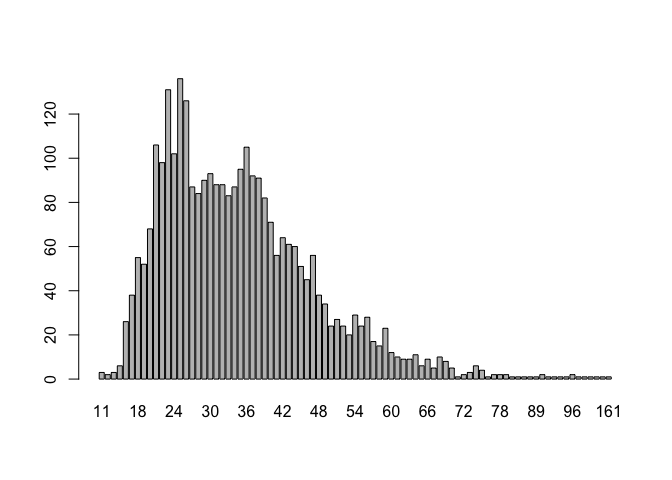
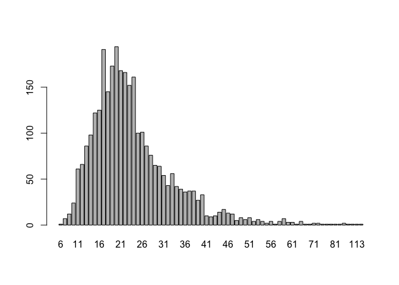
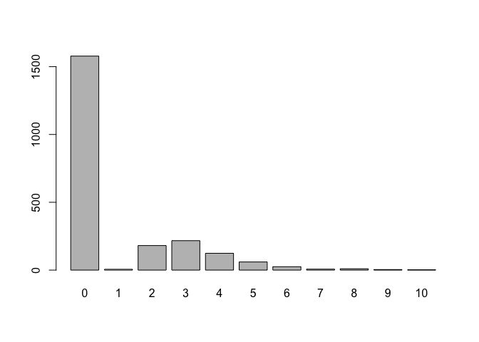

PHOIBLE phoneme class counts
================
Steven Moran

``` r
library(dplyr)
library(testthat)
```

``` r
# Get phoible dev data
phoible <- read.csv('https://raw.githubusercontent.com/phoible/dev/master/data/phoible.csv', stringsAsFactors = F)
```

``` r
# Make sure there aren't any NAs in SegmentClass
table(phoible$SegmentClass, exclude=F)
```

    ## 
    ## consonant      tone     vowel 
    ##     72282      2150     31056

``` r
expect_false(any(is.na(phoible$SegmentClass)))
```

``` r
# Get counts by segment class
phonemes <- phoible %>% group_by(InventoryID, ISO6393, Glottocode, Source) %>% summarize(phonemes=n())
```

    ## `summarise()` has grouped output by 'InventoryID', 'ISO6393', 'Glottocode'. You
    ## can override using the `.groups` argument.

``` r
vowels <- phoible %>% group_by(InventoryID, ISO6393, Glottocode, Source) %>% filter(SegmentClass=="vowel") %>% summarize(vowels=n())
```

    ## `summarise()` has grouped output by 'InventoryID', 'ISO6393', 'Glottocode'. You
    ## can override using the `.groups` argument.

``` r
consonants <- phoible %>% group_by(InventoryID, ISO6393, Glottocode, Source) %>% filter(SegmentClass=="consonant") %>% summarize(consonants=n())
```

    ## `summarise()` has grouped output by 'InventoryID', 'ISO6393', 'Glottocode'. You
    ## can override using the `.groups` argument.

``` r
tones <- phoible %>% group_by(InventoryID, ISO6393, Glottocode, Source) %>% filter(SegmentClass=="tone") %>% summarize(tones=n())
```

    ## `summarise()` has grouped output by 'InventoryID', 'ISO6393', 'Glottocode'. You
    ## can override using the `.groups` argument.

``` r
# Merge into new df
phonemes <- left_join(phonemes, consonants)
```

    ## Joining, by = c("InventoryID", "ISO6393", "Glottocode", "Source")

``` r
phonemes <- left_join(phonemes, vowels)
```

    ## Joining, by = c("InventoryID", "ISO6393", "Glottocode", "Source")

``` r
phonemes <- left_join(phonemes, tones)
```

    ## Joining, by = c("InventoryID", "ISO6393", "Glottocode", "Source")

``` r
head(phonemes)
```

    ## # A tibble: 6 × 8
    ## # Groups:   InventoryID, ISO6393, Glottocode [6]
    ##   InventoryID ISO6393 Glottocode Source phonemes consonants vowels tones
    ##         <int> <chr>   <chr>      <chr>     <int>      <int>  <int> <int>
    ## 1           1 kor     kore1280   spa          40         22     18    NA
    ## 2           2 ket     kett1243   spa          32         18     14    NA
    ## 3           3 lbe     lakk1252   spa          69         60      9    NA
    ## 4           4 kbd     kaba1278   spa          56         49      7    NA
    ## 5           5 kat     nucl1302   spa          35         29      6    NA
    ## 6           6 bsk     buru1296   spa          53         38     12     3

``` r
# There shouldn't be any NAs for consonants or vowels (tones OK)
expect_false(any(is.na(phonemes$consonants)))
expect_false(any(is.na(phonemes$vowels)))

# Reassign NAs in tones to zero -- this ignores the fact that we know that some sources does not report tone!
phonemes$tones[is.na(phonemes$tones)] <- 0

# Check the counts
phonemes$counts.match <- phonemes$consonants + phonemes$vowels + phonemes$tones == phonemes$phonemes
expect_true(all(phonemes$counts.match))

# Mark sources without tones as NA from CLDF contributors CSV
contribs <- read.csv('https://raw.githubusercontent.com/bambooforest/phoible-scripts/master/to_cldf/cldf/contributors.csv')
phonemes <- left_join(phonemes, contribs, by=c("Source"="ID"))
phonemes <- phonemes %>% mutate(tones = ifelse(!with_tones, NA, tones))

table(phonemes$tones, exclude = F)
```

    ## 
    ##    0    1    2    3    4    5    6    7    8    9   10 <NA> 
    ## 1578    6  181  217  124   60   25    7   10    4    2  806

``` r
range(phonemes$tones, na.rm = TRUE)
```

    ## [1]  0 10

``` r
# Write the CSV
df <- phonemes %>% select(-counts.match, -Name, -Contributor, -Description, -Contents, -Citation, -SourceURL, -URL, -with_tones)
head(df)
```

    ## # A tibble: 6 × 8
    ## # Groups:   InventoryID, ISO6393, Glottocode [6]
    ##   InventoryID ISO6393 Glottocode Source phonemes consonants vowels tones
    ##         <int> <chr>   <chr>      <chr>     <int>      <int>  <int> <dbl>
    ## 1           1 kor     kore1280   spa          40         22     18     0
    ## 2           2 ket     kett1243   spa          32         18     14     0
    ## 3           3 lbe     lakk1252   spa          69         60      9     0
    ## 4           4 kbd     kaba1278   spa          56         49      7     0
    ## 5           5 kat     nucl1302   spa          35         29      6     0
    ## 6           6 bsk     buru1296   spa          53         38     12     3

``` r
write.csv(df, "phoible-counts.csv", row.names = F)
```

``` r
# Total counts
counts <- table(phonemes$phonemes)
barplot(counts)
```

<!-- -->

``` r
# Total consonants
counts <- table(phonemes$consonants)
barplot(counts)
```

<!-- -->

``` r
# Total vowels
counts <- table(phonemes$vowels)
barplot(counts)
```

<!-- -->

``` r
# Total counts
counts <- table(phonemes$tones)
barplot(counts)
```

<!-- -->
