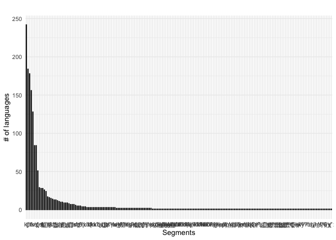

PHOIBLE uvular consonants
================
Steven Moran &lt;<steven.moran@uzh.ch>&gt;
06 April, 2020

``` r
library(dplyr)
library(knitr)
library(ggplot2)
```

``` r
# Get PHOIBLE data and merge in Glottolog metadata
phoible <- read.csv('https://raw.githubusercontent.com/phoible/dev/master/data/phoible.csv', stringsAsFactors = F)

# Merge in Glottolog 4.1 data (https://glottolog.org/meta/downloads)
languoids <- read.csv('glottolog_languoid.csv/languoid.csv', stringsAsFactors = FALSE) 
geo <- read.csv("languages_and_dialects_geo.csv", stringsAsFactors = FALSE)

phoible <- left_join(phoible, languoids, by=c("Glottocode"="id"))
phoible <- left_join(phoible, geo)
```

    ## Joining, by = c("name", "level", "latitude", "longitude")

``` r
# What do we consider retroflexes in PHOIBLE by phonological features?
# retros.by.features <- phoible %>% filter(coronal %in% "+") %>% filter(anterior %in% "-") %>% select(Phoneme) %>% distinct()
```

``` r
# Which rows in phoible have uvular consonants?
uvular.consonants <- phoible %>% filter(grepl("q|ɢ|ɴ|ʀ|χ|ʁ|ʛ|ʟ̠", Phoneme))

# What about uvularization of consonants and/or vowels? I.e. < ʶ>
```

``` r
# How many Glottocodes are there in phoible?
nrow(phoible %>% select(Glottocode) %>% distinct())
```

    ## [1] 2184

``` r
# How many phoible inventories have uvular consonants?
nrow(uvular.consonants %>% select(InventoryID) %>% distinct())
```

    ## [1] 426

``` r
# How many distinct Glottocodes (languiods, i.e. languages, dialects) have uvular.consonants?
gcodes.uvular.consonants <- uvular.consonants %>% select(Glottocode, macroarea, latitude, longitude) %>% distinct()
nrow(gcodes.uvular.consonants)
```

    ## [1] 288

``` r
# How are they distributed in phoible (across duplicate languages)?
distribution.uvular.consonants <- uvular.consonants %>% group_by(Phoneme) %>% summarize(count=n()) %>% arrange(desc(count))
kable(distribution.uvular.consonants)
```

| Phoneme |  count|
|:--------|------:|
| q       |    256|
| χ       |    213|
| ʁ       |    156|
| qʼ      |     84|
| qʰ      |     81|
| χʷ      |     63|
| qʷ      |     50|
| ɢ       |     46|
| ʁʷ      |     34|
| qʷʼ     |     29|
| qː      |     19|
| ʀ       |     19|
| qʷʰ     |     12|
| χː      |     11|
| ɢʷ      |     10|
| qχʼ     |     10|
| qχ      |      9|
| ɴ       |      7|
| q̰       |      7|
| ʁ̞       |      6|
| χʷː     |      5|
| ɴɢ      |      4|
| ɴq      |      4|
| qʷː     |      4|
| ʁː      |      4|
| χʲ      |      4|
| ɴqʰ     |      3|
| qʲʼ     |      3|
| q̰ʷ      |      3|
| qχʷ     |      3|
| qχʼː    |      3|
| ʁˤ      |      3|
| χʷˤ     |      3|
| χˤ      |      3|
| ɢ̥       |      2|
| ɢʁ      |      2|
| qʼː     |      2|
| qˤ      |      2|
| qˤʼ     |      2|
| qχʰː    |      2|
| qχʷʼ    |      2|
| ʀʁ      |      2|
| ʁʲ      |      2|
| ʁʷˤ     |      2|
| ɢː      |      1|
| ɢʱ      |      1|
| ɢʷˤ     |      1|
| ɢˤ      |      1|
| ɢǀ      |      1|
| ɢǀqʰ    |      1|
| ɢǁ      |      1|
| ɢǁqʰ    |      1|
| ɢǂ      |      1|
| ɢǃ      |      1|
| ɢǃqʰ    |      1|
| ɢʘ      |      1|
| ʛ̥       |      1|
| ʰq      |      1|
| ʰqʰ     |      1|
| ɴː      |      1|
| q̚       |      1|
| q͈       |      1|
| q̺       |      1|
| qʲ      |      1|
| qʲʰ     |      1|
| qm      |      1|
| qn      |      1|
| q͈ʷ      |      1|
| qʷʲ     |      1|
| qʷʲʰ    |      1|
| qʷʲʼ    |      1|
| qʷˀ     |      1|
| qʷʼː    |      1|
| qʷˤʰ    |      1|
| qʷˤʼ    |      1|
| qˀ      |      1|
| qˤʰ     |      1|
| qǀ      |      1|
| qǀʼ     |      1|
| qǁ      |      1|
| qǁʼ     |      1|
| qǂ      |      1|
| qǂʼ     |      1|
| qǃ      |      1|
| qǃʼ     |      1|
| qʘ      |      1|
| qʘʼ     |      1|
| qχː     |      1|
| qχʰ     |      1|
| qχʷˤ    |      1|
| qχʷˤʼ   |      1|
| qχˤ     |      1|
| qχˤː    |      1|
| qχˤʼ    |      1|
| ʁ̞ʷ      |      1|
| ʁ̞̰ʷ      |      1|
| ʁʷː     |      1|
| xʀ̥      |      1|
| ˀq      |      1|
| χ͈       |      1|
| χ͈ʷ      |      1|
| χʷʲ     |      1|
| χʷʼ     |      1|
| χʷˤː    |      1|
| χʼ      |      1|
| χʼː     |      1|
| χˤː     |      1|

``` r
# Order the frequency counts and plot the distribution of uvular consonants in the sample
distribution.uvular.consonants$Phoneme <- factor(distribution.uvular.consonants$Phoneme, levels=distribution.uvular.consonants$Phoneme[order(-distribution.uvular.consonants$count)])

# qplot(distribution.uvular.consonants$Phoneme, distribution.uvular.consonants$count)

p <- ggplot(aes(y=count, x=Phoneme), data=distribution.uvular.consonants) +
  geom_bar(stat="identity", width = 0.3, color = "black") +
  xlab("Segments") +
  ylab("# of languages") +
  theme_minimal() +
  ggtitle("")
p
```


``` r
# How are they distributed via macroarea
table(gcodes.uvular.consonants$macroarea)
```

    ## 
    ##        Africa       Eurasia North America     Papunesia South America 
    ##            57           115            50             8            33

``` r
temp <- gcodes.uvular.consonants %>% filter(macroarea!="")
ggplot(data=temp, aes(x=longitude,y=latitude, fill=macroarea, color=macroarea)) + 
  borders("world", colour="gray50", fill="gray50") + 
  geom_point()
```

    ## Warning: Removed 4 rows containing missing values (geom_point).



``` r
# Distribution of uvular consonants per inventory (can't use Glottocode because there are multiple doculects)
uvular.consonants.counts <- uvular.consonants %>% select(InventoryID, Glottocode, Phoneme) %>% group_by(InventoryID, Glottocode) %>% summarize(count=n()) %>% arrange(desc(count))
qplot(y=uvular.consonants.counts$count)
```


