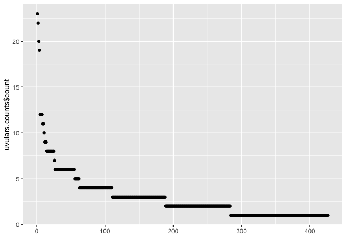

PHOIBLE uvular and ejective consonants
================
Steven Moran &lt;<steven.moran@uzh.ch>&gt;
24 April, 2020

    Data format for uvulars and ejectives data:

    InventoryID | Glottocode | ... | Uvulars | Ejectives | Marginal_Uvular | ...
    1 | aaaa1111 | ... | 2 | 4 | 1 | ...

``` r
library(dplyr)
library(knitr)
library(ggplot2)
```

Data prep
---------

``` r
# Get PHOIBLE data and merge in Glottolog metadata
# TODO: update to URL
phoible <- read.csv('~/Github/phoible/data/phoible.csv', stringsAsFactors = F)

# Merge in Glottolog 4.1 data (https://glottolog.org/meta/downloads)
languoids <- read.csv('glottolog_languoid.csv/languoid.csv', stringsAsFactors = FALSE) 
geo <- read.csv("languages_and_dialects_geo.csv", stringsAsFactors = FALSE)
phoible <- left_join(phoible, languoids, by=c("Glottocode"="id"))
phoible <- left_join(phoible, geo)
```

    ## Joining, by = c("name", "level", "latitude", "longitude")

``` r
rm(geo, languoids)

# Create phoible index
index <- phoible %>% select(InventoryID, Glottocode, ISO6393, LanguageName, SpecificDialect, Source, family_id, level, status, latitude, longitude, country_ids, macroarea) %>% distinct()
```

``` r
# Get uvular consonant counts and the number of marginals
# TODO: What about uvularization of consonants and/or vowels? I.e. < ʶ>
uvulars <- phoible %>% filter(grepl("q|ɢ|ɴ|ʀ|χ|ʁ|ʛ|ʟ̠", Phoneme))
uvular.counts <- uvulars %>% group_by(InventoryID) %>% summarize(Uvulars=n())
uvular.marginals <- uvulars %>% filter(Marginal) %>% group_by(InventoryID) %>% summarize(Marginal_Uvular=n())
```

``` r
# Note that the features +dorsal and +back don't capture uvulars that are palatalized (negates [back])
t1 <- uvulars %>% select(Phoneme) %>% distinct()
"χʲ" %in% t1$Phoneme
```

    ## [1] TRUE

``` r
t2 <- phoible %>% filter(back=="+" & dorsal=="+") %>% select(Phoneme) %>% distinct()
"χʲ" %in% t2$Phoneme
```

    ## [1] FALSE

``` r
setdiff(t1$Phoneme, t2$Phoneme)
```

    ##  [1] "qǀ"   "qǀʼ"  "qǁ"   "qǁʼ"  "qǂ"   "qǂʼ"  "qǃ"   "qǃʼ"  "qʘ"   "qʘʼ" 
    ## [11] "ɢǀ"   "ɢǀqʰ" "ɢǁ"   "ɢǁqʰ" "ɢǂ"   "ɢǃ"   "ɢǃqʰ" "ɢʘ"   "qm"   "qn"  
    ## [21] "xʀ̥"   "χʲ"   "qʲʼ"  "ʁʲ"   "qʲ"   "qʲʰ"  "qʷʲ"  "qʷʲʰ" "qʷʲʼ" "χʷʲ"

``` r
rm(t1, t2)
```

``` r
# Get ejectives counts and the number of marginals
ejectives <- phoible %>% filter(grepl("ʼ", Phoneme))
ejective.counts <- ejectives %>% group_by(InventoryID) %>% summarize(Ejectives=n())
ejective.marginals <- ejectives %>% filter(Marginal) %>% group_by(InventoryID) %>% summarize(Marginal_Ejective=n())
```

``` r
# Joins
df <- left_join(index, uvular.counts)
```

    ## Joining, by = "InventoryID"

``` r
df <- left_join(df, uvular.marginals)
```

    ## Joining, by = "InventoryID"

``` r
df <- left_join(df, ejective.counts)
```

    ## Joining, by = "InventoryID"

``` r
df <- left_join(df, ejective.marginals)
```

    ## Joining, by = "InventoryID"

``` r
rm(ejective.counts, ejective.marginals, uvular.counts, uvular.marginals)

write.csv(df, "uvulars_ejectives.csv", row.names = FALSE)
```

``` r
# Do any languages contain uvulars that are always marginal? Yes.
df[which(df$Uvulars==df$Marginal_Uvular),]
```

    ##      InventoryID Glottocode ISO6393         LanguageName SpecificDialect Source
    ## 241          241   bata1289     bbc                BATAK            <NA>  upsid
    ## 306          306   kumi1248     dih             DIEGUENO            <NA>  upsid
    ## 321          321   basq1248     eus               BASQUE            <NA>  upsid
    ## 354          354   hind1269     hin           HINDI-URDU            <NA>  upsid
    ## 967          967   nubi1253     kcn                 Nubi            <NA>     ph
    ## 1036        1036   phal1254     phl     Palula (Phalura)            <NA>     ph
    ## 1241        1241   adam1253     fub  Fulfulde (Cameroon)             CAM     gm
    ## 2227        2227   sout2672     psi Southeastern Pashayi            <NA>     uz
    ##      family_id    level                status  latitude  longitude
    ## 241   aust1307 language            vulnerable  2.354980   99.17610
    ## 306   coch1271 language   severely endangered 32.331000 -116.60400
    ## 321            language            vulnerable 43.278700   -1.31622
    ## 354   indo1319 language                  safe 25.000000   77.00000
    ## 967   afro1255 language definitely endangered -0.183215   34.75520
    ## 1036  indo1319 language            vulnerable 35.509600   71.84210
    ## 1241  atla1278 language                  safe  8.140326   13.07734
    ## 2227  indo1319 language            vulnerable 34.430990   70.30351
    ##            country_ids     macroarea Uvulars Marginal_Uvular Ejectives
    ## 241                 ID     Papunesia       1               1        NA
    ## 306              MX US North America       1               1        NA
    ## 321              ES FR       Eurasia       1               1        NA
    ## 354        BD BT IN NP       Eurasia       3               3        NA
    ## 967           KE UG US        Africa       1               1        NA
    ## 1036                PK          <NA>       1               1        NA
    ## 1241 CM ER ET NG SD TD        Africa       1               1        NA
    ## 2227                AF       Eurasia       1               1        NA
    ##      Marginal_Ejective
    ## 241                 NA
    ## 306                 NA
    ## 321                 NA
    ## 354                 NA
    ## 967                 NA
    ## 1036                NA
    ## 1241                NA
    ## 2227                NA

``` r
phoible %>% select(InventoryID, Glottocode, LanguageName, Phoneme) %>% filter(InventoryID==354) %>% filter(grepl("q|ɢ|ɴ|ʀ|χ|ʁ|ʛ|ʟ̠", Phoneme))
```

    ##   InventoryID Glottocode LanguageName Phoneme
    ## 1         354   hind1269   HINDI-URDU       q
    ## 2         354   hind1269   HINDI-URDU       ʁ
    ## 3         354   hind1269   HINDI-URDU       χ

``` r
# Do any languages contain ejectives that are always marginal? Yes.
df[which(df$Ejectives==df$Marginal_Ejective),]
```

    ##      InventoryID Glottocode ISO6393 LanguageName SpecificDialect Source
    ## 1276        1276   ikal1242     kck     Ikalanga            <NA>     gm
    ##      family_id   level status latitude longitude country_ids macroarea Uvulars
    ## 1276  atla1278 dialect   safe       NA        NA                Africa      NA
    ##      Marginal_Uvular Ejectives Marginal_Ejective
    ## 1276              NA         1                 1

``` r
phoible %>% select(InventoryID, Glottocode, LanguageName, Phoneme) %>% filter(InventoryID==1276) %>% filter(grepl("ʼ", Phoneme))
```

    ##   InventoryID Glottocode LanguageName Phoneme
    ## 1        1276   ikal1242     Ikalanga     t̠ʃʼ

Descriptive
-----------

``` r
# How many Glottocodes are there in phoible?
nrow(phoible %>% select(Glottocode) %>% distinct())
```

    ## [1] 2184

``` r
# How many phoible inventories have uvular consonants?
nrow(uvulars %>% select(InventoryID) %>% distinct())
```

    ## [1] 426

``` r
# How many are marginal?
nrow(uvulars %>% filter(Marginal) %>% group_by(InventoryID, Marginal)) # 21 rows
```

    ## [1] 21

``` r
uvulars %>% filter(Marginal) %>% group_by(InventoryID, Marginal)
```

    ## # A tibble: 21 x 66
    ## # Groups:   InventoryID, Marginal [16]
    ##    InventoryID Glottocode ISO6393 LanguageName SpecificDialect GlyphID Phoneme
    ##          <int> <chr>      <chr>   <chr>        <chr>           <chr>   <chr>  
    ##  1         231 egyp1253   arz     ARABIC       <NA>            0071    q      
    ##  2         241 bata1289   bbc     BATAK        <NA>            0280    ʀ      
    ##  3         264 buru1296   bsk     BURUSHASKI   <NA>            03C7    χ      
    ##  4         306 kumi1248   dih     DIEGUENO     <NA>            0071    q      
    ##  5         321 basq1248   eus     BASQUE       <NA>            03C7    χ      
    ##  6         354 hind1269   hin     HINDI-URDU   <NA>            0071    q      
    ##  7         354 hind1269   hin     HINDI-URDU   <NA>            0281    ʁ      
    ##  8         354 hind1269   hin     HINDI-URDU   <NA>            03C7    χ      
    ##  9         500 nuuc1236   nuk     TSESHAHT     <NA>            0071+0… qʷ     
    ## 10         500 nuuc1236   nuk     TSESHAHT     <NA>            0071+0… qʼ     
    ## # … with 11 more rows, and 59 more variables: Allophones <chr>, Marginal <lgl>,
    ## #   SegmentClass <chr>, Source <chr>, tone <chr>, stress <chr>, syllabic <chr>,
    ## #   short <chr>, long <chr>, consonantal <chr>, sonorant <chr>,
    ## #   continuant <chr>, delayedRelease <chr>, approximant <chr>, tap <chr>,
    ## #   trill <chr>, nasal <chr>, lateral <chr>, labial <chr>, round <chr>,
    ## #   labiodental <chr>, coronal <chr>, anterior <chr>, distributed <chr>,
    ## #   strident <chr>, dorsal <chr>, high <chr>, low <chr>, front <chr>,
    ## #   back <chr>, tense <chr>, retractedTongueRoot <chr>,
    ## #   advancedTongueRoot <chr>, periodicGlottalSource <chr>,
    ## #   epilaryngealSource <chr>, spreadGlottis <chr>, constrictedGlottis <chr>,
    ## #   fortis <chr>, raisedLarynxEjective <chr>, loweredLarynxImplosive <chr>,
    ## #   click <chr>, family_id <chr>, parent_id <chr>, name <chr>,
    ## #   bookkeeping <chr>, level <chr>, status <chr>, latitude <dbl>,
    ## #   longitude <dbl>, iso639P3code <chr>, description <lgl>,
    ## #   markup_description <lgl>, child_family_count <int>,
    ## #   child_language_count <int>, child_dialect_count <int>, country_ids <chr>,
    ## #   glottocode <chr>, isocodes <chr>, macroarea <chr>

``` r
# How many phoible inventories have ejectives?
nrow(ejectives %>% select(InventoryID) %>% distinct())
```

    ## [1] 267

``` r
# How many are marginal?
nrow(ejectives %>% filter(Marginal) %>% group_by(InventoryID, Marginal))
```

    ## [1] 23

``` r
ejectives %>% filter(Marginal) %>% group_by(InventoryID, Marginal) # 23 rows
```

    ## # A tibble: 23 x 66
    ## # Groups:   InventoryID, Marginal [18]
    ##    InventoryID Glottocode ISO6393 LanguageName SpecificDialect GlyphID Phoneme
    ##          <int> <chr>      <chr>   <chr>        <chr>           <chr>   <chr>  
    ##  1         219 amha1245   amh     AMHARIC      <NA>            0070+0… pʼ     
    ##  2         228 arch1244   aqc     ARCHI        <NA>            0074+0… t̠ʃʷʼ   
    ##  3         228 arch1244   aqc     ARCHI        <NA>            0074+0… t̪s̪ʷʼ…  
    ##  4         228 arch1244   aqc     ARCHI        <NA>            0074+0… t̪ɬ̪ʷʼ…  
    ##  5         283 uppe1439   cjh     UPPER CHEHA… <NA>            006B+0… kʼ     
    ##  6         357 hadz1240   hts     HADZA        <NA>            0070+0… pʼ     
    ##  7         394 kafa1242   kbr     KEFA         <NA>            0074+0… t̠ʃʼ    
    ##  8         500 nuuc1236   nuk     TSESHAHT     <NA>            0071+0… qʼ     
    ##  9         531 rutu1240   rut     RUTUL        <NA>            0074+0… t̠ʃʷʼ   
    ## 10         531 rutu1240   rut     RUTUL        <NA>            0074+0… t̪s̪ʷʼ…  
    ## # … with 13 more rows, and 59 more variables: Allophones <chr>, Marginal <lgl>,
    ## #   SegmentClass <chr>, Source <chr>, tone <chr>, stress <chr>, syllabic <chr>,
    ## #   short <chr>, long <chr>, consonantal <chr>, sonorant <chr>,
    ## #   continuant <chr>, delayedRelease <chr>, approximant <chr>, tap <chr>,
    ## #   trill <chr>, nasal <chr>, lateral <chr>, labial <chr>, round <chr>,
    ## #   labiodental <chr>, coronal <chr>, anterior <chr>, distributed <chr>,
    ## #   strident <chr>, dorsal <chr>, high <chr>, low <chr>, front <chr>,
    ## #   back <chr>, tense <chr>, retractedTongueRoot <chr>,
    ## #   advancedTongueRoot <chr>, periodicGlottalSource <chr>,
    ## #   epilaryngealSource <chr>, spreadGlottis <chr>, constrictedGlottis <chr>,
    ## #   fortis <chr>, raisedLarynxEjective <chr>, loweredLarynxImplosive <chr>,
    ## #   click <chr>, family_id <chr>, parent_id <chr>, name <chr>,
    ## #   bookkeeping <chr>, level <chr>, status <chr>, latitude <dbl>,
    ## #   longitude <dbl>, iso639P3code <chr>, description <lgl>,
    ## #   markup_description <lgl>, child_family_count <int>,
    ## #   child_language_count <int>, child_dialect_count <int>, country_ids <chr>,
    ## #   glottocode <chr>, isocodes <chr>, macroarea <chr>

Exploratory
-----------

``` r
# How are uvulars distributed in phoible (across duplicate languages)?
distribution.uvulars <- uvulars %>% group_by(Phoneme) %>% summarize(count=n()) %>% arrange(desc(count))
kable(distribution.uvulars)
```

| Phoneme |  count|
|:--------|------:|
| q       |    256|
| χ       |    213|
| ʁ       |    156|
| qʼ      |     84|
| qʰ      |     81|
| χʷ      |     63|
| qʷ      |     50|
| ɢ       |     46|
| ʁʷ      |     34|
| qʷʼ     |     29|
| qː      |     19|
| ʀ       |     19|
| qʷʰ     |     12|
| χː      |     11|
| ɢʷ      |     10|
| qχʼ     |     10|
| qχ      |      9|
| ɴ       |      7|
| q̰       |      7|
| ʁ̞       |      6|
| χʷː     |      5|
| ɴɢ      |      4|
| ɴq      |      4|
| qʷː     |      4|
| ʁː      |      4|
| χʲ      |      4|
| ɴqʰ     |      3|
| qʲʼ     |      3|
| q̰ʷ      |      3|
| qχʷ     |      3|
| qχʼː    |      3|
| ʁˤ      |      3|
| χʷˤ     |      3|
| χˤ      |      3|
| ɢ̥       |      2|
| ɢʁ      |      2|
| qʼː     |      2|
| qˤ      |      2|
| qˤʼ     |      2|
| qχʰː    |      2|
| qχʷʼ    |      2|
| ʀʁ      |      2|
| ʁʲ      |      2|
| ʁʷˤ     |      2|
| ɢː      |      1|
| ɢʱ      |      1|
| ɢʷˤ     |      1|
| ɢˤ      |      1|
| ɢǀ      |      1|
| ɢǀqʰ    |      1|
| ɢǁ      |      1|
| ɢǁqʰ    |      1|
| ɢǂ      |      1|
| ɢǃ      |      1|
| ɢǃqʰ    |      1|
| ɢʘ      |      1|
| ʛ̥       |      1|
| ʰq      |      1|
| ʰqʰ     |      1|
| ɴː      |      1|
| q̚       |      1|
| q̺       |      1|
| q͈       |      1|
| qʲ      |      1|
| qʲʰ     |      1|
| qm      |      1|
| qn      |      1|
| q͈ʷ      |      1|
| qʷʲ     |      1|
| qʷʲʰ    |      1|
| qʷʲʼ    |      1|
| qʷˀ     |      1|
| qʷʼː    |      1|
| qʷˤʰ    |      1|
| qʷˤʼ    |      1|
| qˀ      |      1|
| qˤʰ     |      1|
| qǀ      |      1|
| qǀʼ     |      1|
| qǁ      |      1|
| qǁʼ     |      1|
| qǂ      |      1|
| qǂʼ     |      1|
| qǃ      |      1|
| qǃʼ     |      1|
| qʘ      |      1|
| qʘʼ     |      1|
| qχː     |      1|
| qχʰ     |      1|
| qχʷˤ    |      1|
| qχʷˤʼ   |      1|
| qχˤ     |      1|
| qχˤː    |      1|
| qχˤʼ    |      1|
| ʁ̞ʷ      |      1|
| ʁ̞̰ʷ      |      1|
| ʁʷː     |      1|
| xʀ̥      |      1|
| ˀq      |      1|
| χ͈       |      1|
| χ͈ʷ      |      1|
| χʷʲ     |      1|
| χʷʼ     |      1|
| χʷˤː    |      1|
| χʼ      |      1|
| χʼː     |      1|
| χˤː     |      1|

``` r
# Order the frequency counts and plot the distribution of uvular consonants in the sample
distribution.uvulars$Phoneme <- factor(distribution.uvulars$Phoneme, levels=distribution.uvulars$Phoneme[order(-distribution.uvulars$count)])

# qplot(distribution.uvulars$Phoneme, distribution.uvulars$count)

p <- ggplot(aes(y=count, x=Phoneme), data=distribution.uvulars) +
  geom_bar(stat="identity", width = 0.3, color = "black") +
  xlab("Segments") +
  ylab("# of languages") +
  theme_minimal() +
  ggtitle("")
p
```


``` r
# How are uvulars distributed in phoible (across duplicate languages)?
distribution.ejectives <- ejectives %>% group_by(Phoneme) %>% summarize(count=n()) %>% arrange(desc(count))
kable(distribution.ejectives)
```

| Phoneme   |  count|
|:----------|------:|
| kʼ        |    242|
| t̠ʃʼ       |    184|
| pʼ        |    178|
| tʼ        |    156|
| tsʼ       |    128|
| kʷʼ       |     84|
| qʼ        |     84|
| t̪ʼ        |     51|
| qʷʼ       |     29|
| cʼ        |     28|
| tɬʼ       |     28|
| kʲʼ       |     26|
| t̪ʼ|tʼ     |     24|
| t̪s̪ʼ|tsʼ   |     17|
| sʼ        |     16|
| t̠ʃʼː      |     15|
| kʼː       |     14|
| t̺ʼ        |     13|
| tʼː       |     13|
| ʈʂʼ       |     12|
| t̪ɬ̪ʼ|tɬʼ   |     11|
| qχʼ       |     10|
| ʃʼ        |     10|
| pʼː       |      9|
| t̺s̺ʼ       |      9|
| t̪s̪ʼ       |      9|
| ɬʼ        |      8|
| fʼ        |      7|
| s̪ʼ|sʼ     |      7|
| t̠ʃʷʼ      |      7|
| tsʼː      |      6|
| cçʼ       |      5|
| tʷʼ       |      5|
| t̪θʼ       |      5|
| tɬʼː      |      4|
| ʈʼ        |      4|
| xʼ        |      4|
| cʼː       |      3|
| dʼ        |      3|
| ᶑʼ        |      3|
| kʷʼː      |      3|
| kxʼ       |      3|
| kxʼː      |      3|
| kǀʼ       |      3|
| lʼ        |      3|
| qʲʼ       |      3|
| qχʼː      |      3|
| sʼː       |      3|
| ʆʼ        |      3|
| tɕʼ       |      3|
| tʲʼ       |      3|
| tsʷʼ      |      3|
| t̪s̪ʷʼ|tsʷʼ |      3|
| ʼm        |      3|
| ʼn        |      3|
| ɕʼ        |      2|
| d̠ʒʼ       |      2|
| ɡʼ        |      2|
| kǁʼ       |      2|
| kǃʼ       |      2|
| ɬ̪ʼ|ɬʼ     |      2|
| mʼ        |      2|
| ntsʼ      |      2|
| n̠t̠ʃʼ      |      2|
| nʼ        |      2|
| pʷʼ       |      2|
| ɸʼ        |      2|
| qʼː       |      2|
| qˤʼ       |      2|
| qχʷʼ      |      2|
| t̻s̻ʼ       |      2|
| t̪s̪ʼː|tsʼː |      2|
| t̠ʆʷʼ      |      2|
| ʼj        |      2|
| ʼɲ        |      2|
| ʼŋ        |      2|
| ʼw        |      2|
| bʼ        |      1|
| dzʼ       |      1|
| d̠ʒxʼ      |      1|
| ðʼ        |      1|
| dʼkxʼ     |      1|
| d̪ʼkxʼ     |      1|
| ᶑʼː       |      1|
| ɡ‼xʼ      |      1|
| ɡʼkxʼ     |      1|
| ɡǀkxʼ     |      1|
| ɡǀxʼ      |      1|
| ɡǁkxʼ     |      1|
| ɡǁxʼ      |      1|
| ɡǂkxʼ     |      1|
| ɡǃkxʼ     |      1|
| ɡǃxʼ      |      1|
| ɡʘkxʼ     |      1|
| hʼ        |      1|
| k‼ʰʼ      |      1|
| k‼xʼ      |      1|
| k‼ʼ       |      1|
| k̟ʲʼ       |      1|
| kʟ͓̥ʼ       |      1|
| kʟ̥ʼ       |      1|
| kʷʲʼ      |      1|
| kǀʰʼ      |      1|
| kǀkxʼ     |      1|
| kǀxʼ      |      1|
| kǁʰʼ      |      1|
| kǁkxʼ     |      1|
| kǁxʼ      |      1|
| kǂkxʼ     |      1|
| kǃʰʼ      |      1|
| kǃkxʼ     |      1|
| kǃxʼ      |      1|
| kʘkxʼ     |      1|
| lʼː       |      1|
| ɬʲʼ       |      1|
| ɬ̪ʲʼ       |      1|
| ɮʼ        |      1|
| ʎʼ        |      1|
| mpfʼ      |      1|
| mpʼ       |      1|
| ntlʼ      |      1|
| ntʼ       |      1|
| ɲcʼ       |      1|
| ɲʼ        |      1|
| ŋkʼ       |      1|
| ŋǁʼ       |      1|
| ŋǃʼ       |      1|
| pfʼ       |      1|
| pʲʼ       |      1|
| pʃʼ       |      1|
| pʼkxʼ     |      1|
| qʷʲʼ      |      1|
| qʷʼː      |      1|
| qʷˤʼ      |      1|
| qǀʼ       |      1|
| qǁʼ       |      1|
| qǂʼ       |      1|
| qǃʼ       |      1|
| qʘʼ       |      1|
| qχʷˤʼ     |      1|
| qχˤʼ      |      1|
| rʼ        |      1|
| rʼː       |      1|
| s̪ʼ        |      1|
| ʂʼ        |      1|
| ʃ̞ʼ        |      1|
| ʃʼː       |      1|
| ʆʷʼ       |      1|
| t̺ɕ̺ʼ       |      1|
| tʰʼ       |      1|
| t̪ʲʼ       |      1|
| tɬʷʼ      |      1|
| t̪ɬ̪ʷʼ|tɬʷʼ |      1|
| t̪ɬʼ       |      1|
| t̪ɬ̪ʼ       |      1|
| t̪ɬ̪ʼː|tɬʼː |      1|
| t̪s̪ʲʼ      |      1|
| t̪s̪ʷʲʼ     |      1|
| t̪s̪ʷʼ      |      1|
| t̠ʃˤʼ      |      1|
| t̪ʷʲʼ      |      1|
| t̪ʷʼ       |      1|
| t̻ʼ        |      1|
| t̪ʼː       |      1|
| tʼkxʼ     |      1|
| t̪ʼkxʼ     |      1|
| t̪ˤʼ       |      1|
| wʼ        |      1|
| xʷʼ       |      1|
| yʼ        |      1|
| ʔʷʼ       |      1|
| ʔʼ        |      1|
| ʼb        |      1|
| ʼd        |      1|
| ʼɡ        |      1|
| ʼɣ        |      1|
| ʼl        |      1|
| ʼŋǀ       |      1|
| ʼŋǃ       |      1|
| ʼs        |      1|
| ʼʃ        |      1|
| ʕʷʼ       |      1|
| ʕʼ        |      1|
| θʼ        |      1|
| χʷʼ       |      1|
| χʼ        |      1|
| χʼː       |      1|

``` r
# Order the frequency counts and plot the distribution of uvular consonants in the sample
distribution.ejectives$Phoneme <- factor(distribution.ejectives$Phoneme, levels=distribution.ejectives$Phoneme[order(-distribution.ejectives$count)])

# qplot(distribution.ejectives$Phoneme, distribution.ejectives$count)

p <- ggplot(aes(y=count, x=Phoneme), data=distribution.ejectives) +
  geom_bar(stat="identity", width = 0.3, color = "black") +
  xlab("Segments") +
  ylab("# of languages") +
  theme_minimal() +
  ggtitle("")
p
```


``` r
# Distribution of uvular consonants per inventory (can't use Glottocode because there are multiple doculects)
uvulars.counts <- uvulars %>% select(InventoryID, Glottocode, Phoneme, macroarea) %>% group_by(InventoryID, Glottocode, macroarea) %>% summarize(count=n()) %>% arrange(desc(count))

qplot(y=uvulars.counts$count)
```



``` r
# How are they distributed via macroarea
table(uvulars.counts$macroarea)
```

    ## 
    ##        Africa       Eurasia North America     Papunesia South America 
    ##            68           193            64            13            41

``` r
# Distribution of ejective per inventory (can't use Glottocode because there are multiple doculects)
ejectives.counts <- ejectives %>% select(InventoryID, Glottocode, Phoneme, macroarea) %>% group_by(InventoryID, Glottocode, macroarea) %>% summarize(count=n()) %>% arrange(desc(count))

qplot(y=ejectives.counts$count)
```


``` r
# How are they distributed via macroarea
table(ejectives.counts$macroarea)
```

    ## 
    ##        Africa       Eurasia North America South America 
    ##            70            54            75            28
